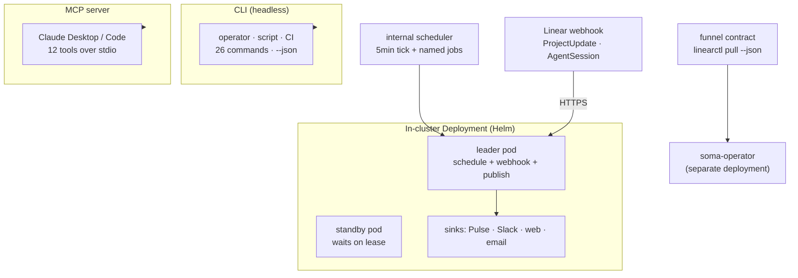
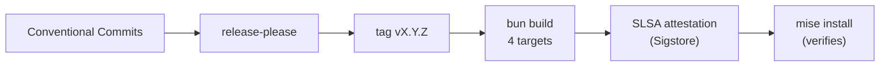

<h1 align="center">linearctl</h1>

<p align="center">
  <em>Linear API orchestration — from headless CLI to in-cluster reconciliation loop.</em>
</p>

<p align="center">
  
  
  
  
  
  
</p>

<p align="center">
  <a href="https://github.com/cerebral-work/linearctl/actions/workflows/ci.yml"></a>
  <a href="https://github.com/cerebral-work/linearctl/releases/latest"></a>
  <a href="https://linear.app/docs/loops"></a>
</p>

---

## What is this?

`linearctl` is a **Linear API orchestrator** — a single-binary TypeScript
service that runs three ways:

1. **CLI** — 26 headless commands for the Linear workflows you keep
   re-improvising by hand: `pull`, `digest`, `triage`, `stale`, `file`,
   `update`, `comment`, `milestone`, `cycle`, `roadmap`, `release-notes`,
   `standup`, `xref`, `search`, `show`, `history`, `loops lint`, and more.
2. **MCP server** — `linearctl mcp serve` exposes 12 tools to Claude Desktop /
   Claude Code over stdio.
3. **In-cluster Deployment** — a Helm chart deploying a leader-elected
   always-on `Deployment` that owns the schedule + webhook ingress, publishes
   digests to Linear Pulse / Slack / web / email, and serves the funnel
   contract for downstream Kubernetes operators.

Built on the official [`@linear/sdk`](https://www.npmjs.com/package/@linear/sdk)
v86 + live Linear GraphQL API. No scraping, no undocumented endpoints.



## Quickstart

### As a CLI

```bash
# install via mise (no Node runtime — bun embeds it)
mise use -g "github:cerebral-work/linearctl"
linearctl whoami
linearctl digest --since 7d --team CER --json | jq
```

### As an in-cluster Deployment

```bash
# add the chart (from the repo — no remote registry yet)
helm install linearctl ./deploy/chart \
  --set secrets.linearApiKey.secretName=linearctl-linear-api-key \
  --set deployment.publish.dryRun=true

# verify
kubectl get pods -l app.kubernetes.io/name=linearctl
kubectl logs deploy/linearctl-orchestra -f
```

<details>
<summary><strong>Develop from source</strong></summary>

```bash
bun install                 # bun ≥ 1.3 (see .prototools)
bun run dev -- whoami       # run from source
bun run typecheck           # tsc --noEmit
bun test                    # 100+ unit tests
bun run build               # bun build --compile → dist/linearctl
helm template ./deploy/chart # render the chart locally
```
</details>

## The funnel contract — machine-to-machine Linear control

The core in-cluster primitive. `linearctl pull` + `linearctl update --state` +
`linearctl comment` form a **headless funnel contract** — the exact PULL +
TRANSITION + COMMENT surface a Kubernetes operator needs to control Linear
issues without a human at a terminal.

```bash
# The soma-operator's exact funnel query (deployed on Cygnus, proven with EST-83):
linearctl pull --team EST --state-set Todo --state-set Backlog --label soma-ingest --json

# Transition (sends ONLY { stateId } — description-clobber invariant, tested):
linearctl update EST-83 --state "In Progress" --json

# Comment:
linearctl comment EST-83 --body "dispatched to worker X" --json
```

**10 stable JSON fields per issue:** `id` (UUID), `identifier`, `title`, `state`,
`stateType`, `priority`, `labels`, `description`, `url`, `updatedAt`.

**Hard invariant:** a state-only update never round-trips the description —
verified live against the API, tested in `test/funnel-parity.test.ts`. The
soma-operator's CI conformance test runs `linearctl pull` full-unbounded and
asserts its own GraphQL returns the same set — no runtime coupling, just
contract parity. Full spec: [`docs/funnel-contract.md`](./docs/funnel-contract.md).

## In-cluster Deployment (`deploy/chart/`)

| Manifest | What it does |
|---|---|
| `deployment.yaml` | 2-replica `Deployment`, leader-elected via `coordination.k8s.io/Lease`. Non-root, read-only rootfs, all capabilities dropped. Runs `linearctl loops lint` on startup (fails readiness if recipes are invalid). |
| `rbac.yaml` | `ServiceAccount` + minimal `Role` (lease create/get/update only — no cluster-wide perms). |
| `service.yaml` | `ClusterIP` + `ServiceMonitor` (Prometheus) + `PodDisruptionBudget` (minAvailable: 1). |
| `loop-recipes-cm.yaml` | Mounts `.linearctl/loop-recipes/*.md` as a ConfigMap. Pod restarts on recipe changes (checksum annotation). |
| `ingress.yaml` | Linear webhook ingress (`/webhook`) with signature verification at the edge. |

**Safe-by-default:** `dryRun: true` out of the box — the opera logs "would
publish" + dedup hash, no mutations. Operator sign-off gates the first publish
per (surface × audience) pair. Secrets resolved from
[OpenBao](https://openbao.org) via `ExternalSecret` — never in Helm values.

See [the Helm chart values](./deploy/chart/values.yaml) for the full
configuration surface.

## Linear Loops recipe catalog

9 versioned, lint-validated recipes for
[Linear Loops](https://linear.app/docs/loops) — the recurring AI-driven
workflows launched July 2026. Loops have no public API yet (the
`WorkflowDefinition` schema type exists but has no query or mutation surface —
verified via live `__schema` introspection), so these recipes are the **design
authority** the operator pastes into Linear's "Create loop" UI:

| Recipe | Trigger | What it does |
|---|---|---|
| `bug-triage-dispatcher` | issue → Triage | investigate root cause via Code Intelligence, comment recommendation |
| `triage-debt-weekly-sweep` | Mon 09:00 | comment on top-10 oldest unassigned/unestimated issues |
| `project-update-synthesizer` | Fri 16:00 | draft weekly Project Updates (draft, never publish) |
| `carry-over-warning` | cycle ends <2d, unstarted | warn assignee of carry-over risk |
| `plan-doc-drift-detector` | Mon 10:00 | diff `roadmap-*.md` ↔ Linear project overview |
| `cross-platform-handoff-design` | issue created, label=design-system | create platform-specific sub-issues |
| `release-notes-attach` | milestone → completed | assemble release notes grouped by label |
| `pulse-curator` | weekdays 09:00 | score Project Updates on clarity/signal/staleness |
| `triage-rationale-checker` | issue leaves Triage | check assignee+estimate+priority+labels |

```bash
linearctl loops lint
# → 9 recipe(s), 0 error(s), 0 warning(s) ✓ all recipes valid
```

Each recipe carries a `last_verified` date — staleness is visible, not silent.
When Linear ships a Loops API, the YAML maps 1:1 to `WorkflowDefinition`
fields — `loops apply` and `loops diff` become CRUD wrappers with zero design
churn. See [`.linearctl/loop-recipes/README.md`](./.linearctl/loop-recipes/README.md).

## Commands

All commands honor `--json`; mutating verbs are safe-by-default. Exit codes:
`0` ok · `1` error · `2` rate-limited (pull) / not-found.

### Read (15 commands)

`whoami` · `digest` · `pull` · `triage` · `stale` · `milestone` · `roadmap` ·
`cycle` · `xref` · `search` · `show` · `history` · `comments` ·
`release-notes` · `standup` · `ratelimit`

### Write (11 commands)

`file` · `update` · `close` · `comment` · `project` · `milestone create` ·
`doc` · `link` · `label` · `park` · `template`

### Loops + MCP

`loops lint` · `mcp serve`

Full reference: [`docs/spec.md` §6](./docs/spec.md). Tooling rationale:
[`docs/decisions.md`](./docs/decisions.md).

## Authentication

`LINEAR_API_KEY` from the environment — env only, never stored/printed/logged.
In-cluster: resolved from [OpenBao](https://openbao.org) via `ExternalSecret`,
injected as a `secretKeyRef`. A native OAuth `actor=app` path is future work.

## How it ships

Conventional Commits → **release-please** → tag → **bun cross-compiles** 4
targets (linux/macos × x64/arm64) → **SLSA-attested** tarballs → `mise`
verifies attestation on install. CI on every PR: `tsc --noEmit` · `bun test`
(100+ tests) · `bun build --compile` + `--version` smoke.



## Project stats

| | |
|---|---|
| **Commands** | 26 (read, write, loops, mcp) |
| **MCP tools** | 12 (7 read + 5 write) |
| **Tests** | 100+ (unit + live-contract + MCP handshake + funnel-parity + loop-recipes) |
| **Loop recipes** | 9 (linted, versioned, `last_verified` staleness-tracked) |
| **Helm chart** | `deploy/chart/` — Deployment + RBAC + Service + Ingress + ConfigMap + PDB |
| **Binary** | Single bun-compiled binary, 4 platforms, SLSA-attested |
| **Runtime** | No Node required — bun embeds the runtime |
| **Install (CLI)** | `mise use -g "github:cerebral-work/linearctl"` |
| **Install (cluster)** | `helm install linearctl ./deploy/chart` |

## Dogfooding

`linearctl` files its own backlog in Linear (team CER) via `linearctl file`,
grooms it with `triage` / `stale` / `xref`, and tracks milestones via
`milestone` / `roadmap`. The project is its own first user — and its own first
in-cluster reconciliation target.

---

<p align="center"><sub>Built for the Cerebral workspace · MIT · <code>chris@todie.io</code> · <a href="https://github.com/cerebral-work/linearctl">GitHub</a> · <a href="https://linear.app/cerebral-work">Linear</a></sub></p>
