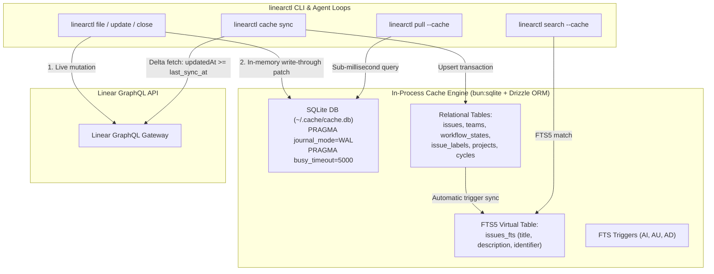

# Feature: `linearctl cache` — Local SQLite ORM Cache

**Status:** implemented
**Command:** `linearctl cache sync [--full] [--since <window>] [--team KEY...]` · `linearctl cache status [--json]` · `linearctl cache clear` · `linearctl cache query [filters] [--json]` · `linearctl pull --cache` · `linearctl search --cache`
**Roadmap:** net-new (CER-2650)

## Motivation

Autonomous agent loops (`soma-operator`, `godseat`), background reconciliation daemons, and interactive CLI sessions frequently poll Linear's GraphQL API. Under high polling frequency or during large milestone sweeps, remote API calls suffer from:

1. **High latency:** 300ms–800ms per GraphQL request over HTTP.
2. **Rate limits:** Linear's 1,440-minute sliding window / complexity limits degrade or block background workers.
3. **Flakiness:** Transient network drops or Linear API maintenance interrupt deterministic agent loops.

`linearctl cache` embeds a high-performance, in-process SQLite database powered by `bun:sqlite` and Drizzle ORM. It caches the workspace's issues, teams, workflow states, labels, projects, milestones, and cycles locally. Read operations execute in **sub-millisecond latencies (<0.5ms p99)** with zero network overhead.

---

## Architecture



### Core Components

1. **Embedded Engine:** Built directly into the compiled standalone `dist/linearctl` binary via `bun:sqlite`. No external database daemons, background services, or shared C libraries required.
2. **Relational Schema (Drizzle ORM):** Full relational mapping for `teams`, `users`, `workflow_states`, `issue_labels`, `projects`, `project_milestones`, `cycles`, `issues`, and `issue_relations`.
3. **FTS5 Full-Text Search:** Integrated SQLite FTS5 table (`issues_fts`) with rowid-backed synchronization triggers (`issues_ai`, `issues_au`, `issues_ad`) for full-text search across issue title, description, and identifier.
4. **Delta Synchronization:** Periodic or on-demand sync fetches only records modified since the previous sync (`updatedAt >= last_sync_at`), minimizing payload transfer and GraphQL complexity cost.
5. **Write-Through Mutation:** Every CLI mutation (`linearctl file`, `linearctl update`, `linearctl close`) instantly updates the local SQLite cache upon successful API response, eliminating read-after-write consistency delays.

---

## CLI Reference

### 1. `linearctl cache sync`

Synchronize local cache from the Linear GraphQL API.

```bash
# Incremental delta sync (default: only records changed since last sync)
linearctl cache sync

# Full sync (re-pull all workspace entities)
linearctl cache sync --full

# Scoped delta sync for specific teams
linearctl cache sync --team CER --team EST

# Sync records modified within a specific lookback window
linearctl cache sync --since 24h
```

| Flag | Description |
|---|---|
| `--full` | Force a complete re-fetch of all workspace entities instead of a delta sync |
| `--since <window>` | Filter issues updated since `<window>` (e.g. `24h`, `7d`, `2w`, or ISO date) |
| `--team <key...>` | Scope issue, workflow state, and label fetching to specific team keys |

### 2. `linearctl cache status`

Inspect cache database location, file size, last sync timestamp, and entity row counts.

```bash
# Pretty-printed table
linearctl cache status

# Machine-readable JSON
linearctl cache status --json
```

Output:
```
Linear Local Cache Status
  Database path:  /home/ctodie/.cache/cache.db
  Database size:  11.11 MB
  Last sync:      2026-10-08T13:23:05.639Z

┌────────────────────┬───────┐
│ Entity             │ Count │
│ Issues             │ 2297  │
│ Teams              │ 15    │
│ Workflow States    │ 121   │
│ Issue Labels       │ 348   │
│ Projects           │ 82    │
│ Project Milestones │ 273   │
│ Cycles             │ 23    │
│ Issue Relations    │ 4149  │
│ Users              │ 42    │
└────────────────────┴───────┘
```

### 3. `linearctl cache clear`

Clear all cached tables and metadata, resetting the local database.

```bash
linearctl cache clear
```

### 4. `linearctl cache query`

Execute direct SQL or filtered queries against the local cache.

```bash
linearctl cache query --team CER --state started --label bug --json
```

---

## Funnel & Search Fast-Paths (`--cache`)

Downstream agent loops can pass the `--cache` flag to read commands to bypass the network entirely.

### `linearctl pull --cache`

Executes the funnel contract query directly against local SQLite tables:

```bash
linearctl pull --cache \
  --team EST \
  --state-set Todo \
  --state-set Backlog \
  --label soma-ingest \
  --limit 50
```

- Schema strictly conforms to the 9-field `PullIssue` contract in `docs/funnel-contract.md`.
- Default behavior excludes `completed` and `canceled` states unless `--state all` is passed.
- Supports multi-label conjunction (AND), state aliases, priority parsing, and sliding-window limits.

### `linearctl search --cache`

Executes full-text and filtered searches using SQLite FTS5:

```bash
linearctl search --cache "reconcile loop" --team CER --json
```

---

## Configuration & Environment Variables

| Variable | Description | Default |
|---|---|---|
| `LINEARCTL_CACHE` | When set to `1` or `true`, enables `--cache` mode by default for `pull` and `search` | `false` |
| `LINEARCTL_CACHE_DIR` | Custom directory path for SQLite cache databases | `$XDG_CACHE_HOME/linearctl` or `~/.cache/linearctl` |
| `LINEARCTL_CACHE_FILE` | Explicit file path for the SQLite database (overrides directory resolution) | `~/.cache/cache.db` |

---

## Performance & Latency Guardrails

Benchmarks run against an in-memory SQLite database populated with **10,000 issues, 10 teams, 50 workflow states, and 50 labels** (`bun run bench:cache`):

| Operation | Guardrail SLA | Actual p50 | Actual p95 | Actual p99 |
|---|---|---|---|---|
| **Point Issue Lookup** (`identifier`) | `<= 2.0 ms` | **0.14 ms** | **0.27 ms** | **0.48 ms** |
| **Funnel Pull Query** (Filtered & Sorted) | `<= 5.0 ms` | **0.24 ms** | **0.39 ms** | **0.49 ms** |
| **FTS5 Full-Text Search** | `<= 10.0 ms` | **0.27 ms** | **0.79 ms** | **0.94 ms** |

Compared to live Linear GraphQL API calls (300ms–800ms), the local cache delivers a **600x to 1,500x speedup**.

---

## Troubleshooting & Maintenance

### Concurrent Access & Locks

The cache database enables WAL (Write-Ahead Logging) mode (`PRAGMA journal_mode = WAL`) and sets a busy timeout of 5,000ms (`PRAGMA busy_timeout = 5000`). Multiple CLI processes and agents can read concurrently without blocking writes.

If a process terminates uncleanly while holding an exclusive lock, SQLite automatically recovers upon next connection. If issues persist:

```bash
linearctl cache clear
linearctl cache sync --full
```

### Database Recovery

To perform a clean rebuild without deleting settings or keys:

```bash
rm -f ~/.cache/cache.db ~/.cache/cache.db-wal ~/.cache/cache.db-shm
linearctl cache sync --full
```
