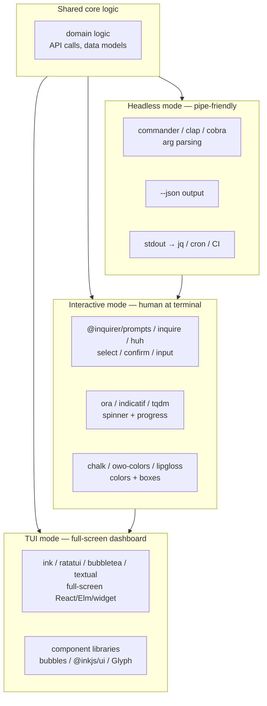

# TUI/CLI Library Landscape — Cross-Language Reference

A comprehensive, evidence-based catalog of the state of the art in terminal
UI and CLI libraries. Organized by language/runtime, each entry includes
adoption signals (GitHub stars, download counts), maintenance status, notable
adopters, and a one-line characterization.

## Files

| File | Language(s) | Coverage |
|------|-------------|----------|
| [`rust.md`](./rust.md) | Rust | clap, ratatui, inquire, indicatif, owo-colors, tabled, syntect, insta, cargo-dist |
| [`go.md`](./go.md) | Go | cobra, bubbletea, huh, lipgloss, glamour, chroma, GoReleaser + Charm ecosystem |
| [`python.md`](./python.md) | Python | click, typer, textual, rich, questionary, tqdm, pygments, pytest + Textual ecosystem |
| [`typescript-javascript.md`](./typescript-javascript.md) | TS/JS | commander, @inquirer/prompts, ink, OpenTUI, ora, chalk, shiki, bun build — **linearctl's ecosystem** |
| [`c-cpp.md`](./c-cpp.md) | C/C++ | ncurses, notcurses, FTXUI, FINAL CUT, CLI11 — foundational layers |
| [`other-languages.md`](./other-languages.md) | Haskell, OCaml, Ruby, Zig, Nim, Elixir, Crystal | brick, nottui, TTY toolkit, OpenTUI native core |

## Categories covered (per language)

1. Argument parsing & CLI frameworks
2. Interactive prompts (select / confirm / input)
3. Full-screen TUI frameworks
4. Spinners & progress
5. Styling (ANSI colors, borders, layout)
6. Tables
7. Markdown rendering
8. Syntax highlighting
9. Testing
10. Binary distribution & release
11. Terminal I/O backends (low-level)
12. Notifications & system integration
13. ASCII art & branding

Not every language has entries in every category — smaller ecosystems have
gaps, which is itself useful signal.

## Methodology

- Stars and download counts sourced from GitHub, npm, crates.io, PyPI, and
  pkg.go.dev as of July 2026.
- Maintenance status: ✅ active (publish ~3mo), ⚠️ stale (>12mo or minimal),
  ❌ dead/archived.
- Sources: GitHub repositories, package registries, npmtrends.com, lib.rs,
  terminaltrove.com, awesome-tuis lists, comparison articles.

## The three-mode CLI architecture

How these layers compose in a modern multi-modal CLI like linearctl:

The three modes share one core, one binary, one auth path. Headless is
`--json` and pipes; interactive adds prompts + spinners when no flags are
given; TUI is a separate `tui` subcommand for full-screen dashboard views.
None fights the others.

## Cross-language "winners" at a glance

| Category | Rust | Go | Python | TS/JS |
|----------|------|-----|--------|-------|
| Arg parsing | clap | cobra | click / typer | commander |
| Prompts | inquire | huh | questionary | @inquirer/prompts |
| TUI framework | ratatui | bubbletea | textual | ink / OpenTUI |
| Styling | owo-colors | lipgloss | rich | chalk / picocolors |
| Spinner/progress | indicatif | bubbles/spinner | tqdm / rich.progress | ora / listr2 |
| Tables | tabled | lipgloss/table | rich.Table | cli-table3 |
| Markdown | termimad | glamour | rich.markdown | marked + marked-terminal |
| Syntax highlight | syntect | chroma | pygments | shiki / highlight.js |
| Testing | insta + assert_cmd | tea-test | pytest + pexpect | ink-testing-library |
| Distribution | cargo-dist | GoReleaser | uv / PyInstaller | bun build --compile |

## Relevance to linearctl

linearctl is TypeScript + bun. The most relevant file is
[`typescript-javascript.md`](./typescript-javascript.md), which covers
linearctl's current stack (commander, @linear/sdk, bun:test, bun build) and
the candidate libraries for future interactive/TUI modes.

The other language files serve as reference points — patterns and adoption
signals that inform architecture decisions even when the specific library
isn't a candidate.
