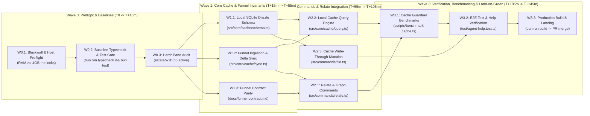

# linearctl: Critical Path Method (CPM) & Agent Sprint Wave Plan

## 1. Goal Description & Problem Context

The objective is to establish the fastest, collision-free execution route and distribution strategy for autonomous multi-agent sprint waves across **linearctl** (`cerebral-work/linearctl` on physical host `ceres`).
linearctl serves as the headless CLI and funnel operator for Linear workflows across the cerebral estate, providing point lookups, batch issue ingestion, ticket filing, dependency graph relationships, and local SQLite caching for downstream autonomous agents (`godseat`, `soma-operator`, and interactive developer lanes).

Production multi-agent execution experiences across `unsigned-paas`, `soma-os`, and `cortex` identify three fundamental operational hazards:
1. **Host Resource Contention on `ceres`**: Uncoordinated compilation and testing across concurrent agent sessions triggers CPU starvation and memory exhaustion. All task executions MUST enforce host throttling, nice level 19, and verify a free memory floor of $\ge 4000\text{ MB}$.
2. **Git Lock & Merge Collision**: Simultaneous subagents writing to overlapping source paths deadlock on `.git/index.lock` or produce merge conflicts. Subagents MUST operate under **path-disjoint boundaries** with zero transient physical worktrees, using Blackwall Landlock containment and DeltaDB virtual changesets.
3. **Funnel Contract Parity & Downstream SLAs**: Downstream agents depend on sub-5ms query latencies and zero API calls on cache hits. Incomplete or drifting schemas degrade autonomous agent pipelines. Critical Path scheduling guarantees funnel parity before higher-level CLI features land.

---

## 2. Operating Principles (Christian Todie Doctrine)

> [!IMPORTANT]
> **Core Estate Invariants**
> - **Branch Model**: Work executes on feature branches (`feat/*`) branched from `main`, landing via signed PRs.
> - **Merge-on-Green**: When all automated gates (`bun run typecheck`, `bun test`, `make smoke`) pass, PRs merge directly without manual delay.
> - **Zero Transient Physical Worktrees**: Subagents must not create temporary physical Git worktrees on host `ceres` (`git worktree add`). They must operate in Blackwall Landlock sandboxes or virtual DeltaDB execution slots.
> - **Host Throttling & Priority**: Heavy background tasks run at `nice -n 19`.
> - **Maximum 3 Active Agents**: No more than 3 active builder subagents may run concurrently per lane.
> - **Controlled Language**: Procedural text conforms to ASD-STE100 (sentences $\le 20$ words for procedures, $\le 25$ words for descriptions).

---

## 3. Mathematical Critical Path Method (CPM) Analysis

We model linearctl development and release cycles as a Directed Acyclic Graph (DAG) partitioned into four sequential waves ($W_0 \to W_1 \to W_2 \to W_3$).

### 3.1 Task Table & Critical Path Calculation

| Task ID | Task Description | Path Disjoint Target | Duration ($t_i$) | Dependencies | Slack / Float | Critical? |
| :--- | :--- | :--- | :--- | :--- | :--- | :--- |
| **W0.1** | Host preflight & lock checks | Workspace root | 5 min | None | 0 min | **Yes** |
| **W0.2** | Baseline typecheck & test suite | Workspace root | 5 min | W0.1 | 0 min | **Yes** |
| **W0.3** | Herdr pane audit & socket check | Herdr socket | 5 min | W0.2 | 0 min | **Yes** |
| **W1.1** | Drizzle schema & FTS5 triggers | `src/core/cache/schema.ts`, `db.ts` | 25 min | W0.3 | 15 min | No |
| **W1.2** | Funnel ingestion & delta sync engine | `src/core/cache/sync.ts` | 40 min | W0.3 | 0 min | **Yes** |
| **W1.3** | Funnel contract parity validation | `docs/funnel-contract.md` | 20 min | W0.3 | 20 min | No |
| **W2.1** | Relate commands & blocking links | `src/commands/relate.ts` | 30 min | W1.2, W1.3 | 20 min | No |
| **W2.2** | Cache query engine & FTS5 search | `src/core/cache/query.ts` | 50 min | W1.1, W1.2 | 0 min | **Yes** |
| **W2.3** | Write-through cache invalidation | `src/commands/file.ts`, `update.ts` | 35 min | W1.1 | 15 min | No |
| **W3.1** | Cache guardrail benchmarking (p99 $\le 2\text{ms}$) | `scripts/benchmark-cache.ts` | 20 min | W2.1, W2.2 | 0 min | **Yes** |
| **W3.2** | E2E suite & agent-help contract tests | `test/agent-help.test.ts` | 15 min | W3.1, W2.3 | 0 min | **Yes** |
| **W3.3** | Single-binary compilation & landing | Workspace root | 5 min | W3.2 | 0 min | **Yes** |

### 3.2 Makespan Formula

The Critical Path consists of:
$$\text{CPM Path} = W0.1 \to W0.2 \to W0.3 \to W1.2 \to W2.2 \to W3.1 \to W3.2 \to W3.3$$

$$\text{Total Makespan} = 5 + 5 + 5 + 40 + 50 + 20 + 15 + 5 = \mathbf{145\text{ minutes (2.4 hours)}}.$$

Non-critical path tasks run concurrently with zero git merge contention because paths remain strictly disjoint.

---

## 4. Agent Swarm Distribution & Capacity Tiers

Models and tasks are mapped to the unsigned LLM gateway (`https://llm.unsigned.gg/v1`):

| Capacity Tier | Role / Scope | Target Models | Herdr Pane Assignment | Assigned Scope |
| :--- | :--- | :--- | :--- | :--- |
| **Tier A** (Deep Reasoning & Lead) | Lead coordinator, critic, architecture verification | `google/gemini-3.8-flash` (AGY lead), `kimi-k3` | `estate/w1B:p6` (`linearctl-lead`) | Invariants, gate reviews, release promotion |
| **Tier B** (Bounded Code Builders) | TypeScript systems implementation, cache sync, ORM queries | `mistralai/devstral-2512`, `kimi-k2.7-code`, `qwen3.5-397b` | Virtual slots (`builder-cache`, `builder-cli`) | Path-disjoint TypeScript files, zero transient worktrees |
| **Tier C** (Mechanical & Observers) | CI watching, lock checking, test execution, metric verification | `google/gemini-3.5-flash`, `qwen3.6-35b` | Background processes (`verifier`) | Shell execution, `bun test`, benchmark verification |

---

## 5. Wave Execution & Collision Avoidance Protocols

### 5.1 Strict Path-Disjoint Assignment Matrix

To prevent git index lock collisions:
- **Builder 1 (`builder-cache`)**: Confined strictly to `src/core/cache/` (`schema.ts`, `db.ts`, `sync.ts`, `query.ts`).
- **Builder 2 (`builder-cli`)**: Confined strictly to `src/commands/` (`relate.ts`, `file.ts`, `update.ts`, `search.ts`).
- **Lead / Verifier (`linearctl-lead`)**: Operates integration verification at workspace root (`Makefile`, `package.json`, `scripts/`, `test/`).

### 5.2 Host Protection Invariants on `ceres`
1. **Memory Floor**: Before every wave execution, verify `free -m` reports $\ge 4000\text{ MB}$ available memory.
2. **Process Priority**: Background build and test invocations run with `nice -n 19`.
3. **Git Lock Verification**: If `.git/index.lock` exists, the wave runner halts immediately.
4. **Max Concurrency**: No more than 3 active subagents may execute simultaneously per lane.
5. **Virtual Isolation**: Subagents use DeltaDB virtual tracking or Blackwall Landlock sandboxing rather than physical worktree clones.
