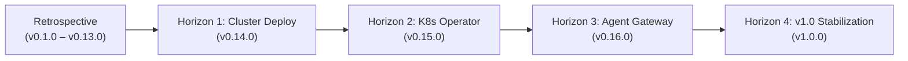

# linearctl Product & Architecture Roadmap

This document outlines the product vision, architecture milestones, and delivery horizons for `linearctl`.

`linearctl` serves as the Linear automation harness for human operators and autonomous agent networks. It operates across three distinct tiers:
1. **Developer CLI:** High-performance local terminal interface with offline SQLite caching.
2. **Agent Gateway:** Model Context Protocol (MCP) server for Claude Code and Cortex agent meshes.
3. **Cluster Operator:** Kubernetes controller reconciling Linear workspace state against cluster resources.

---

## Delivery Horizons



---

## Retrospective: Completed Milestones (v0.1.0 – v0.13.0)

The foundational CLI capabilities, local cache engine, and release pipeline are complete.

### Core CLI Foundations (M0 – M2)
- **Scaffolding & SDK Integration (M0):** Initial Bun project configuration with `@linear/sdk`.
- **Read Operations (M1):** Non-mutating commands (`whoami`, `digest`, `triage`, `stale`, `search`, `show`, `ratelimit`).
- **Write Operations (M2):** Mutating verbs with dry-run safety (`file`, `update`, `close`, `comment`, `project`, `batch`).

### Native Agent Capabilities (M4)
- **Interactive TUI:** Terminal user interface for fast triage and keyboard-driven navigation (CER-1550).
- **Watch Daemon:** Real-time polling mode for monitoring active ticket state changes (CER-1149).
- **Application Actor Identity:** Support for OAuth service actors without personal token attribution (CER-1148).

### Local SQLite ORM Cache (v0.11 – v0.12)
- High-performance local database storing issues, projects, and cycles (CER-2650 through CER-2664).
- Delta synchronization protocol using Linear GraphQL updated-at cursors.
- Sub-millisecond p99 local query engine for fast agent lookups.

### Workspace Reorganization & Hardening (v0.13.0)
- Team key lookup and resolution commands with cache fallback (CER-2612, PR #197).
- Reorganization batch write error recovery and automatic state re-read (PR #195).
- In-repo distroless container builds signed with Cosign and published to Harbor (CER-2647).

---

## Horizon 1: Production Cluster Deployment (Target: v0.14.0)

**Goal:** Run `linearctl` as an always-on deployment in the `unsigned-paas` Kubernetes cluster.

### Deliverables
- **ArgoCD GitOps Deployment:** Deploy Harbor image `platform/linearctl` and Helm chart `0.3.0` in the `linear-system` namespace.
- **Secret Integration:** Synchronize `LINEAR_API_KEY` from OpenBao through Kubernetes `ExternalSecret` resources.
- **Webhook Ingress:** Ingest `ProjectUpdate` and `AgentSession` webhooks through cluster ingress.
- **Digest Publication Sinks:** Deliver scheduled workspace digests to Linear Pulse, Slack, and email sinks.

### Acceptance Criteria
1. The `linearctl-orchestra` pod achieves leader election and reports healthy liveness probes.
2. Webhook endpoints accept signed Linear event payloads and queue background processing jobs.
3. Digest cron jobs execute on schedule without memory leaks or unhandled promise rejections.

---

## Horizon 2: Kubernetes Operator Mode (Target: v0.15.0)

**Goal:** Introduce `linearctl-operator` to reconcile declarative Kubernetes Custom Resources directly with Linear.

### Deliverables
- **Operator Runtime Skeleton (CER-1695):** Implement `linearctl operator` controller manager using `@kubernetes/client-node`.
- **`LinearProject` CRD (CER-1696):** Mirror Linear project metadata, milestone progress, and triage counts into Kubernetes status.
- **`LinearDigestSchedule` CRD (CER-1698):** Declaratively generate periodic digest JSON files directly into Kubernetes ConfigMaps.
- **`LinearTicketBinding` CRD (CER-1699):** Link Kubernetes resource lifecycles (Job completion, Deployment rollouts) to ticket state transitions.

```yaml
apiVersion: linear.cerebral.work/v1alpha1
kind: LinearTicketBinding
metadata:
  name: batch-job-binding
spec:
  ticket: CER-1695
  resource:
    apiVersion: batch/v1
    kind: Job
    name: build-worker-42
  rules:
    - when: Succeeded
      then: close
      comment: "Automated verification completed by cluster job."
```

### Acceptance Criteria
1. The operator binary runs inside the cluster and watches custom resource events.
2. Changes to bound Kubernetes jobs automatically update ticket states in Linear.
3. `LinearDigestSchedule` updates destination ConfigMaps according to configured cron intervals.

---

## Horizon 3: Reverie & Agent Mesh Supergateway (Target: v0.16.0)

**Goal:** Establish `linearctl` as the central ticket access layer for autonomous agent clusters.

### Deliverables
- **In-Cluster MCP Supergateway (CER-1693):** Deploy the Model Context Protocol server over internal cluster network endpoints.
- **Blackwall Dispatch Reconciliation (CER-1846):** Align structured task-plan generation and ticket execution contracts.
- **Cortex Mesh Bridge:** Stream real-time ticket assignment events directly into Cortex agent communication channels.
- **Automated Evidence Collection:** Attach verification artifacts and command logs to Linear tickets upon agent completion.

### Acceptance Criteria
1. In-cluster agents invoke Linear MCP tools without direct egress internet access.
2. Autonomous agent runs post structured completion comments with reproducible command evidence.
3. Cortex message events trigger targeted ticket triage passes.

---

## Horizon 4: Enterprise Distribution & v1.0.0 Stabilization (Target: v1.0.0)

**Goal:** Finalize the public interface, ensure binary integrity across platforms, and commit to semantic stability.

### Deliverables
- **macOS Notarization & Code Signing (CER-1760, CER-1150):** Sign darwin binaries through the automated release pipeline.
- **CLI Output Schema Freeze:** Freeze JSON schema outputs for all commands under strict compatibility guarantees.
- **Cache Migration Protocol:** Establish forward and backward migration guarantees for local SQLite database files.
- **Command Deprecation Policy:** Document formal lifecycle rules for command flag deprecation and removals.

### Acceptance Criteria
1. Darwin binaries execute on macOS systems without Gatekeeper warnings.
2. CLI JSON outputs validate against published JSON schemas in automated test suites.
3. Upgrades between sequential minor versions preserve existing local SQLite cache files without data loss.

---

## Linear Tracker Alignment

The following table maps delivery horizons to Linear project milestones and tracking issues:

| Horizon | Linear Milestone | Relevant Issues | Status | Target Date |
| :--- | :--- | :--- | :--- | :--- |
| **Shipped** | M0 · Scaffold | CER-1000..CER-1010 | Closed | 2026-06-30 |
| **Shipped** | M1 · Read commands | CER-1011..CER-1030 | Closed | 2026-07-15 |
| **Shipped** | M2 · Write + batch | CER-1031..CER-1050 | Closed | 2026-07-28 |
| **Shipped** | M4 · Native agent | CER-1148, CER-1149, CER-1550 | Closed | 2026-09-30 |
| **Shipped** | Local Ticket Copy ORM Cache | CER-2650..CER-2664 | Closed | 2026-10-08 |
| **Horizon 1** | Production Deployment | CER-2647 | In Progress | 2026-10-20 |
| **Horizon 2** | Kubernetes Operator | CER-1695, CER-1696, CER-1698, CER-1699 | Backlog | 2026-11-15 |
| **Horizon 3** | reverie Cloud Tie-In | CER-1693, CER-1846 | Backlog | 2026-11-30 |
| **Horizon 4** | Release / Packaging | CER-1760, CER-1150 | Backlog | 2026-12-15 |
