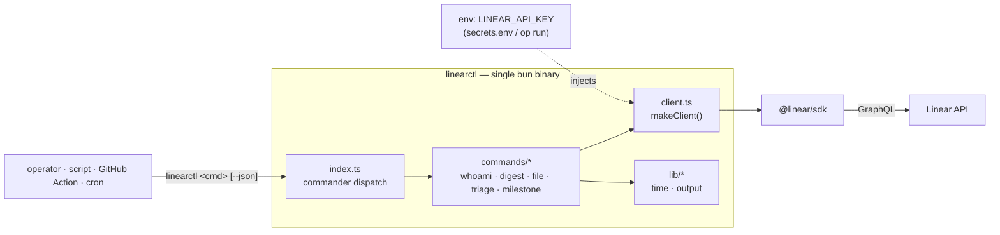
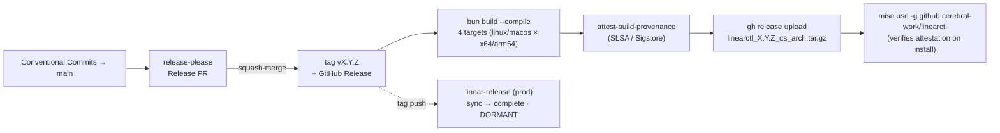
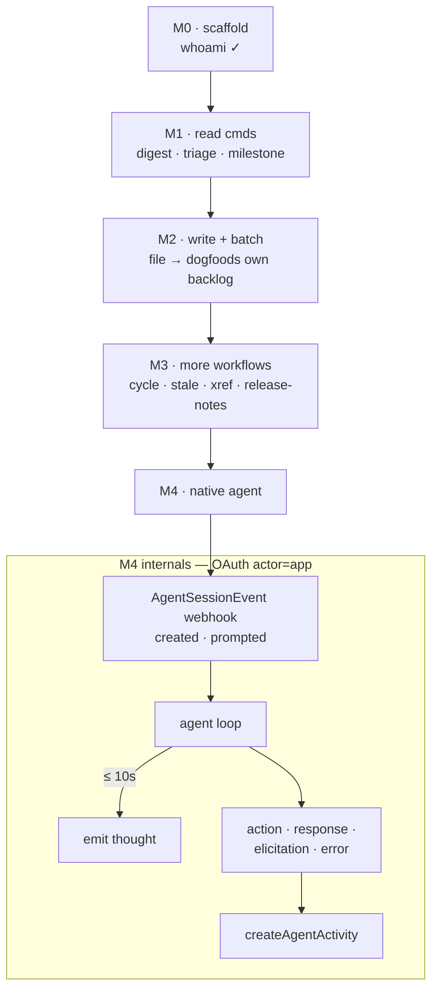

# `linearctl` — Specification

**Status:** command surface complete. Every command in §6 — `whoami`, `digest`,
`file`, `triage`, `milestone` (incl. `create`), `project` (incl. `update`), `roadmap`,
`update`/`close`, `stale`, `xref`, `show`, `ratelimit`, `doc`, `comment`, and `mcp serve`
(MCP server for Claude Desktop / Code) — is implemented **and verified against the live API**. Built +
shipped with **bun**.

**Tooling rationale** (bun vs npm, what we declined and why) lives in
[`docs/decisions.md`](./decisions.md). This document is the product + design
contract; the code catches up to it, milestone by milestone.

---

## 1. Motivation

A handful of Linear workflows get **re-improvised every session** — assembled ad
hoc from MCP tool calls, then thrown away:

- *"What have we been up to?"* — the session-start summary of recent issue activity.
- *Filing issues / specs in bulk* — repeatedly hit the **local MCP `save_issue`
  rate-guard** ("5th save_issue in 10 min" → blocked mid-batch).
- *Triage sweeps* — unassigned / unestimated / in-Triage issues.
- *Milestone tracking* — "knock out the milestones before the release-please swap"
  needs a progress read.

These are **interactive, in-session, one-shot** today. They can't run headless
(cron, CI, a git hook, a `| jq` pipeline), they aren't reproducible, and they share
the local hypervisor's MCP rate-guard with every other agent action. `linearctl`
makes them **first-class, scriptable, composable commands** on the official
[`@linear/sdk`](https://www.npmjs.com/package/@linear/sdk).

## 2. Goals / Non-goals

**Goals** — one small fast CLI for the recurring jobs; headless + `--json`
everywhere; honest auth (env-only, never stored/printed); composable with cron /
CI / git hooks; a clean path from CLI → native Linear agent.

**Non-goals** — not a replacement for the Linear MCP server or web app (covers the
*recurring* flows, not the full API); not a general issue browser; no destructive
operations beyond the explicitly-modelled writes.

## 3. Positioning vs existing skills (gap-filler, not duplication)

The in-session skills are **interactive** — a human/agent drives them one issue at
a time through the MCP server. `linearctl` is the **headless / batch / CI**
complement to the same jobs, in a **different rate-limit domain** (§9).

| `linearctl` command | Complements skill | Why a CLI is the gap-filler |
|---|---|---|
| `linearctl digest` | *(none — net-new)* | The session-start "what have we been up to" summary, made reproducible and pipeable. |
| `linearctl file` | `file-bug`, `linear-file-spec` | Interactive + MCP-bound today; `linearctl file` runs in scripts/CI/loops and **sidesteps the local MCP `save_issue` rate-guard**. |
| `linearctl triage` | `issue-triage` | The skill reasons about one issue; `linearctl triage` is a fast headless *listing* to feed it, a standup, or a CI gate. |
| `linearctl milestone` | *(none — net-new)* | Milestone burn-down for the release-readiness check. |
| `linearctl whoami` | *(none)* | Auth smoke-test / the thin slice. |

Rule of thumb: **skills decide, `linearctl` enumerates and executes in bulk.**

## 4. Architecture



- **Runtime/build:** **bun** (pinned `1.3.14`). `bun run dev` from source; `bun
  build --compile --minify` → a standalone `dist/linearctl`. `tsc --noEmit` is the
  type-checker (bun strips types). ESM, `strict`.
- **Deps:** `@linear/sdk`, `commander`. Dev: `typescript`, `@types/bun`. Minimal.
- **Output contract:** human table by default; `--json` → structured JSON on
  stdout (logs/errors on stderr) so every command composes with `jq`.
- **Exit codes:** `0` ok · `1` runtime/auth error · `2` not-yet-implemented (a stub
  is never mistaken for a silent success).

## 5. Authentication & secrets

`linearctl` reads a Linear **personal API key** from `LINEAR_API_KEY`. Provision it
from your secret manager (e.g. 1Password rendered into your shell at `chezmoi
apply` time), or inject it per-run:

```bash
# inject the key from your secret manager for one run (1Password shown)
LINEAR_API_KEY="op://<vault>/<item>/<field>" op run -- linearctl whoami
```

The key is **never** stored, cached, logged, or printed; `*.env` is git-ignored.

A native OAuth `actor=app` path is now implemented (T13 / CER-1148) — see
§10 and `linearctl auth --help`. The OAuth path is **additive**: existing
commands keep the env-only `LINEAR_API_KEY` contract; `linearctl auth
client-credentials` mints a 30-day app-actor token from the
`linear-unsigned-oauth` 1Password item for the revenant bot / `linearctl watch`
daemon; `auth exchange-code` / `auth refresh` cover the browser install path.

## 6. Command reference

### 6.1 `linearctl whoami` — *implemented + verified*
`linearctl whoami [--json]`. Resolves `client.viewer` + `client.organization`. The thin
slice proving auth end-to-end; run it first on any new machine.

### 6.2 `linearctl digest` — *implemented + verified*
`linearctl digest [--since 7d] [--team CER...] [--json]`. Issues updated within the
window, grouped by workflow-state type (completed / started / unstarted / triage /
backlog / canceled). Filter `{ updatedAt: { gte }, team?: { key: { in } } }`,
`orderBy: updatedAt`, fully paginated via `fetchNext()`. `--team` is repeatable;
omit it (or pass `all`) for every accessible team.

### 6.3 `linearctl file` — *implemented + verified*
`linearctl file <title> --team CER [--project ID] [--desc <md|->] [--label name...] [--json]`.
Create an issue headless; `--desc -` reads markdown from stdin. Resolve team by key,
resolve `--label` names → IDs (case-insensitive, `pickLabelIds` errors on any
unmatched), `createIssue({ teamId, title, description, projectId, labelIds })`, print
`identifier` + `url`. Batch-friendly with backoff (§9; batch mode is T6, not yet built).

### 6.4 `linearctl triage` — *implemented + verified*
`linearctl triage [--team CER...] [--json]`. Active-state issues (completed /
canceled excluded) in the **Triage** state, **or** unassigned, **or** unestimated,
**or** no-priority. Each row flags *why* it surfaced (reasons computed per issue).
Fully paginated. `--team` is repeatable; omit it (or `all`) for every team. The
grooming SURFACE step (RFC §3.2).

### 6.5 `linearctl milestone` — *implemented + verified*
`linearctl milestone [--project ID] [--json]`. Per-milestone burn-down (issues done
vs total, percent + ASCII bar) for a project; omit `--project` for all accessible
milestones. `--project` accepts a UUID, slug id, or name. Counts come from two
filtered issue queries per milestone (total, and `state.type = completed`) — no
per-issue N+1. Backs the release-readiness check.

### 6.6 `linearctl project` — *implemented + verified (create, list)*
`linearctl project create <name> --team CER [--desc <md|->] [--json]` and
`linearctl project list [--team CER] [--json]`. The Project container that `file`'s
issues attach to — the first half of the M2 dogfood loop (create the project, then
`file` its backlog into it). `create` resolves the team by key
(`teams({ filter: { key: { eq } } })`), calls `createProject({ name, teamIds, description })`,
and prints `name` + `url` + `id`. `list` shows projects (optionally team-scoped) as a
table of name / state / progress / id. `--desc -` reads markdown from stdin.

### 6.7 `linearctl mcp serve` — *implemented + verified*
`linearctl mcp serve`. Runs a stdio Model Context Protocol server
(`@modelcontextprotocol/sdk`) exposing linearctl's capabilities as tools to Claude
Desktop / Claude Code — the shared core behind the plugin track (`docs/plugin-spec.md`).
Tools call the same `src/core/*` fns as the CLI:
- **read** (`readOnlyHint`): `whoami`, `project_list`, `digest`, `triage`,
  `milestone`, `stale`, `project_overview_get`.
- **write** (non-destructive): `file_issue`, `project_create`, `issue_update`,
  `issue_close`, `project_overview_set`, `comment_issue`. No delete/archive tool
  (`docs/plugin-spec.md` D6).

Speaks JSON-RPC on stdout (logs to stderr only); `LINEAR_API_KEY` validated at
startup. Tool errors are returned as `isError` results, never crashes.

### 6.8 `linearctl update` / `close` — *implemented + verified*
`linearctl update <id> [--state <name>] [--assignee me|email|name|id] [--label name...]
[--project ID] [--priority 0-4] [--json]` and `linearctl close <id> [--json]`. Mutate
an issue: state / assignee / labels (replace) / project / priority, resolved by name
against the issue's own team; `<id>` accepts a UUID **or** an identifier (`CER-123`).
`close` moves the issue to the team's completed state (prefers one named "Done").
Backs the MCP `issue_update` / `issue_close` tools — the headless write loop
(file → update → close). No delete/archive (`docs/plugin-spec.md` D6).

### 6.9 `linearctl stale` — *implemented + verified*
`linearctl stale [--team CER...] [--older-than 30d] [--label NAME [--apply]] [--json]`.
Sweep active-state issues by last-update age (RFC §3.2 stale-sweep), bucketed
**warn** (older than `--older-than`, default 30d) and **critical** (older than ~90d
→ close-or-justify). **Read-only by default.** `--label NAME` adds a label to the
surfaced issues via `addedLabelIds` (preserves existing labels), but only writes
with `--apply` — otherwise it is a dry-run preview. Never closes an issue. Fully
paginated; `--team` repeatable. With `triage`, satisfies the RFC §3.4 audit.

### 6.10 `linearctl xref` — *implemented + verified*
`linearctl xref [--repo owner/repo] [--team CER...] [--limit 50] [--json]`.
**Read-only** PR↔ticket reconcile (RFC §3.4). Scans open + merged GitHub PRs (via
`gh`) for `KEY-N` refs, validates each against Linear (so non-tickets like
`UTF-8` are ignored), and reports: in-flight PRs naming no ticket, merged PRs
naming no ticket, merged PRs whose ticket isn't Done, and — when `--team` scopes
the prefixes — prefix-matching refs pointing at no real ticket. **Requires the
GitHub CLI (`gh`) installed + authenticated** — the only verb with a non-Linear
dependency; it errors clearly (never crashes) if `gh` is unavailable. `--repo`
omitted uses the current directory's repo.

**`--fix [--apply]`** turns findings into ticket-state remediation: a merged PR
whose body **closes** the ref (`Closes`/`Fixes`/`Resolves`) plans a close; a bare
ref (branch/title/`Refs`) on a never-started ticket (unstarted/backlog/triage)
plans a move to the team's started state — a merged slice never completes a
parent. Already-started and canceled tickets are untouched. Dry-run unless
`--apply` (the 2026-07-01 live run caught a PR body that said "Closes
<umbrella> Bucket 1" — the preview is the guard against lying magic words).

### 6.11 `linearctl show` — *implemented + verified*
`linearctl show <id> [--json]`. Read one issue in full: metadata (state,
assignee, priority, project, labels, parent, timestamps) + description. The
read half `update`/`close` lacked — ticket scope no longer requires PR-body
archaeology.

### 6.12 `linearctl ratelimit` — *implemented + verified*
`linearctl ratelimit [--json]`. Spec §7 item 7 / T18, shipped: probes the org
quota with a complexity-1 viewer query and reads `X-RateLimit-*` off the raw
response (requests + complexity axes, reset as ISO). Exit `2` when either axis
is exhausted so `&&`-chains abort; an unreadable probe is **not** exhausted
(never aborts a batch that might have headroom).

### 6.13 `linearctl doc` — *implemented + verified (read path live; write path unit-tested)*
`linearctl doc get-overview --project <ref> [--json]` / `doc set-overview
--project <ref> --file <md|-> [--json]`. Read / replace a project's **overview
document** (`Project.content`, markdown — the UI's Overview tab). `get` prints
raw markdown (pipe to a file); `set` is a whole-document replace from a file or
stdin and **refuses empty content** (blanking an overview is a delete, not an
update). Closes the headless gap behind the unsigned-paas house rule that plan
docs mirror to the Linear project overview. MCP: `project_overview_get` /
`project_overview_set`.

### 6.14 `linearctl comment` — *implemented + verified*
`linearctl comment <id> --body <md|-> [--json]`. Add a comment to an issue
headless — the write mutation between `update`/`close` (mutate fields) and
`show` (read). `--body` is required; `--body -` reads markdown from stdin (same
convention as `file --desc -`). No `--apply` gate — a comment is
non-destructive (additive), so safe-by-default is satisfied without a dry-run
flag. Single Linear mutation: `createComment({ issueId, body })`. MCP:
`comment_issue` (non-destructive, not read-only). See `docs/features/comment.md`.


### 6.15 `linearctl milestone create` — *implemented + verified*
`linearctl milestone create <name> --project <ref> [--target-date <YYYY-MM-DD>] [--desc <md|->] [--json]`.
Create a project milestone — the grouping unit behind Linear's roadmap view.
`--project` accepts name or UUID (same as `file --project`); `--target-date` is
optional (YYYY-MM-DD, Linear's `TimelessDate` scalar); `--desc` optional markdown
(same `-` stdin convention). Emits the milestone UUID + name. See CER-1686.

### 6.16 `linearctl project update` — *implemented + verified*
`linearctl project update <ref> [--state <state>] [--name <name>] [--desc <md|->] [--json]`.
Update a project's state, name, or description. `<ref>` accepts project name or
UUID. `--state` sets the project status type (backlog, planned, started, paused,
completed, canceled) — resolved against the workspace's project-status set. At
least one mutation flag is required. See CER-1687.

### 6.17 `linearctl roadmap` — *implemented + verified*
`linearctl roadmap --project <ref> [--json]`. Render a project roadmap: a
milestone timeline with target dates, progress bars (done/open), and issue
lists per milestone. Sorted by target date (undated first). `--json` emits
structured milestone + issue data for piping. If a project has no milestones,
suggests `milestone create`. See CER-1688.

### 6.18 `linearctl auth` — *implemented + verified (contract tests; live mint pending operator gate)*
`linearctl auth <verb>` — OAuth token lifecycle for the `linear-unsigned-oauth`
1Password item (the `unsigned-gg` Linear bot). Four verbs covering the two
OAuth paths (spec §5):

- `auth client-credentials [--scope ...] [--json]` — **Path A** (recommended for
  the revenant bot): mints a 30-day app-actor token via the
  `client_credentials` grant (server-to-server, no browser, no refresh token).
  Reads `client_id` + `client_secret` from 1Password by field ID. Requires the
  "client credentials tokens" toggle ON on the Linear OAuth app (operator
  question §7 q1).
- `auth exchange-code <code> [--redirect-uri ...] [--json]` — **Path B**: trades an
  authorization_code (from the dc `/oauth/linear/callback` redirect) for a 24h
  access_token + refresh_token.
- `auth refresh <refreshToken> [--json]` — **Path B refresh**.
- `auth whoami [--token <token>] [--user] [--json]` — verify a token resolves as
  the expected actor (`actorKind: "app"` proves `actor=app` worked). Defaults to
  the `dev_app_token` 1Password field; `--user` uses `dev_user_token`; `--token`
  verifies an arbitrary token (e.g. one just minted).

The OAuth path is **additive** — existing commands keep the env-only
`LINEAR_API_KEY` contract. Token values flow through stdout (the caller's
responsibility to capture via `--json`); they are never written to disk or
logs. See `src/lib/oauth.ts` (transport), `src/lib/secrets.ts` (1Password),
`src/core/auth.ts` (orchestration), `src/commands/auth.ts` (CLI). CER-1148.
## 7. Proposed additional workflows (backlog)

Surfaced from patterns this codebase already exercises:

1. **`linearctl cycle`** — current-cycle review: scope, completed, carry-over, scope-change.
2. **`linearctl stale [--older 30d]`** — in-progress issues untouched for *N* days (rot detector).
3. **`linearctl xref [--pr N]`** — ~~PR ↔ issue cross-ref audit~~ *shipped* (§6.10, incl. `--fix`).
4. **`linearctl release-notes <from>..<to>`** — notes assembled from issues *completed* in a range, grouped by label (feeds `cut-release` / `linear-release`).
5. **`linearctl standup [--slack #chan]`** — render `digest` as a standup; **operator-gated** Slack send (never auto-post).
6. **`linearctl watch` (daemon)** — the bridge to §10: subscribe to webhooks and react.
7. *(shipped — §6.12)* **`linearctl ratelimit`** — probe the org-level Linear API quota before a batch run: remaining request budget + reset timestamp. Lets a batch agent gate itself on headroom rather than discovering exhaustion mid-batch via a `RATELIMITED` error. `--json` for scripted gates; exit `2` when quota is at zero so `&&`-chains abort cleanly. (Observed pain-point: a 32-issue filing run exhausted the 2500 req/hr ceiling with no prior visibility; this command closes that gap.)
8. *(shipped — §6.13)* **`linearctl doc`** — get/set a project's overview document headlessly. (Observed pain-point: the unsigned-paas house rule mirrors plan docs to the Linear project overview, which was unfulfillable without the UI.)

## 8. Distribution & release

**Single binary via bun, consumed through mise** — the same install UX as the
operator's `ant` / `linear-release` tools.



- **release-please** (`release-type: node`, `bump-minor-pre-major`) maintains a
  Release PR from Conventional Commits; merging tags `vX.Y.Z` + cuts a GitHub
  Release, which fans out the bun cross-compile matrix.
- **Attestation** (`actions/attest-build-provenance`) Sigstore-signs each tarball
  digest — producer-agnostic, so a bun binary is gated on install exactly like a Go
  one. mise's `github:` backend verifies SLSA provenance + attestations by default.
- **Caveat:** bun binaries embed the runtime → **~60–92 MB per platform per
  release** (vs a ~7 MB Go binary). Accepted for a pinned-version internal CLI; see
  ADR-0001. `--bytecode` is intentionally **off** (it grows the file).
- **CI smoke** compiles the binary and runs it (`--version`) on every PR, so a
  compile or **module-load / bundling** failure (the binary won't build or start —
  the `@linear/sdk` import executes at module load) is caught at PR time. Note
  [bun#11785](https://github.com/oven-sh/bun/issues/11785) is a graphql *server*
  schema-realm fault; `@linear/sdk` is a client and never builds a schema, so it
  cannot trip it — that is *why* bun is safe here (verified by the research
  compile + run), not something the smoke can guard.
- **MCP handshake smoke** (`test/mcp-handshake.test.ts`, runs in `bun test`):
  spawns `mcp serve`, completes the initialize + `tools/list` handshake, and
  asserts the tool surface — catches a broken server or bad tool registration at
  PR time. Runs offline (a dummy `LINEAR_API_KEY`; registration makes no API call).
- **macOS:** unsigned Mach-O binaries are Gatekeeper-quarantined on download —
  notarization / `xattr -d com.apple.quarantine` is a tracked ticket (T15).

## 9. Rate-limit posture (honest)

| Limiter | Whose | What `linearctl` does |
|---|---|---|
| Local MCP `save_issue` guard ("5 in 10 min") | **Ours** (hypervisor) | **Sidestepped** — `linearctl` calls Linear directly, not via the local MCP. The batch-filing win. |
| Linear API complexity / `RATELIMITED` | **Linear's** | **Still applies.** Back off, batch, prefer one filtered query over N round-trips. A higher ceiling, not magic. |

Claiming `linearctl` "fixes rate limits" would be false. It moves batch work out from under
a *self-imposed* guard; Linear's real limits remain and are respected.

**Missing capability (filed as T18):** there is currently no way to *probe* the Linear API rate-limit state before issuing calls. Batch agents discover exhaustion only when a call fails with `RATELIMITED`, which is too late (mid-batch, partial state). `linearctl ratelimit` (see §7 item 7) will surface `X-RateLimit-Remaining` / reset headers so a caller can check headroom with a single cheap query and abort or sleep before the batch rather than after.

## 10. Roadmap: CLI → native Linear agent

The biggest leverage is evolving from a CLI you run into an **agent assigned to
issues** that reacts to webhooks. (Research: linear.app/developers AIG + SDK.)



**What a native agent implements** (from the Agent Interaction Guidelines):

- **OAuth `actor=app`** workspace install (admin-approved), scopes
  `app:assignable` + `app:mentionable` (assignment/mention triggers), plus
  `read`/`write` and `customer:*` / `initiative:*` as needed. Create an
  Application, enable webhooks → **"Agent session events"** (+ inbox notifications).
- **Webhook lifecycle:** `created` (a mention/delegation starts a session — begin
  the agent loop, emit a `thought` **within 10 s**, use `promptContext`); `prompted`
  (a new user message in an existing session).
- **Activities** (`createAgentActivity`): `thought`, `action` (with optional
  `result`), `response`, `elicitation`, `error`. Read history via
  `agentSession.activities()`, narrowing on `content.__typename`.
- **Attribution:** issues created by the agent use `createAsUser` + `displayIconUrl`.
- **Roadmap-adjacent (not infra now):** **Pulse** (AI summaries) and **project
  updates / status updates** are surfaces `linearctl` can read into `digest` / write from
  `standup` later — captured here, not scaffolded.

This is the structural upgrade the "surface insights from agents" ask points at.
Cross-cutting SDK practice: resolve relations in the query (the SDK lazy-fetches
`.state` / `.assignee` → N+1 traps), always paginate, treat connections as cursors.

## 11. Verification checklist (before any command is "working")

- [ ] `bun run typecheck` clean · `bun test` green · `bun run build` compiles + runs.
- [ ] `linearctl whoami` returns the expected viewer + org (✓ done).
- [ ] Each read command verified against live data before M1 is declared done.
- [ ] No secret in git history; `*.env` ignored (verified pre-first-commit).

## 12. First-pass tickets (the backlog)

These live here for now. The project **files its own backlog via `linearctl file`** once
M2 lands — the dogfooding loop (don't hand-file them to Linear; that's outward-facing
and would hit the rate-guard). Titles are Conventional-Commit-ready.

| # | Title | Milestone | Scope |
|---|---|---|---|
| T1 | `feat(digest): recent-activity digest` — *shipped (§6.2)* | M1 | filter updatedAt+team, group by state.type, `--json` |
| T2 | `feat(triage): triage listing` — *shipped (§6.4)* | M1 | triage-state / unassigned / unestimated; flag *why* |
| T3 | `feat(milestone): milestone burn-down` — *shipped (§6.5)* | M1 | per-milestone done vs open + bar |
| T4 | `test: live-API contract tests behind a key gate` — *shipped* | M1 | verify each read cmd vs live data (`test/live-contract.test.ts`) |
| T5 | `feat(file): headless issue creation` — *shipped (§6.3)* | M2 | resolve team by key, `createIssue`, stdin desc, print id+url |
| T6 | `feat(file): batch mode + RATELIMITED backoff` — *shipped (§6.3)* | M2 | read N from stdin/file, exponential backoff (`src/core/file-batch.ts`) |
| T7 | `feat(cli): output contract polish (table/--json)` — *shipped* | M1 | consistent rendering across commands (`src/lib/output.ts`) |
| T8 | `feat(cycle): current-cycle review` — *shipped* | M3 | scope / completed / carry-over / scope-change (`src/commands/cycle.ts`) |
| T9 | `feat(stale): stale in-progress sweep` — *shipped (§6.9)* | M3 | untouched > N days |
| T10 | `feat(xref): PR↔issue cross-ref audit` — *shipped (§6.10)* | M3 | open PRs w/o issue; done issues w/o merged PR |
| T11 | `feat(release-notes): notes from completed issues` — *shipped* | M3 | range → grouped by label (`src/commands/release-notes.ts`) |
| T12 | `feat(standup): render digest (+ operator-gated Slack)` — *shipped (read path; Slack send deferred)* | M3 | never auto-post (`src/commands/standup.ts`) |
| T13 | `feat(agent): OAuth actor=app scaffolding` — *shipped (§6.18 `linearctl auth`; CER-1148)* | M4 | `auth client-credentials` (Path A, 30d app token) + `auth exchange-code` / `auth refresh` (Path B); credentials read from 1Password `linear-unsigned-oauth` item by field ID; **CER-1148** |
| T14 | `feat(agent): linearctl watch — AgentSessionEvent daemon` | M4 | created/prompted loop, 10s thought, activities — **CER-1149** |
| T15 | `chore(release): macOS notarization / codesign` — *pipeline built (ADR-0007); gated on Apple Developer Program enrollment (CER-1150)* | M2 | Gatekeeper quarantine fix for darwin assets; build-darwin job on `macos-latest`, dormant-until-keyed |
| T16 | `ci: SHA-pin all GitHub Actions` — *shipped* | M1 | supply-chain hardening (all workflows pin to commit SHA) |
| T17 | `feat(project): create + list Linear projects` — *shipped (§6.6)* | M2 | resolve team by key, `createProject`, print id+url; the dogfood-loop container for `file` |
| T18 | `feat(ratelimit): expose API rate-limit quota + reset time` — *shipped (§6.12)* | M3 | lightweight introspection query → `remaining` / `resetAt`; `--json`; exit `2` when exhausted so batch scripts abort before filing; surfaces `X-RateLimit-*` headers from `@linear/sdk` response metadata |
| T19 | `feat(doc): project overview get/set` — *shipped (§6.13)* | M3 | `doc get-overview` / `doc set-overview --file <md\|->` on `Project.content`; whole-document replace, empty-content guard; MCP `project_overview_get`/`_set` |
| T20 | `feat(milestone): create project milestones` — *shipped (§6.15)* | M3 | `milestone create <name> --project <ref> [--target-date] [--desc]`; resolves project name→UUID; emits milestone UUID (CER-1686) |
| T21 | `feat(project): update project state/name/description` — *shipped (§6.16)* | M3 | `project update <ref> [--state] [--name] [--desc]`; resolves state by type against workspace project-status set (CER-1687) |
| T22 | `feat(roadmap): milestone timeline view` — *shipped (§6.17)* | M3 | `roadmap --project <ref> [--json]`; milestone timeline with progress + issue lists, sorted by target date (CER-1688) |
| T23 | `chore(dev): dev loop scripts + CONTRIBUTING.md` — *shipped (PR #90)* | M3 | `dev:watch`, `test:watch`, `test:fast`, `ci`, `dev:all`, `quick`, `lint` npm scripts + dev onboarding guide |
| T24 | `feat(pull): --limit for bounded smoke loops + updatedAt invariant` — *shipped (PR #96)* | M3 | `pull --limit N` caps result count; pagination guard + slice; `updatedAt` load-bearing dedup invariant documented in funnel contract |
| T25 | `feat(loops): Linear Loop recipe catalog` — *shipped (PR #97)* | M3 | `.linearctl/loop-recipes/` catalog + linter; recipes for recurring Linear workflows (digest, triage, stale, xref) expressed as composable loop definitions |
| T26 | `test: core module coverage (milestone, project, roadmap, pull, digest, stale, triage, cycles, documents, issues, whoami, bulk, comments)` — *shipped (PRs #94/#95 + direct)* | M3 | 130 new tests (108→238 pass, 229→470 expects); stubbed LinearClient pattern for every core module; lefthook pre-commit typecheck |
