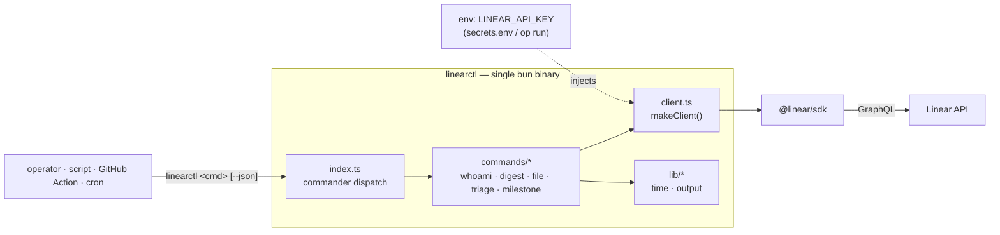
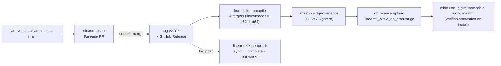
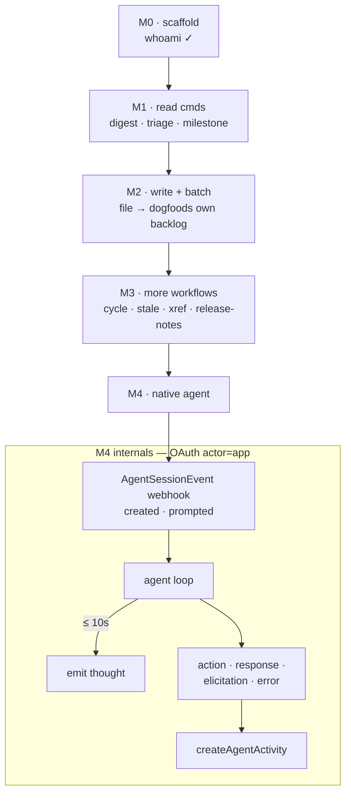

# `linearctl` — Specification

**Status:** v0.1 scaffold, pre-code. `whoami` implemented **and verified against
the live API**; `digest` / `file` / `triage` / `milestone` are
specified-but-stubbed (full CLI surface — `--help`, `--json`, required-options —
with bodies that exit `2` and point here). Built + shipped with **bun**.

**Tooling rationale** (bun vs npm, what we declined and why) lives in
[`docs/decisions.md`](./decisions.md). This document is the product + design
contract; the code catches up to it, milestone by milestone.

---

## 1. Motivation

A handful of Linear workflows get **re-improvised every session** — assembled ad
hoc from MCP tool calls, then thrown away:

- *"What have we been up to?"* — the session-start summary of recent issue activity.
- *Filing issues / specs in bulk* — repeatedly hit the **local MCP `save_issue`
  rate-guard** ("5th save_issue in 10 min" → blocked mid-batch).
- *Triage sweeps* — unassigned / unestimated / in-Triage issues.
- *Milestone tracking* — "knock out the milestones before the release-please swap"
  needs a progress read.

These are **interactive, in-session, one-shot** today. They can't run headless
(cron, CI, a git hook, a `| jq` pipeline), they aren't reproducible, and they share
the local hypervisor's MCP rate-guard with every other agent action. `linearctl`
makes them **first-class, scriptable, composable commands** on the official
[`@linear/sdk`](https://www.npmjs.com/package/@linear/sdk).

## 2. Goals / Non-goals

**Goals** — one small fast CLI for the recurring jobs; headless + `--json`
everywhere; honest auth (env-only, never stored/printed); composable with cron /
CI / git hooks; a clean path from CLI → native Linear agent.

**Non-goals** — not a replacement for the Linear MCP server or web app (covers the
*recurring* flows, not the full API); not a general issue browser; no destructive
operations beyond the explicitly-modelled writes.

## 3. Positioning vs existing skills (gap-filler, not duplication)

The in-session skills are **interactive** — a human/agent drives them one issue at
a time through the MCP server. `linearctl` is the **headless / batch / CI**
complement to the same jobs, in a **different rate-limit domain** (§9).

| `linearctl` command | Complements skill | Why a CLI is the gap-filler |
|---|---|---|
| `linearctl digest` | *(none — net-new)* | The session-start "what have we been up to" summary, made reproducible and pipeable. |
| `linearctl file` | `file-bug`, `linear-file-spec` | Interactive + MCP-bound today; `linearctl file` runs in scripts/CI/loops and **sidesteps the local MCP `save_issue` rate-guard**. |
| `linearctl triage` | `issue-triage` | The skill reasons about one issue; `linearctl triage` is a fast headless *listing* to feed it, a standup, or a CI gate. |
| `linearctl milestone` | *(none — net-new)* | Milestone burn-down for the release-readiness check. |
| `linearctl whoami` | *(none)* | Auth smoke-test / the thin slice. |

Rule of thumb: **skills decide, `linearctl` enumerates and executes in bulk.**

## 4. Architecture



- **Runtime/build:** **bun** (pinned `1.3.14`). `bun run dev` from source; `bun
  build --compile --minify` → a standalone `dist/linearctl`. `tsc --noEmit` is the
  type-checker (bun strips types). ESM, `strict`.
- **Deps:** `@linear/sdk`, `commander`. Dev: `typescript`, `@types/bun`. Minimal.
- **Output contract:** human table by default; `--json` → structured JSON on
  stdout (logs/errors on stderr) so every command composes with `jq`.
- **Exit codes:** `0` ok · `1` runtime/auth error · `2` not-yet-implemented (a stub
  is never mistaken for a silent success).

## 5. Authentication & secrets

`linearctl` reads a Linear **personal API key** from `LINEAR_API_KEY`. Provision it
from your secret manager (e.g. 1Password rendered into your shell at `chezmoi
apply` time), or inject it per-run:

```bash
# inject the key from your secret manager for one run (1Password shown)
LINEAR_API_KEY="op://<vault>/<item>/<field>" op run -- linearctl whoami
```

The key is **never** stored, cached, logged, or printed; `*.env` is git-ignored. A
native OAuth `actor=app` path is future work (§10).

## 6. Command reference

### 6.1 `linearctl whoami` — *implemented + verified*
`linearctl whoami [--json]`. Resolves `client.viewer` + `client.organization`. The thin
slice proving auth end-to-end; run it first on any new machine.

### 6.2 `linearctl digest` — *specified*
`linearctl digest [--since 7d] [--team CER] [--json]`. Issues updated within the window,
grouped by workflow-state type (completed / started / triage / backlog). Filter
`{ updatedAt: { gte }, team?: { key: { eq } } }`, `orderBy: updatedAt`, paginate via
`fetchNext()`.

### 6.3 `linearctl file` — *specified*
`linearctl file <title> --team CER [--project ID] [--desc <md|->] [--label name...] [--json]`.
Create an issue headless; `--desc -` reads markdown from stdin. Resolve team by key,
`createIssue({ teamId, title, description, projectId })`, print `identifier` + `url`.
Batch-friendly with backoff (§9).

### 6.4 `linearctl triage` — *specified*
`linearctl triage --team CER [--json]`. Issues in the **Triage** state, **or** unassigned,
**or** unestimated. Output flags *why* each surfaced.

### 6.5 `linearctl milestone` — *specified*
`linearctl milestone [--project ID] [--json]`. Per-milestone burn-down (done vs open,
percent + bar) for a project. Backs the release-readiness check.

## 7. Proposed additional workflows (backlog)

Surfaced from patterns this codebase already exercises:

1. **`linearctl cycle`** — current-cycle review: scope, completed, carry-over, scope-change.
2. **`linearctl stale [--older 30d]`** — in-progress issues untouched for *N* days (rot detector).
3. **`linearctl xref [--pr N]`** — PR ↔ issue cross-ref audit (complements `pr-triage`; ties to linear-release linkage).
4. **`linearctl release-notes <from>..<to>`** — notes assembled from issues *completed* in a range, grouped by label (feeds `cut-release` / `linear-release`).
5. **`linearctl standup [--slack #chan]`** — render `digest` as a standup; **operator-gated** Slack send (never auto-post).
6. **`linearctl watch` (daemon)** — the bridge to §10: subscribe to webhooks and react.

## 8. Distribution & release

**Single binary via bun, consumed through mise** — the same install UX as the
operator's `ant` / `linear-release` tools.



- **release-please** (`release-type: node`, `bump-minor-pre-major`) maintains a
  Release PR from Conventional Commits; merging tags `vX.Y.Z` + cuts a GitHub
  Release, which fans out the bun cross-compile matrix.
- **Attestation** (`actions/attest-build-provenance`) Sigstore-signs each tarball
  digest — producer-agnostic, so a bun binary is gated on install exactly like a Go
  one. mise's `github:` backend verifies SLSA provenance + attestations by default.
- **Caveat:** bun binaries embed the runtime → **~60–92 MB per platform per
  release** (vs a ~7 MB Go binary). Accepted for a pinned-version internal CLI; see
  ADR-0001. `--bytecode` is intentionally **off** (it grows the file).
- **CI smoke** compiles the binary and runs it (`--version`) on every PR, so a
  compile or **module-load / bundling** failure (the binary won't build or start —
  the `@linear/sdk` import executes at module load) is caught at PR time. Note
  [bun#11785](https://github.com/oven-sh/bun/issues/11785) is a graphql *server*
  schema-realm fault; `@linear/sdk` is a client and never builds a schema, so it
  cannot trip it — that is *why* bun is safe here (verified by the research
  compile + run), not something the smoke can guard.
- **macOS:** unsigned Mach-O binaries are Gatekeeper-quarantined on download —
  notarization / `xattr -d com.apple.quarantine` is a tracked ticket (T15).

## 9. Rate-limit posture (honest)

| Limiter | Whose | What `linearctl` does |
|---|---|---|
| Local MCP `save_issue` guard ("5 in 10 min") | **Ours** (hypervisor) | **Sidestepped** — `linearctl` calls Linear directly, not via the local MCP. The batch-filing win. |
| Linear API complexity / `RATELIMITED` | **Linear's** | **Still applies.** Back off, batch, prefer one filtered query over N round-trips. A higher ceiling, not magic. |

Claiming `linearctl` "fixes rate limits" would be false. It moves batch work out from under
a *self-imposed* guard; Linear's real limits remain and are respected.

## 10. Roadmap: CLI → native Linear agent

The biggest leverage is evolving from a CLI you run into an **agent assigned to
issues** that reacts to webhooks. (Research: linear.app/developers AIG + SDK.)



**What a native agent implements** (from the Agent Interaction Guidelines):

- **OAuth `actor=app`** workspace install (admin-approved), scopes
  `app:assignable` + `app:mentionable` (assignment/mention triggers), plus
  `read`/`write` and `customer:*` / `initiative:*` as needed. Create an
  Application, enable webhooks → **"Agent session events"** (+ inbox notifications).
- **Webhook lifecycle:** `created` (a mention/delegation starts a session — begin
  the agent loop, emit a `thought` **within 10 s**, use `promptContext`); `prompted`
  (a new user message in an existing session).
- **Activities** (`createAgentActivity`): `thought`, `action` (with optional
  `result`), `response`, `elicitation`, `error`. Read history via
  `agentSession.activities()`, narrowing on `content.__typename`.
- **Attribution:** issues created by the agent use `createAsUser` + `displayIconUrl`.
- **Roadmap-adjacent (not infra now):** **Pulse** (AI summaries) and **project
  updates / status updates** are surfaces `linearctl` can read into `digest` / write from
  `standup` later — captured here, not scaffolded.

This is the structural upgrade the "surface insights from agents" ask points at.
Cross-cutting SDK practice: resolve relations in the query (the SDK lazy-fetches
`.state` / `.assignee` → N+1 traps), always paginate, treat connections as cursors.

## 11. Verification checklist (before any command is "working")

- [ ] `bun run typecheck` clean · `bun test` green · `bun run build` compiles + runs.
- [ ] `linearctl whoami` returns the expected viewer + org (✓ done).
- [ ] Each read command verified against live data before M1 is declared done.
- [ ] No secret in git history; `*.env` ignored (verified pre-first-commit).

## 12. First-pass tickets (the backlog)

These live here for now. The project **files its own backlog via `linearctl file`** once
M2 lands — the dogfooding loop (don't hand-file them to Linear; that's outward-facing
and would hit the rate-guard). Titles are Conventional-Commit-ready.

| # | Title | Milestone | Scope |
|---|---|---|---|
| T1 | `feat(digest): recent-activity digest` | M1 | filter updatedAt+team, group by state.type, `--json` |
| T2 | `feat(triage): triage listing` | M1 | triage-state / unassigned / unestimated; flag *why* |
| T3 | `feat(milestone): milestone burn-down` | M1 | per-milestone done vs open + bar |
| T4 | `test: live-API contract tests behind a key gate` | M1 | verify each read cmd vs live data |
| T5 | `feat(file): headless issue creation` | M2 | resolve team by key, `createIssue`, stdin desc, print id+url |
| T6 | `feat(file): batch mode + RATELIMITED backoff` | M2 | read N from stdin/file, exponential backoff |
| T7 | `feat(cli): output contract polish (table/--json)` | M1 | consistent rendering across commands |
| T8 | `feat(cycle): current-cycle review` | M3 | scope / completed / carry-over / scope-change |
| T9 | `feat(stale): stale in-progress sweep` | M3 | untouched > N days |
| T10 | `feat(xref): PR↔issue cross-ref audit` | M3 | open PRs w/o issue; done issues w/o merged PR |
| T11 | `feat(release-notes): notes from completed issues` | M3 | range → grouped by label |
| T12 | `feat(standup): render digest (+ operator-gated Slack)` | M3 | never auto-post |
| T13 | `feat(agent): OAuth actor=app scaffolding` | M4 | app registration, scopes, token storage |
| T14 | `feat(agent): linearctl watch — AgentSessionEvent daemon` | M4 | created/prompted loop, 10s thought, activities |
| T15 | `chore(release): macOS notarization / codesign` | M2 | Gatekeeper quarantine fix for darwin assets |
| T16 | `ci: SHA-pin all GitHub Actions` | M1 | supply-chain hardening |
