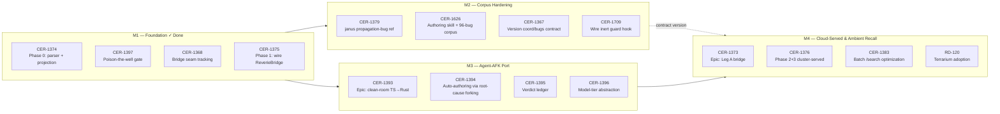

# Roadmap — Cicatrix

**Linear project:** [Cicatrix](https://linear.app/cerebral-work/project/cicatrix-6e706227ee20)
- **State:** backlog
- **Progress:** M1 100% (4/4 done) · M2 0% (0/4) · M3 100%¹ (4/4 "Ready") · M4 0% (0/3)
- **Issues in project:** 14 (4 Done, 4 Ready, 6 Backlog) + 1 cross-team ref (RD-120, Terrarium)
- **Milestones:** 4 created in Linear (M1–M4, target dates 2026-06-30 → 2026-11-30)
- **Generated:** 2026-07-22

> ¹ Linear counts "Ready" state as completed in progress bars. M3 issues are in "Ready"
> (not "Done") — they are unstarted, not complete. Move them to "Todo" or "Backlog" for
> accurate progress tracking.

## Overview

cicatrix is an independent **regression-memory + convention-drift** framework with
commit-time review gates. Its premise: an agent (human or LLM) reintroduces a fixed bug
because the *memory of past failures* is not queryable at authoring time. cicatrix makes it
queryable, and gates commits on it. Method drawn from `wbrown/janus-datalog`; substrate is
[reverie](https://github.com/cerebral-work/reverie) (the single memory surface, CER-1369).

The Cicatrix project in Linear was an **empty shell** (0 issues, 0% progress, state: backlog).
All cicatrix work was scattered across the Reverie project (CER-1373/1374/1375/1376), the
Terrarium project (RD-120), and unassigned (9 issues). This roadmap consolidates 14 issues
into the Cicatrix project with four thematic milestones and four target dates.

### What was done (2026-07-22)

- **4 milestones created** in the Cicatrix project (M1–M4) with target dates.
- **14 issues moved** into the Cicatrix project (all CER-* cicatrix issues).
- **14 issues assigned** to milestones via bulk update.
- **1 missing ticket filed** — CER-1709 (inert guard-main-push hook wiring) under M2.
- **RD-120** (team RD / Terrarium) **could not be moved** — Linear requires issue team to
  match project team. It stays in the Terrarium project and is referenced cross-project in M4.

## Milestones

| Milestone | UUID | Target | Progress | Issues |
|---|---|---|---|---|
| **M1 — Foundation: Bug-Memory Store & Reverie Bridge** | `632e8643` | 2026-06-30 | 100% (4/4) | CER-1374, CER-1397, CER-1368, CER-1375 |
| **M2 — Corpus Hardening & Contract Versioning** | `bafee59e` | 2026-08-15 | 0% (0/4) | CER-1379, CER-1626, CER-1367, CER-1709 (new) |
| **M3 — Agent-AFK Port: Strong-Idea Clean-Room (TS→Rust)** | `a7d17024` | 2026-09-15 | 100%¹ (4/4) | CER-1393, CER-1394, CER-1395, CER-1396 |
| **M4 — Cloud-Served Bridge & Ambient Recall (GATED)** | `20bdf421` | 2026-11-30 | 0% (0/3) | CER-1373, CER-1376, CER-1383 (+ RD-120 cross-ref) |

### M1 — Foundation: Bug-Memory Store & Reverie Bridge

> Stand up the core loop: parse bug-facts from markdown, project into reverie, query at authoring time with git-ancestry time-travel.

**Dependency:** Complete — all four issues done.

| ID | Title | State | Priority | Assignee |
|---|---|---|---|---|
| [CER-1374](https://linear.app/cerebral-work/issue/CER-1374/phase-0-cicatrix-bridge-prep-markdown-parser-projection-builder) | Phase 0 — cicatrix bridge prep (markdown parser + projection builder, UNBLOCKED) | Done | Medium | ctodie |
| [CER-1397](https://linear.app/cerebral-work/issue/CER-1397/cicatrix-falsification-gated-projection-pipeline-empirical-evidence) | cicatrix: falsification-gated projection pipeline — empirical evidence floor + two-tier corpus (THE poison-the-well gate) | Done | Urgent | aria |
| [CER-1368](https://linear.app/cerebral-work/issue/CER-1368/track-the-cicatrixreverie-bridge-seam-untracked-cross-repo-coupling) | Track the cicatrix→reverie bridge seam (untracked cross-repo coupling) | Done | Medium | — |
| [CER-1375](https://linear.app/cerebral-work/issue/CER-1375/phase-1-wire-the-reveriebridge-recordquery-as-of-git-ancestry) | Phase 1 — wire the ReverieBridge (record/query + --as-of git-ancestry) | Done | Medium | ctodie |

### M2 — Corpus Hardening & Contract Versioning

> Harden the parser against real-world bug docs, version the cross-repo contract, and build the authoring/query skill so agents reach for the corpus before writing.

**Dependency:** Builds on M1's stable foundation; no external blockers.

| ID | Title | State | Priority | Assignee |
|---|---|---|---|---|
| [CER-1367](https://linear.app/cerebral-work/issue/CER-1367/version-the-reverie-coordbugs-contract-before-cicatrix-builds-its) | Version the reverie coord/bugs contract before cicatrix builds its bridge | Backlog | Low | ctodie |
| [CER-1626](https://linear.app/cerebral-work/issue/CER-1626/cicatrix-cicatrix-authoringquery-skill-upstream-96-bug-corpus-as-bug) | cicatrix: `cicatrix` authoring/query skill + upstream 96-bug corpus as bug_md robustness fixture | Backlog | Low | ctodie |
| [CER-1379](https://linear.app/cerebral-work/issue/CER-1379/cicatrix-wbrown-janus-datalog-propagation-bug-docs-as-a-regression) | cicatrix: wbrown janus-datalog propagation-bug docs as a regression-pattern reference | Backlog | Low | ctodie |
| [CER-1709](https://linear.app/cerebral-work/issue/CER-1709/cicatrix-wire-the-inert-guard-main-push-hook-into-claudesettingsjson) | cicatrix: wire the inert guard-main-push hook into .claude/settings.json | Backlog | Medium | — |

### M3 — Agent-AFK Port: Strong-Idea Clean-Room (TS→Rust)

> Port the strongest ideas from agent-afk into cicatrix: auto-authoring via parallel root-cause forking, an append-only verdict ledger, and model-tier abstraction for LLM review calls.

**Dependency:** The biggest build track; CER-1393 (epic) gates CER-1394/1395/1396. Starts after M1, can overlap M2.

| ID | Title | State | Priority | Assignee |
|---|---|---|---|---|
| [CER-1393](https://linear.app/cerebral-work/issue/CER-1393/epic-cicatrix-agent-afk-port-the-strong-ideas-clean-room-tsrust) | Epic — cicatrix ← agent-afk: port the strong ideas (clean-room TS→Rust) | Ready | Medium | — |
| [CER-1394](https://linear.app/cerebral-work/issue/CER-1394/cicatrix-diagnose-style-auto-authoring-parallel-root-cause-forking) | cicatrix: diagnose-style auto-authoring — parallel root-cause forking → auto-populate BugFact | Ready | High | — |
| [CER-1395](https://linear.app/cerebral-work/issue/CER-1395/cicatrix-append-only-verdict-ledger-audit-receipt-of-review-commit) | cicatrix: append-only verdict ledger — audit receipt of review + commit-gate decisions | Ready | Medium | — |
| [CER-1396](https://linear.app/cerebral-work/issue/CER-1396/cicatrix-model-tier-abstraction-for-llm-reviewdiagnose-calls-cheap) | cicatrix: model-tier abstraction for LLM review/diagnose calls (cheap drift vs capable root-cause) | Ready | Low | — |

### M4 — Cloud-Served Bridge & Ambient Recall (GATED)

> Point cicatrix at a cluster-served reveried over authed ingress, optimize batch search, adopt the cicatrix standard in terrarium, and close the CER-1369 loop via revenant ambient injection.

**Dependency:** Gated on external deps: reverie cloud deploy (CER-1362 → OPS-271), reveried home on Cygnus, and revenant (TOD-978).

| ID | Title | State | Priority | Assignee |
|---|---|---|---|---|
| [CER-1373](https://linear.app/cerebral-work/issue/CER-1373/epic-cicatrix-reverie-bug-fact-bridge-leg-a) | Epic — cicatrix → reverie bug-fact bridge (Leg A) | Backlog | Medium | ctodie |
| [CER-1376](https://linear.app/cerebral-work/issue/CER-1376/phase-23-cluster-served-bridge-and-revenant-consumption-gated-future) | Phase 2+3 — cluster-served bridge & revenant consumption (GATED, future) | Backlog | Low | ctodie |
| [CER-1383](https://linear.app/cerebral-work/issue/CER-1383/cicatrix-query-touches-known-bug-fires-one-search-per-changed-file) | cicatrix query: touches_known_bug fires one /search per changed file — needs a reverie batch endpoint | Backlog | Medium | ctodie |
| [RD-120](https://linear.app/cerebral-work/issue/RD-120) | adopt: cerebral-work/cicatrix | Backlog | Low | — |

> RD-120 is in team **RD** (Terrarium project) and cannot be moved to the CER-team Cicatrix
> project — Linear requires issue team to match project team. It is referenced cross-project
> under M4 because it tracks the terrarium adoption of the cicatrix standard.

## Rendered Roadmap (from `linearctl roadmap --project Cicatrix`)

```
Cicatrix — 4 milestone(s)

  M1 — Foundation: Bug-Memory Store & Reverie Bridge  (due 2026-06-30)  [████████████████████] 100%  4/4
    CER-1397  [Done]  cicatrix: falsification-gated projection pipeline — empirical evidence floor + two-tier corpus (THE poison-the-well gate)  @aria
    CER-1375  [Done]  Phase 1 — wire the ReverieBridge (record/query + --as-of git-ancestry)  @ctodie
    CER-1374  [Done]  Phase 0 — cicatrix bridge prep (markdown parser + projection builder, UNBLOCKED)  @ctodie
    CER-1368  [Done]  Track the cicatrix→reverie bridge seam (untracked cross-repo coupling)

  M2 — Corpus Hardening & Contract Versioning  (due 2026-08-15)  [░░░░░░░░░░░░░░░░░░░░] 0%  0/4
    CER-1709  [Backlog]  cicatrix: wire the inert guard-main-push hook into .claude/settings.json
    CER-1626  [Backlog]  cicatrix: `cicatrix` authoring/query skill + upstream 96-bug corpus as bug_md robustness fixture  @ctodie
    CER-1379  [Backlog]  cicatrix: wbrown janus-datalog propagation-bug docs as a regression-pattern reference  @ctodie
    CER-1367  [Backlog]  Version the reverie coord/bugs contract before cicatrix builds its bridge  @ctodie

  M3 — Agent-AFK Port: Strong-Idea Clean-Room (TS→Rust)  (due 2026-09-15)  [████████████████████] 100%  4/4
    CER-1396  [Ready]  cicatrix: model-tier abstraction for LLM review/diagnose calls (cheap drift vs capable root-cause)
    CER-1395  [Ready]  cicatrix: append-only verdict ledger — audit receipt of review + commit-gate decisions
    CER-1394  [Ready]  cicatrix: diagnose-style auto-authoring — parallel root-cause forking → auto-populate BugFact
    CER-1393  [Ready]  Epic — cicatrix ← agent-afk: port the strong ideas (clean-room TS→Rust)

  M4 — Cloud-Served Bridge & Ambient Recall (GATED)  (due 2026-11-30)  [░░░░░░░░░░░░░░░░░░░░] 0%  0/3
    CER-1383  [Backlog]  cicatrix query: touches_known_bug fires one /search per changed file — needs a reverie batch endpoint  @ctodie
    CER-1376  [Backlog]  Phase 2+3 — cluster-served bridge & revenant consumption (GATED, future)  @ctodie
    CER-1373  [Backlog]  Epic — cicatrix → reverie bug-fact bridge (Leg A)  @ctodie
```

## Roadmap Diagram



## Execution Notes

- **M1 is complete.** All four foundation issues are Done: the markdown parser (CER-1374), the
  falsification-gated projection pipeline / poison-the-well gate (CER-1397), the bridge seam
  tracking (CER-1368), and the wired ReverieBridge with `--as-of` git-ancestry (CER-1375).
- **M2 has no external blockers** and can start immediately. CER-1367 (contract versioning) is
  the cheapest — version the reverie `coord/bugs` contract before the bridge evolves further.
  CER-1626 (authoring skill + 96-bug corpus fixture) is the highest-leverage: hardens `bug_md.rs`
  against 96 real-world variant documents and packages the query-before-authoring pattern as a skill.
  CER-1709 (filed in this session) wires the inert `.claude/hooks/guard-main-push.sh` into
  `.claude/settings.json` — the guard landed in code but was never wired, so it's been inert.
- **M3 shows 100% but is unstarted.** All four issues are in "Ready" state — Linear counts this
  as completed in progress bars, but the work has not begun. CER-1393 is the epic; CER-1394
  (auto-authoring, P2 High) is the most ambitious — parallel root-cause forking to auto-populate
  BugFacts. These should be moved to "Todo" for accurate progress tracking.
- **M4 is gated on external infrastructure.** CER-1373 (Leg A epic) and CER-1376 (Phase 2+3) are
  blocked on the reverie cloud deploy path: `reverie.dev.unsigned.gg` no longer resolves (Lyra
  retirement under OPS-468); the new target is wherever reveried lands on **Cygnus**. CER-1383
  (batch `/search`) needs a reverie-side endpoint change (`POST /search/batch`), not a local
  cicatrix patch. RD-120 (terrarium adoption) is a governance decision, not code — and it stays
  in the Terrarium project (team RD) since Linear won't allow cross-team project moves.

