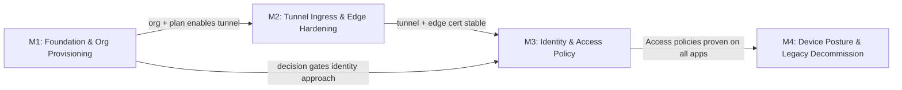

# Cloudflare Zero Trust Adoption — Roadmap

> **Source:** Linear project "Cloudflare Zero Trust adoption" (7 issues across all states).
> **Generated:** 2026-07-22 via `linearctl` (`search --project "Cloudflare Zero Trust adoption" --state all --json`).
> **Project state:** 6/7 complete (86%) — foundation, tunnel ingress, edge TLS, and identity/Access policy are shipped; one backlog item (Phase 6 — Tailscale retirement) remains.

---

## Live Linear State (auto-rendered 2026-07-29 14:34 UTC)

| Milestone | Linear ID | Target Date | Issues | Progress |
|----------|-----------|------------|--------|----------|
| Device Posture & Legacy Decommission | `468b77c8-2fff-43df-94fd-2c3c702f854c` | 2026-09-15 | 2 | 0% (0/2) |
| Identity & Access Policy | `819337ab-0bc2-4c68-89e0-66c006b64b43` | 2026-07-01 | 1 | 100% (1/1) |
| Tunnel Ingress & Edge Hardening | `6f9701a9-1af6-46f4-b21a-0da388020c3d` | 2026-06-15 | 3 | 100% (3/3) |
| Foundation & Org Provisioning | `21e891d9-4954-4c0d-9372-3da1e5c52074` | 2026-05-15 | 2 | 100% (2/2) |

```
Cloudflare Zero Trust adoption — 4 milestone(s)

  Foundation & Org Provisioning  (due 2026-05-15)  [████████████████████] 100%  2/2
    OPS-388  [Done]  DECISION: app-sso coexist-by-tier vs CF Access replaces it
    OPS-386  [Done]  Phase 0 (BLOCKER): provision Cloudflare Zero Trust org — team domain + plan

  Tunnel Ingress & Edge Hardening  (due 2026-06-15)  [████████████████████] 100%  3/3
    OPS-392  [Done]  Investigate 530/1033 edge→tunnel routing before Phase 2 cutover
    OPS-390  [Done]  Phase 2 GATE: Advanced Certificate Manager for *.dev.unsigned.gg edge cert
    OPS-387  [Done]  Phase 1: cloudflared Tunnel as additive ingress path (non-destructive)  @ctodie

  Identity & Access Policy  (due 2026-07-01)  [████████████████████] 100%  1/1
    OPS-403  [Done]  SSO 3 — CF Access: swap docs.cerebral.work (+ dreams legacy app) policies to Keycloak IdP groups  @ctodie

  Device Posture & Legacy Decommission  (due 2026-09-15)  [░░░░░░░░░░░░░░░░░░░░] 0%  0/2
    OPS-898  [Triage]  Phase 4-5: Cloudflare WARP device posture rollout and fleet validation
    OPS-389  [Backlog]  Phase 6: retire Tailscale (LAST, after WARP proven)
```

*Last 7 days: 0 issue(s) touched, 0 completed.*
*Rendered by `.github/scripts/render-roadmap.sh` (corpus auto-render, schedule + dispatch).*

## Overview



**Milestones execute sequentially** (provision → tunnel+edge → identity/access → device posture+decommission), with M3 (identity/Access policy) gated by both M1's architecture decision and M2's stable edge surface.

---

## M1 — Foundation & Org Provisioning

**Goal:** Provision the Cloudflare Zero Trust organization, team domain, and plan tier — the structural prerequisite every subsequent phase depends on. Includes the architecture decision on whether CF Access coexists with or replaces app-level SSO.

| Issue | Title | State | Priority | Assignee |
|-------|-------|-------|----------|----------|
| [OPS-386](https://linear.app/cerebral-work/issue/OPS-386) | Phase 0 (BLOCKER): provision Cloudflare Zero Trust org — team domain + plan | ✅ Done | High | — |
| [OPS-388](https://linear.app/cerebral-work/issue/OPS-388) | DECISION: app-sso coexist-by-tier vs CF Access replaces it | ✅ Done | Urgent | — |

**Status:** The Zero Trust organization is provisioned with team domain and plan set. The critical architecture decision (coexist-by-tier vs full replacement) is resolved — this determines whether CF Access runs alongside existing app-level SSO or supersedes it. Both items are shipped; M1 is the settled foundation.

---

## M2 — Tunnel Ingress & Edge Hardening

**Goal:** Stand up cloudflared as an additive (non-destructive) ingress path, route edge traffic through the tunnel, investigate and resolve edge→tunnel routing anomalies, and harden the edge with Advanced Certificate Manager for `*.dev.unsigned.gg`.

| Issue | Title | State | Priority | Assignee |
|-------|-------|-------|----------|----------|
| [OPS-387](https://linear.app/cerebral-work/issue/OPS-387) | Phase 1: cloudflared Tunnel as additive ingress path (non-destructive) | ✅ Done | Urgent | ctodie |
| [OPS-392](https://linear.app/cerebral-work/issue/OPS-392) | Investigate 530/1033 edge→tunnel routing before Phase 2 cutover | ✅ Done | High | — |
| [OPS-390](https://linear.app/cerebral-work/issue/OPS-390) | Phase 2 GATE: Advanced Certificate Manager for `*.dev.unsigned.gg` edge cert | ✅ Done | Medium | — |

**Status:** cloudflared tunnel is live as a parallel ingress path (no disruption to existing traffic). The 530/1033 routing investigation is resolved, clearing the gate for Phase 2. Advanced Certificate Manager is provisioned for the `*.dev.unsigned.gg` edge cert — the edge TLS surface is hardened. All three items shipped; the edge is ready for identity/Access policy enforcement.

---

## M3 — Identity & Access Policy

**Goal:** Establish Cloudflare Access as the identity boundary — backing Access policies to Keycloak IdP groups to enforce per-app authentication and authorization across the dev surface.

| Issue | Title | State | Priority | Assignee |
|-------|-------|-------|----------|----------|
| [OPS-403](https://linear.app/cerebral-work/issue/OPS-403) | SSO 3 — CF Access: swap docs.cerebral.work (+ dreams legacy app) policies to Keycloak IdP groups | ✅ Done | Medium | ctodie |

**Status:** CF Access policies for `docs.cerebral.work` and the dreams legacy app are now backed by Keycloak IdP groups rather than app-level SSO. The coexist-by-tier decision from M1 (OPS-388) has been implemented: tier-1 apps get CF Access enforcement while the IdP integration handles group-based authorization. This milestone is shipped.

---

## M4 — Device Posture & Legacy Decommission

**Goal:** Roll out Cloudflare WARP as the device posture agent, prove it across the fleet, and retire Tailscale as the primary device-level tunnel — the final phase of Zero Trust adoption.

| Issue | Title | State | Priority | Assignee |
|-------|-------|-------|----------|----------|
| [OPS-389](https://linear.app/cerebral-work/issue/OPS-389) | Phase 6: retire Tailscale (LAST, after WARP proven) | ⏳ Backlog | Low | — |

**Status:** Tailscale retirement is parked in Backlog — it is explicitly the last phase, gated on WARP being proven across the fleet. No WARP rollout issue exists yet in the project; when that work begins, a Phase 4/5 issue for WARP deployment and validation should be filed to track the gate condition for OPS-389.

---

## Roadmap Visualization

```
Cloudflare Zero Trust Adoption — Roadmap
==========================================

   COMPLETED (6/7)                        BACKLOG (1/7)
   ──────────────                         ────────────

M1 Foundation & Org           [██████████] ✓
   Provisioning                 OPS-386, OPS-388

M2 Tunnel Ingress &           [██████████████████] ✓
   Edge Hardening               OPS-387, OPS-392, OPS-390

M3 Identity & Access          [██████████] ✓
   Policy                       OPS-403

M4 Device Posture &            [░░░░░░░░░░] OPS-389
   Legacy Decommission          (gated on WARP rollout)

Legend: █ = done   ░ = open/backlog

Dependency chain:
  M1/OPS-388 (decision) ──gates──→ M3/OPS-403 (Access policy implementation)
  M2/OPS-390 (edge cert) ──gates──→ M3/OPS-403 (Access enforcement on stable edge)
  M3/OPS-403 (Access proven) ──gates──→ M4/OPS-389 (retire Tailscale after WARP)
```

---

## Summary Statistics

| Milestone | Done | Backlog | Total |
|-----------|------|---------|-------|
| M1 — Foundation & Org Provisioning | 2 | 0 | 2 |
| M2 — Tunnel Ingress & Edge Hardening | 3 | 0 | 3 |
| M3 — Identity & Access Policy | 1 | 0 | 1 |
| M4 — Device Posture & Legacy Decommission | 0 | 1 | 1 |
| **Total** | **6** | **1** | **7** |

**Completion:** 6/7 (86%) — foundation, tunnel ingress, edge TLS hardening, and identity/Access policy are all shipped. The remaining 14% is Phase 6 (Tailscale retirement), explicitly the last phase and gated on a WARP rollout that hasn't been scoped yet.

---

## Recommended Sequencing

1. **M4 / OPS-389** — The only open item. File a WARP deployment + validation issue (Phase 4/5) to establish the gate condition, then retire Tailscale once WARP is proven fleet-wide. Low priority — this is cleanup, not critical path.
2. **M1–M3 (sustaining)** — All shipped. No follow-up unless new apps are added to the dev surface (each would require a CF Access policy backed by Keycloak IdP groups, following the OPS-403 pattern).
