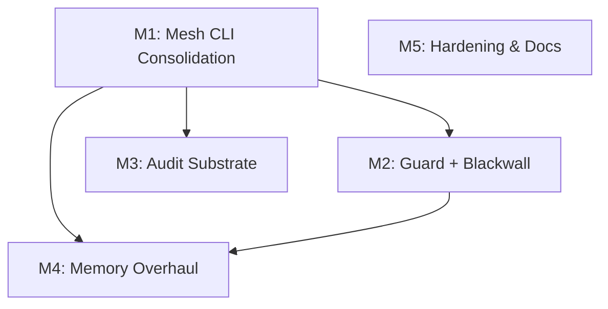

# Cortex — Project Roadmap

> Generated 2026-07-22 from `linearctl search --project "Cortex" --state all --json` +
> text-scoped search across all teams. 58 issues analyzed; 42 active issues assigned
> to 5 thematic milestones. 16 completed/canceled issues tracked as precedent.

## Live Linear State (auto-rendered 2026-07-29 14:31 UTC)

| Milestone | Linear ID | Target Date | Issues | Progress |
|----------|-----------|------------|--------|----------|
| M5: Hardening, Docs & Infrastructure Hygiene | `874fb888-ac63-436e-973b-3eab933744af` | 2026-11-30 | 11 | 0% (0/11) |
| M4: Memory & Retrieval Overhaul | `1cc5cef1-422f-4001-80f8-e8aeca92a034` | 2026-10-15 | 1 | 0% (0/1) |
| M3: Audit Substrate & Revenant Sensing | `ed6e28c9-6146-4f78-a815-2a334a00b7eb` | 2026-09-30 | 2 | 0% (0/2) |
| M2: Guard + Blackwall Orchestration | `01bda899-853c-458d-bcb8-8d208824bee2` | 2026-09-30 | 4 | 0% (0/4) |
| M1: Mesh CLI Consolidation & Stable Contract | `7dc65dac-350a-4410-95ae-fa59c0743416` | 2026-08-15 | 5 | 0% (0/5) |

```
Cortex — 5 milestone(s)

  M1: Mesh CLI Consolidation & Stable Contract  (due 2026-08-15)  [░░░░░░░░░░░░░░░░░░░░] 0%  0/5
    CER-1490  [Backlog]  cortex: coord passthrough is dead post-mesh-strip — status/peers subcommands error
    CER-1416  [Backlog]  Retire the agent-coordination mesh (coord + mesh-control) from reverie — umbrella
    CER-1392  [Backlog]  cortex.mesh/v1 — stable `cortex --json` mesh-sensing contract (peers/health/locks façade over coord)  @ctodie
    CER-1006  [Backlog]  Tier 5.6: Extract `reverie-cortex` from `reveried`  @ctodie
    CER-587  [Backlog]  chore: merge reverie-status-tui into cortex (formerly meshctl)  @ctodie

  M3: Audit Substrate & Revenant Sensing  (due 2026-09-30)  [░░░░░░░░░░░░░░░░░░░░] 0%  0/2
    CER-1514  [Backlog]  P2.6 Dream mutation ledger
    CER-1398  [Backlog]  Fix follow-up defects surfaced in PR #803 review

  M2: Guard + Blackwall Orchestration  (due 2026-09-30)  [░░░░░░░░░░░░░░░░░░░░] 0%  0/4
    CER-1685  [In Progress]  Cortex ↔ Blackwall integration: multi-project dispatch consumer spec  @ctodie
    CER-1226  [Backlog]  Coord mesh: typed atomic-ops + per-object monotonic LWW + fractional ranks for ordered queues  @ctodie
    CER-1210  [Backlog]  [aoe-adapter spike] T5: stand up aoe on the bastion as the A1 drop-in runtime  @ctodie
    CER-1084  [In Progress]  Scaffold reverie-guard crate with hook-contract CLI in shadow mode  @ctodie

  M4: Memory & Retrieval Overhaul  (due 2026-10-15)  [░░░░░░░░░░░░░░░░░░░░] 0%  0/1
    CER-1225  [Backlog]  Typed semantic layer over lcm_turns + lazy Arrow/S3 materialization + content-keyed query cache  @aria

  M5: Hardening, Docs & Infrastructure Hygiene  (due 2026-11-30)  [░░░░░░░░░░░░░░░░░░░░] 0%  0/11
    CER-1563  [Backlog]  cortex: finish 2die4 → cerebral.work migration (Pages domain, domains, © notice, CLAUDE.md commit)  @ctodie
    CER-1484  [Backlog]  release-please leaves Cargo.lock stale on every release merge (workspace version bump not mirrored)  @ctodie
    CER-1284  [Backlog]  Tooling to scaffold the docs-first RFC workflow (doc-branch + draft PR + Linear mirror; stack/land helpers; pre-push check)  @ctodie
    CER-1270  [Backlog]  install-reverie.sh leaves reveried DOWN when an auxiliary binary (e.g. reverie-tracee) is held open — exits 0 without restarting the daemon  @ctodie
    CER-1223  [Backlog]  cortex drift: daemon-runtime shows null transiently right after a reveried restart  @ctodie
    CER-1222  [Backlog]  [docs] site keep-current — meshctl→cortex + version sweep across the site  @ctodie
    CER-1221  [Backlog]  [docs] Editorial layout — style &lt;pre&gt;/&lt;code&gt; blocks  @ltodie
    CER-1218  [Backlog]  [docs] cerebral.work — reverie + cortex product/usability docs (living page)  @ltodie
    CER-1190  [Todo]  Consolidate duplicated fmt-subscriber tracing init across reverie-bench/eventmanager/tracee (+ tracee Cargo normalization)  @ctodie
    CER-1174  [Backlog]  metrics: COORD_ROLES vocab is stale — reveried_coord_sessions gauge is role-blind  @ctodie
    CER-124  [Backlog]  Identify and evaluate first 3 venture bets  @ctodie
```

*Last 7 days: 14 issue(s) touched, 6 completed.*
*Rendered by `.github/scripts/render-roadmap.sh` (corpus auto-render, schedule + dispatch).*

## Project state

| Metric | Value |
|--------|-------|
| Linear project | [Cortex](https://linear.app/cerebral-work/project/cortex-3b043823d188) |
| Project state | Backlog |
| Current progress | 25% |
| Total issues analyzed | 58 |
| Active issues | 42 |
| Completed | 13 |
| Canceled | 3 |
| Teams touched | CER (39), TOD (14), OPS (4), RD (1) |
| Top assignee | ctodie (31) |

## Milestone summary

| # | Milestone | Target | Issues | Dependencies | Theme |
|---|----------|--------|--------|--------------|-------|
| M1 | Mesh CLI Consolidation & Stable Contract | 2026-08-15 | 11 | — | CLI unification + stable contract |
| M2 | Guard + Blackwall Orchestration | 2026-09-30 | 6 | M1 | Two-layer orchestration control path |
| M3 | Audit Substrate & Revenant Sensing | 2026-09-30 | 6 | M1 | Audit event-sourcing + revenant sensing |
| M4 | Memory & Retrieval Overhaul | 2026-10-15 | 3 | M1, M2 | Semantic memory + corpus migration |
| M5 | Hardening, Docs & Infrastructure Hygiene | 2026-11-30 | 16 | — | Daemon robustness + docs + CI hygiene |

## Dependency graph



## M1: Mesh CLI Consolidation & Stable Contract

**Target:** 2026-08-15

Unify the three-named CLI (coord / meshctl / cortex), establish a stable `cortex --json` mesh-sensing contract, retire dead code paths, and resolve the naming collisions that block external consumers. This is the foundation — the blackwall integration (M2) and audit substrate (M3) both consume the stable mesh contract produced here.

| Issue | State | Priority | Assignee | Title |
|-------|-------|----------|----------|-------|
| [CER-1416](https://linear.app/cerebral-work/issue/CER-1416/retire-the-agent-coordination-mesh-coord-mesh-control-from-reverie) | Backlog | — | — | Retire the agent-coordination mesh (coord + mesh-control) from reverie — umbrella |
| [CER-1490](https://linear.app/cerebral-work/issue/CER-1490/cortex-coord-passthrough-is-dead-post-mesh-strip-statuspeers) | Backlog | — | — | cortex: coord passthrough is dead post-mesh-strip — status/peers subcommands error |
| [CER-1006](https://linear.app/cerebral-work/issue/CER-1006/tier-56-extract-reverie-cortex-from-reveried) | Backlog | High | ctodie | Tier 5.6: Extract `reverie-cortex` from `reveried` |
| [CER-1392](https://linear.app/cerebral-work/issue/CER-1392/cortexmeshv1-stable-cortex-json-mesh-sensing-contract-peershealthlocks) | Backlog | High | ctodie | cortex.mesh/v1 — stable `cortex --json` mesh-sensing contract (peers/health/locks façade over coord) |
| [CER-1638](https://linear.app/cerebral-work/issue/CER-1638/naming-decision-cortex-reverie-mesh-cli-vs-cortex-soma-9-layer) | Backlog | High | — | Naming decision: cortex (reverie mesh CLI) vs Cortex (soma §9 layer) |
| [TOD-938](https://linear.app/cerebral-work/issue/TOD-938/meshrs-cortex-json-mesh-client-deferred-blocked-on-reverie-mesh-fix) | Backlog | High | — | mesh.rs — cortex --json mesh client (deferred; blocked on reverie mesh fix) |
| [TOD-949](https://linear.app/cerebral-work/issue/TOD-949/trustworthy-cortex-mesh-interface-stable-json-contract-for-external) | Backlog | High | — | Trustworthy cortex mesh interface — stable --json contract for external consumers |
| [TOD-950](https://linear.app/cerebral-work/issue/TOD-950/unify-the-mesh-cli-dedupe-coord-meshctl-cortex-command-modules) | Backlog | High | — | Unify the mesh CLI — dedupe coord / meshctl / cortex command modules + functions |
| [TOD-998](https://linear.app/cerebral-work/issue/TOD-998/naming-collision-revenant-reverie-are-both-taken-on-cratesio-decide) | Backlog | High | ctodie | Naming collision: `revenant` + `reverie` are both taken on crates.io — decide accept / rename / approach owners |
| [CER-587](https://linear.app/cerebral-work/issue/CER-587/chore-merge-reverie-status-tui-into-cortex-formerly-meshctl) | Backlog | Low | ctodie | chore: merge reverie-status-tui into cortex (formerly meshctl) |
| [RD-119](https://linear.app/cerebral-work/issue/RD-119) | Backlog | Low | — | adopt: cerebral-work/cortex |

## M2: Guard + Blackwall Orchestration

**Target:** 2026-09-30

Stand up the two-layer orchestration control path locked in the 2026-07-21 operator interview: reverie-guard (decide, policy, injection-safe) + blackwall (execute, jailed, custody-recorded). Cortex is the multi-project dispatch consumer onto Cygnus (prod Talos). Depends on M1's stable mesh contract.

**Depends on:** M1

| Issue | State | Priority | Assignee | Title |
|-------|-------|----------|----------|-------|
| [CER-1685](https://linear.app/cerebral-work/issue/CER-1685/cortex-blackwall-integration-multi-project-dispatch-consumer-spec) | In Progress | — | ctodie | Cortex ↔ Blackwall integration: multi-project dispatch consumer spec |
| [CER-1084](https://linear.app/cerebral-work/issue/CER-1084/scaffold-reverie-guard-crate-with-hook-contract-cli-in-shadow-mode) | Backlog | High | ctodie | Scaffold reverie-guard crate with hook-contract CLI in shadow mode |
| [CER-1210](https://linear.app/cerebral-work/issue/CER-1210/aoe-adapter-spike-t5-stand-up-aoe-on-the-bastion-as-the-a1-drop-in) | Backlog | High | ctodie | [aoe-adapter spike] T5: stand up aoe on the bastion as the A1 drop-in runtime |
| [TOD-959](https://linear.app/cerebral-work/issue/TOD-959/epic-revenant-the-factorys-orchestration-home-workspace-substrate) | Backlog | High | — | epic: revenant → the factory's orchestration home (workspace + substrate extraction) |
| [CER-1226](https://linear.app/cerebral-work/issue/CER-1226/coord-mesh-typed-atomic-ops-per-object-monotonic-lww-fractional-ranks) | Backlog | Medium | ctodie | Coord mesh: typed atomic-ops + per-object monotonic LWW + fractional ranks for ordered queues |
| [TOD-946](https://linear.app/cerebral-work/issue/TOD-946/mesh-command-intake-generalize-the-unix-socket-gated) | Backlog | Medium | — | Mesh command intake — generalize the Unix socket (GATED) |

## M3: Audit Substrate & Revenant Sensing

**Target:** 2026-09-30

Event-source the audit substrate, wire revenant Tier-1 sensing + Tier-3 control, and index Claude Code agent-teams into the audit plane. Runs in parallel with M2 — both consume M1's contract but have no interdependency.

**Depends on:** M1

| Issue | State | Priority | Assignee | Title |
|-------|-------|----------|----------|-------|
| [CER-1398](https://linear.app/cerebral-work/issue/CER-1398/fix-follow-up-defects-surfaced-in-pr-803-review) | Backlog | — | — | Fix follow-up defects surfaced in PR #803 review |
| [TOD-971](https://linear.app/cerebral-work/issue/TOD-971/event-source-the-audit-substrate-costcache-token-metrics) | Backlog | Medium | — | Event-source the audit substrate + cost/cache token metrics |
| [TOD-957](https://linear.app/cerebral-work/issue/TOD-957/feataudit-sense-index-claude-code-agent-teams-into-revenantaudit-tier) | Backlog | Medium | — | feat(audit): sense + index Claude Code agent-teams into revenant:audit (Tier 2) |
| [TOD-958](https://linear.app/cerebral-work/issue/TOD-958/ref-lift-agent-of-empires-patterns-into-revenant-tier-1-sensing-tier) | Backlog | Medium | — | ref: lift Agent of Empires patterns into revenant Tier-1 sensing + Tier-3 control |
| [TOD-939](https://linear.app/cerebral-work/issue/TOD-939/mesh-poller-task-populate-sessions-gauge-emit-audit-events-deferred) | Backlog | High | — | mesh_poller task — populate sessions gauge + emit audit events (deferred) |
| [CER-1514](https://linear.app/cerebral-work/issue/CER-1514/p26-dream-mutation-ledger) | Backlog | Medium | — | P2.6 Dream mutation ledger |

## M4: Memory & Retrieval Overhaul

**Target:** 2026-10-15

Overhaul engram retrieval with semantic search, activate the entity graph, and migrate the operator corpus from laptop SQLite to cloud reverie-pg. The corpus migration (OPS-191) is a freeze-window one-way cutover — schedule after M1/M2 land to avoid cross-axis risk.

**Depends on:** M1, M2

| Issue | State | Priority | Assignee | Title |
|-------|-------|----------|----------|-------|
| [OPS-191](https://linear.app/cerebral-work/issue/OPS-191/operator-corpus-migration-laptop-engramdb-cloud-reverie-pg-client) | In Progress | High | ctodie | Operator corpus migration: laptop engram.db → cloud reverie-pg + client cutover (freeze-window, one-way) |
| [TOD-954](https://linear.app/cerebral-work/issue/TOD-954/engram-retrieval-entity-model-overhaul-semantic-mem-search-activate) | Backlog | Medium | — | engram: retrieval + entity-model overhaul — semantic mem_search, activate entity graph, relevance-aware context |
| [CER-1225](https://linear.app/cerebral-work/issue/CER-1225/typed-semantic-layer-over-lcm-turns-lazy-arrows3-materialization) | Backlog | Medium | aria | Typed semantic layer over lcm_turns + lazy Arrow/S3 materialization + content-keyed query cache |

## M5: Hardening, Docs & Infrastructure Hygiene

**Target:** 2026-11-30

Fix daemon-robustness defects, modernize the docs site, complete the 2die4→cerebral.work domain migration, and address CI/release infra hygiene. Cross-cutting — items can start in parallel with M2-M4 but the sweep completes last.

| Issue | State | Priority | Assignee | Title |
|-------|-------|----------|----------|-------|
| [CER-1223](https://linear.app/cerebral-work/issue/CER-1223/cortex-drift-daemon-runtime-shows-null-transiently-right-after-a) | Backlog | Low | ctodie | cortex drift: daemon-runtime shows null transiently right after a reveried restart |
| [CER-1174](https://linear.app/cerebral-work/issue/CER-1174/metrics-coord-roles-vocab-is-stale-reveried-coord-sessions-gauge-is) | Backlog | Low | ctodie | metrics: COORD_ROLES vocab is stale — reveried_coord_sessions gauge is role-blind |
| [CER-1190](https://linear.app/cerebral-work/issue/CER-1190/consolidate-duplicated-fmt-subscriber-tracing-init-across-reverie) | Todo | Low | ctodie | Consolidate duplicated fmt-subscriber tracing init across reverie-bench/eventmanager/tracee (+ tracee Cargo normalization) |
| [TOD-283](https://linear.app/cerebral-work/issue/TOD-283/brand-motif-psychosis-drift-accountability-pattern) | Backlog | Medium | ctodie | Brand Motif: "Psychosis Drift" Accountability Pattern |
| [CER-1218](https://linear.app/cerebral-work/issue/CER-1218/docs-cerebralwork-reverie-cortex-productusability-docs-living-page) | Backlog | Medium | ltodie | [docs] cerebral.work — reverie + cortex product/usability docs (living page) |
| [CER-1221](https://linear.app/cerebral-work/issue/CER-1221/docs-editorial-layout-style-andltpreandgtandltcodeandgt-blocks) | Backlog | Medium | ltodie | [docs] Editorial layout — style &lt;pre&gt;/&lt;code&gt; blocks |
| [CER-1222](https://linear.app/cerebral-work/issue/CER-1222/docs-site-keep-current-meshctlcortex-version-sweep-across-the-site) | Backlog | Medium | ctodie | [docs] site keep-current — meshctl→cortex + version sweep across the site |
| [CER-1270](https://linear.app/cerebral-work/issue/CER-1270/install-reveriesh-leaves-reveried-down-when-an-auxiliary-binary-eg) | Backlog | Medium | ctodie | install-reverie.sh leaves reveried DOWN when an auxiliary binary (e.g. reverie-tracee) is held open — exits 0 without restarting the daemon |
| [CER-1284](https://linear.app/cerebral-work/issue/CER-1284/tooling-to-scaffold-the-docs-first-rfc-workflow-doc-branch-draft-pr) | Backlog | Low | ctodie | Tooling to scaffold the docs-first RFC workflow (doc-branch + draft PR + Linear mirror; stack/land helpers; pre-push check) |
| [CER-1484](https://linear.app/cerebral-work/issue/CER-1484/release-please-leaves-cargolock-stale-on-every-release-merge-workspace) | Backlog | Medium | ctodie | release-please leaves Cargo.lock stale on every release merge (workspace version bump not mirrored) |
| [CER-1563](https://linear.app/cerebral-work/issue/CER-1563/cortex-finish-2die4-cerebralwork-migration-pages-domain-domains-c) | Backlog | Medium | ctodie | cortex: finish 2die4 → cerebral.work migration (Pages domain, domains, © notice, CLAUDE.md commit) |
| [CER-124](https://linear.app/cerebral-work/issue/CER-124/identify-and-evaluate-first-3-venture-bets) | Backlog | High | ctodie | Identify and evaluate first 3 venture bets |
| [OPS-607](https://linear.app/cerebral-work/issue/OPS-607/openbao-tailnet-endpoint-baotail769bd2tsnet-drops-while-pod-healthy) | Todo | High | ctodie | OpenBao tailnet endpoint (bao.tail769bd2.ts.net) drops while pod healthy — masks as outage |
| [TOD-929](https://linear.app/cerebral-work/issue/TOD-929/fresh-machine-bootstrap-runbook-test-in-a-throwaway-vmcontainer) | Backlog | Medium | — | Fresh-machine bootstrap runbook + test in a throwaway VM/container |
| [OPS-69](https://linear.app/cerebral-work/issue/OPS-69/add-path-filters-to-skip-ci-for-docs-only-changes) | Backlog | High | ctodie | Add path filters to skip CI for docs-only changes |
| [OPS-53](https://linear.app/cerebral-work/issue/OPS-53/pull-github-actions-billing-data-for-all-repos) | Backlog | High | ctodie | Pull GitHub Actions billing data for all repos |

## Completed work (precedent)

These issues provide context for the active roadmap — they represent prior phases that shaped the current architecture (meshctl→cortex rename, coord retirement, deepagent backend, etc.).

| Issue | State | Title |
|-------|-------|-------|
| [CER-606](https://linear.app/cerebral-work/issue/CER-606/v042-domain-prefixed-affinity-keywords) | Canceled | [v0.4.2] Domain-prefixed affinity keywords |
| [CER-1046](https://linear.app/cerebral-work/issue/CER-1046/refactorcortex-absorb-coord-cli-into-cortex-as-native-subcommands) | Canceled | refactor(cortex): absorb `coord` CLI into cortex as native subcommands |
| [CER-1249](https://linear.app/cerebral-work/issue/CER-1249/cortex-sessions-clean-doesnt-reap-redis-primary-coord-session-records) | Canceled | cortex sessions clean doesn't reap redis-primary coord session records |
| [CER-1051](https://linear.app/cerebral-work/issue/CER-1051/chore-finish-meshctlcortex-rename-fix-churnrs-findreplace-artifact) | Done | chore: finish meshctl→cortex rename + fix churn.rs find/replace artifact |
| [CER-1052](https://linear.app/cerebral-work/issue/CER-1052/cortex-completions-zsh-emits-compdef-meshctl-stale-binary-name) | Done | cortex completions zsh emits #compdef meshctl (stale binary name) |
| [CER-1135](https://linear.app/cerebral-work/issue/CER-1135/coord-rust-fs-readers-silently-report-empty-under-default-redis) | Done | coord Rust FS-readers silently report empty under default redis backend |
| [CER-1191](https://linear.app/cerebral-work/issue/CER-1191/extract-reverie-llm-traits-leaf-crate-to-sever-the-reverie-store) | Done | Extract reverie-llm-traits leaf crate to sever the reverie-store → reverie-deepagent dep edge |
| [CER-1194](https://linear.app/cerebral-work/issue/CER-1194/coord-route-the-3-standalone-rust-lock-readers-through-the-backend) | Done | coord: route the 3 standalone Rust lock-readers through the backend resolver (adr-012 step-3) |
| [CER-1219](https://linear.app/cerebral-work/issue/CER-1219/docs-docs-hub-install-usage-landing-for-reverie-cortex) | Done | [docs] /docs hub — install + usage landing for reverie + cortex |
| [CER-1380](https://linear.app/cerebral-work/issue/CER-1380/openai-compatible-deepagent-backend-default-model-swap-to-xiaomimimo) | Done | OpenAI-compatible deepagent backend + default model swap to xiaomi/mimo-v2.5 |
| [CER-1412](https://linear.app/cerebral-work/issue/CER-1412/coordmesh-retirement-umbrella-remove-the-coord-control-plane-operator) | Done | Coord/mesh retirement umbrella — remove the coord control plane (operator directive 2026-07-01) |
| [CER-1443](https://linear.app/cerebral-work/issue/CER-1443/installer-ships-retired-surface-offload-scripts-install-mesh-coordmesh) | Done | Installer ships retired surface: offload scripts + install-mesh + coord/mesh next-steps text (CER-1412 straggler) |
| [CER-1504](https://linear.app/cerebral-work/issue/CER-1504/prune-noise-heuristic-can-never-match-rows-from-the-primary-write-path) | Done | Prune noise heuristic can never match rows from the primary write path (insert 1/1 vs predicate ==0) |
| [CER-1613](https://linear.app/cerebral-work/issue/CER-1613/reveried-dream-merge-phase-on-busy-loop-wedges-the-entire-daemon-4h) | Done | reveried: dream MERGE phase O(n³) busy-loop wedges the entire daemon (4h dark, SIGKILL required) |
| [CER-672](https://linear.app/cerebral-work/issue/CER-672/role-perirhinal-enforce-changelogmd-update-on-every-merged-pr) | Done | role: perirhinal — enforce CHANGELOG.md update on every merged PR |
| [TOD-941](https://linear.app/cerebral-work/issue/TOD-941/shed-threads-organs-browser-tab-pool-threads-specific-bins) | Done | Shed Threads organs (browser, tab pool, Threads-specific bins) |

## Methodology

1. **Data collection:** `linearctl search --project "Cortex" --state all --json` (1 issue
   in-project) supplemented by `linearctl search --text "Cortex" --state all --json`
   (57 issues mentioning Cortex across CER/TOD/OPS/RD teams). Deduplicated by identifier
   → 58 unique issues.
2. **Thematic analysis:** Each active issue's title was classified by architectural concern
   — mesh CLI consolidation, orchestration control path, audit substrate, memory overhaul,
   and infrastructure hygiene. Completed/canceled issues were grouped as precedent.
3. **Milestone design:** 5 milestones with explicit dependency edges. M1 (mesh CLI
   consolidation) is the foundation — both M2 (guard + blackwall) and M3 (audit substrate)
   consume its stable `cortex --json` contract. M4 (memory overhaul) is sequenced after
   M2 to avoid cross-axis risk during the one-way corpus migration. M5 (hardening/docs)
   is cross-cutting and runs in parallel but completes last.
4. **Target dates:** Estimated from issue scope, dependencies, and the operator interview
   (reverie #12691, 2026-07-21) which set an open-ended research timeline.
