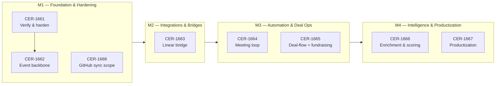

# Roadmap — CRM

**Linear project:** [CRM](https://linear.app/cerebral-work/project/crm-76ec8bb34dc0)
- **State:** backlog
- **Progress:** 0% (0 of 8 issues done)
- **Issues:** 8 (all Backlog)
- **Assignee:** unassigned
- **Generated:** 2026-07-22

## Live Linear State (auto-rendered 2026-07-29 14:32 UTC)

| Milestone | Linear ID | Target Date | Issues | Progress |
|----------|-----------|------------|--------|----------|
| M4 — Intelligence & Productization | `dd5b1b50-8983-4618-8a8a-51279129687a` | 2026-11-30 | 2 | 0% (0/2) |
| M3 — Automation & Deal Ops | `24fcefe7-af78-4f31-8cf4-6376939e7f42` | 2026-10-15 | 2 | 0% (0/2) |
| M2 — Integrations & Bridges | `893f5702-1ce3-47fd-bac7-32173dba40bf` | 2026-09-15 | 1 | 0% (0/1) |
| M1 — Foundation & Hardening | `ca6b60f1-4b37-43a0-aa48-18037676ccf9` | 2026-08-15 | 3 | 0% (0/3) |

```
CRM — 4 milestone(s)

  M1 — Foundation & Hardening  (due 2026-08-15)  [░░░░░░░░░░░░░░░░░░░░] 0%  0/3
    CER-1668  [Backlog]  Re-point or scope the CER team GitHub sync (currently mirrors ALL CER issues into cerebral-work/reverie)
    CER-1662  [Backlog]  Phase 1 — event backbone (crm-events Worker)
    CER-1661  [Backlog]  Phase 0 — verify & harden

  M2 — Integrations & Bridges  (due 2026-09-15)  [░░░░░░░░░░░░░░░░░░░░] 0%  0/1
    CER-1663  [Backlog]  Phase 2 — Linear bridge (first-party linear-app)

  M3 — Automation & Deal Ops  (due 2026-10-15)  [░░░░░░░░░░░░░░░░░░░░] 0%  0/2
    CER-1665  [Backlog]  Phase 4 — deal-flow + fundraising ops
    CER-1664  [Backlog]  Phase 3 — meeting → memory → Linear loop

  M4 — Intelligence & Productization  (due 2026-11-30)  [░░░░░░░░░░░░░░░░░░░░] 0%  0/2
    CER-1667  [Backlog]  Phase 6 — productization consolidation
    CER-1666  [Backlog]  Phase 5 — prospect enrichment & scoring
```

*Last 7 days: 0 issue(s) touched, 0 completed.*
*Rendered by `.github/scripts/render-roadmap.sh` (corpus auto-render, schedule + dispatch).*

## Milestones

| Milestone | Theme | Issues | Dependency |
|---|---|---|---|
| **M1 — Foundation & Hardening** | Verify the existing CRM surface, harden it, stand up the crm-events Worker backbone, and scope the CER-team GitHub sync. | [CER-1661](https://linear.app/cerebral-work/issue/CER-1661/phase-0-verify-and-harden), [CER-1662](https://linear.app/cerebral-work/issue/CER-1662/phase-1-event-backbone-crm-events-worker), [CER-1668](https://linear.app/cerebral-work/issue/CER-1668/re-point-or-scope-the-cer-team-github-sync-currently-mirrors-all-cer) | None — this is the starting track. All later milestones depend on the event backbone (CER-1662) landing first. |
| **M2 — Integrations & Bridges** | Build the first-party Linear bridge (linear-app) so the CRM can round-trip issues, comments, and state without the brittle linearctl-driven sync. | [CER-1663](https://linear.app/cerebral-work/issue/CER-1663/phase-2-linear-bridge-first-party-linear-app) | Depends on M1 — the event backbone (CER-1662) must exist before the Linear bridge can subscribe to it. |
| **M3 — Automation & Deal Ops** | Close the meeting → memory → Linear loop and stand up deal-flow + fundraising operations on top of the event backbone and Linear bridge. | [CER-1664](https://linear.app/cerebral-work/issue/CER-1664/phase-3-meeting-memory-linear-loop), [CER-1665](https://linear.app/cerebral-work/issue/CER-1665/phase-4-deal-flow-fundraising-ops) | Depends on M2 — the meeting loop and deal-flow both require the Linear bridge (CER-1663) for round-trip state. |
| **M4 — Intelligence & Productization** | Add prospect enrichment & scoring, then consolidate the CRM into a productized surface. | [CER-1666](https://linear.app/cerebral-work/issue/CER-1666/phase-5-prospect-enrichment-and-scoring), [CER-1667](https://linear.app/cerebral-work/issue/CER-1667/phase-6-productization-consolidation) | Depends on M3 — enrichment needs deal-flow data to score against; productization consolidates everything downstream into one surface. |

### M1 — Foundation & Hardening

> Verify the existing CRM surface, harden it, stand up the crm-events Worker backbone, and scope the CER-team GitHub sync.

**Dependency:** None — this is the starting track. All later milestones depend on the event backbone (CER-1662) landing first.
**Target:** 2026-08-15

| ID | Title | State | Priority | Assignee |
|---|---|---|---|---|
| [CER-1661](https://linear.app/cerebral-work/issue/CER-1661/phase-0-verify-and-harden) | Phase 0 — verify & harden | Backlog | High | — |
| [CER-1662](https://linear.app/cerebral-work/issue/CER-1662/phase-1-event-backbone-crm-events-worker) | Phase 1 — event backbone (crm-events Worker) | Backlog | High | — |
| [CER-1668](https://linear.app/cerebral-work/issue/CER-1668/re-point-or-scope-the-cer-team-github-sync-currently-mirrors-all-cer) | Re-point or scope the CER team GitHub sync (currently mirrors ALL CER issues into cerebral-work/reverie) | Backlog | — | — |

### M2 — Integrations & Bridges

> Build the first-party Linear bridge (linear-app) so the CRM can round-trip issues, comments, and state without the brittle linearctl-driven sync.

**Dependency:** Depends on M1 — the event backbone (CER-1662) must exist before the Linear bridge can subscribe to it.
**Target:** 2026-09-15

| ID | Title | State | Priority | Assignee |
|---|---|---|---|---|
| [CER-1663](https://linear.app/cerebral-work/issue/CER-1663/phase-2-linear-bridge-first-party-linear-app) | Phase 2 — Linear bridge (first-party linear-app) | Backlog | High | — |

### M3 — Automation & Deal Ops

> Close the meeting → memory → Linear loop and stand up deal-flow + fundraising operations on top of the event backbone and Linear bridge.

**Dependency:** Depends on M2 — the meeting loop and deal-flow both require the Linear bridge (CER-1663) for round-trip state.
**Target:** 2026-10-15

| ID | Title | State | Priority | Assignee |
|---|---|---|---|---|
| [CER-1664](https://linear.app/cerebral-work/issue/CER-1664/phase-3-meeting-memory-linear-loop) | Phase 3 — meeting → memory → Linear loop | Backlog | Medium | — |
| [CER-1665](https://linear.app/cerebral-work/issue/CER-1665/phase-4-deal-flow-fundraising-ops) | Phase 4 — deal-flow + fundraising ops | Backlog | Medium | — |

### M4 — Intelligence & Productization

> Add prospect enrichment & scoring, then consolidate the CRM into a productized surface.

**Dependency:** Depends on M3 — enrichment needs deal-flow data to score against; productization consolidates everything downstream into one surface.
**Target:** 2026-11-30

| ID | Title | State | Priority | Assignee |
|---|---|---|---|---|
| [CER-1666](https://linear.app/cerebral-work/issue/CER-1666/phase-5-prospect-enrichment-and-scoring) | Phase 5 — prospect enrichment & scoring | Backlog | Medium | — |
| [CER-1667](https://linear.app/cerebral-work/issue/CER-1667/phase-6-productization-consolidation) | Phase 6 — productization consolidation | Backlog | Low | — |

## Roadmap Diagram



## Execution Notes

- All eight issues are currently in **Backlog** with no progress and no assignees.
- **M1** is the critical foundation: CER-1661 (verify & harden) gates CER-1662 (event backbone), which every subsequent milestone depends on. CER-1668 (GitHub sync scope) is a parallel hygiene task — resolving it early prevents the CER-team mirror from polluting `cerebral-work/reverie` with CRM issues.
- **M2** is a single high-leverage issue: the first-party Linear bridge (CER-1663) replaces the brittle linearctl-driven sync with a proper linear-app integration. It blocks all automation downstream.
- **M3** stands up the two automation loops — meeting capture (CER-1664) and deal-flow ops (CER-1665). Both need the Linear bridge for round-trip state.
- **M4** is the capstone: enrichment & scoring (CER-1666) needs deal-flow data to score against; productization (CER-1667) consolidates everything into one shippable surface.
- Recommended sequence: M1 → M2 → M3 → M4 (strictly sequential — each milestone's issues depend on the prior milestone's deliverables).

## Rendered Output

```
(roadmap will be rendered here after milestones are created and issues assigned)
```
