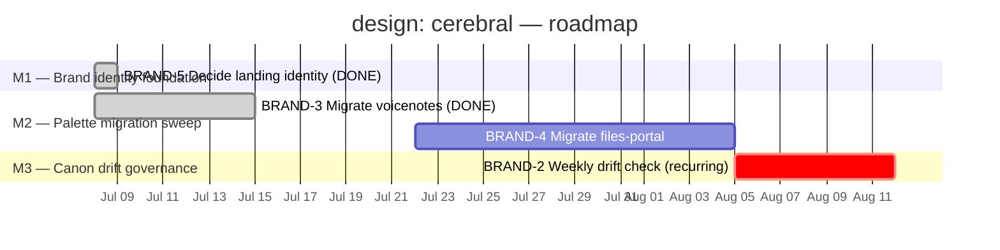

# design: cerebral — Project Roadmap

> Linear project: [design: cerebral](https://linear.app/cerebral-work/project/design-cerebral-78287e7047a5)
> Team: BRAND · State: backlog · Progress: 50% · Lead: ctodie
> Generated: 2026-07-22 via `linearctl search --project "design: cerebral" --state all --json`

---

## Project charter

The **design: cerebral** project governs the Cerebral brand's design surface —
the `living-terminal` palette, the `@cerebral/design` package, and the
.page-by-page migration of Cerebral properties off the deprecated pre-seed
palette. Two of four tracked issues have shipped (BRAND-3 voicenotes migration,
BRAND-5 landing-identity decision); the project sits at 50% progress with two
open items: the files-portal palette migration (BRAND-4) and the standing
weekly drift-check chore (BRAND-2).

The remaining arc is narrow but sequenced: finish the last palette migration,
then stand up the governance loop that keeps the canon honest forever after.
This roadmap organizes the full four-issue history into three thematic
milestones — the identity decision that's done, the palette migration that's
mostly done, and the governance loop that closes the project out.

### Issues in scope (4)

| ID | Title | State | Priority | Assignee |
|---|---|---|---|---|
| [BRAND-2](https://linear.app/cerebral-work/issue/BRAND-2/chore-weekly-drift-check-design-sync-check-mirror-hygiene) | [chore] weekly drift check — design-sync --check + mirror hygiene | Backlog | — | unassigned |
| [BRAND-3](https://linear.app/cerebral-work/issue/BRAND-3/migrate-voicenotes-off-pre-seed-palette-onto-living-terminal) | Migrate voicenotes off pre-seed palette onto living-terminal | Ready | — | unassigned |
| [BRAND-4](https://linear.app/cerebral-work/issue/BRAND-4/migrate-files-portal-off-pre-seed-palette-onto-living-terminal) | Migrate files-portal off pre-seed palette onto living-terminal | Backlog | — | unassigned |
| [BRAND-5](https://linear.app/cerebral-work/issue/BRAND-5/decide-cerebralwork-landing-editorial-identity-vs-living-terminal) | Decide: cerebral.work landing — editorial identity vs living-terminal | Done | — | ctodie |

---

## Milestone breakdown

Three milestones, mapped to the project's natural phases. M1 captures the
completed identity decision (historical context). M2 is the active palette
migration phase — one done, one to go. M3 is the governance loop that
maintains canon integrity as the project's steady-state exit criterion.

### M1 — Brand identity foundation (BRAND-5)

> The foundational decision: which visual identity the Cerebral brand
> commits to. Resolved — `living-terminal` won over editorial.

| Issue | State | Priority |
|---|---|---|
| [BRAND-5](https://linear.app/cerebral-work/issue/BRAND-5) — Decide: cerebral.work landing — editorial identity vs living-terminal | ✅ Done | — |

**Scope (from BRAND-5):**

- **Decision recorded:** cerebral.work landing wears the `living-terminal`
  palette (Catppuccin-derived terminal aesthetic), not a separate editorial
  identity. This decision gates all downstream palette work.
- **Outcome:** every subsequent migration (BRAND-3, BRAND-4) targets
  `living-terminal` as the canonical Cerebral palette — there is no
  "editorial" variant to maintain.
- **Completed:** 2026-07 (Done state, assigned to ctodie).

**Deliverable:** a recorded, shipped brand-identity decision. This is the
project's foundation — without it, the palette migrations have no target.

---

### M2 — Palette migration sweep (BRAND-3, BRAND-4)

> Migrate every Cerebral property off the deprecated pre-seed palette onto
> the canonical `living-terminal` tokens. One down, one to go.

| Issue | State | Priority |
|---|---|---|
| [BRAND-3](https://linear.app/cerebral-work/issue/BRAND-3) — Migrate voicenotes off pre-seed palette | ✅ Ready | — |
| [BRAND-4](https://linear.app/cerebral-work/issue/BRAND-4) — Migrate files-portal off pre-seed palette | 📋 Backlog | — |

**Scope (from BRAND-3 + BRAND-4):**

- **BRAND-3 (done):** voicenotes app migrated off pre-seed palette onto
  `living-terminal`. Palette tokens sourced from `@cerebral/design`.
- **BRAND-4 (open):** files-portal app — the last remaining property still
  wearing pre-seed colors. Same migration shape as BRAND-3: swap hard-coded
  pre-seed values for `living-terminal` tokens from `@cerebral/design`.
- **Completion criterion:** no Cerebral property references pre-seed palette
  values. `grep` across the codebase returns zero pre-seed hex hits.

**Deliverable:** a fully migrated Cerebral web surface — every property on
the canonical palette. BRAND-4 is the sole remaining blocker for this
milestone.

---

### M3 — Canon drift governance (BRAND-2)

> The standing weekly chore: verify the design canon against live usage and
> the claude.ai mirror. This is the project's exit criterion — once M2
> completes the migrations and M3 confirms the drift check runs clean, the
> design:cerebral surface is in steady state.

| Issue | State | Priority |
|---|---|---|
| [BRAND-2](https://linear.app/cerebral-work/issue/BRAND-2) — [chore] weekly drift check — design-sync --check + mirror hygiene | 📋 Backlog | — |

**Scope (from BRAND-2):**

- **Weekly verification:**
  - `@cerebral/design` canon (`tokens.json` → `theme.css`) vs live usage
    across all Cerebral properties (voicenotes, files-portal, landing)
  - claude.ai "cerebral" design project mirror — confirm the mirror matches
    the repo canon
- **Drift reporting:** report drift as a COUNT in a comment on BRAND-2 (the
  issue stays open as the standing record)
- **Automation:** wired to the harness cron — runs weekly without manual
  invocation
- **Mirror hygiene:** keep the claude.ai design-sync manifest in sync with
  the repo canon source

**Deliverable:** a green recurring drift signal. This milestone closes the
project — the design:cerebral surface is in steady state when the weekly
check runs clean against a fully-migrated surface.

**Dependency:** M2 — the drift check is most meaningful when all properties
are on the canonical palette (otherwise it reports known migration gaps
as "drift").

---

## Roadmap visualization



---

## Issue → milestone matrix

| Issue | M1 Brand identity | M2 Palette migration | M3 Drift governance |
|---|---|---|---|
| BRAND-5 — Decide: cerebral.work landing identity | ✅ | (gates) | |
| BRAND-3 — Migrate voicenotes off pre-seed palette | | ✅ | |
| BRAND-4 — Migrate files-portal off pre-seed palette | | ✅ | |
| BRAND-2 — Weekly canon/mirror drift check | | | ✅ |

> M1 → M2 is a soft gate (the identity decision determined the migration
> target). M2 → M3 is a meaningful gate: the drift check is most valuable
> once the migration sweep is complete.

---

## Dependency graph

```
M1: Brand identity             M2: Palette migration            M3: Drift governance
───────────────────            ──────────────────────           ─────────────────────
BRAND-5 landing identity ──→   BRAND-3 voicenotes (done) ──→   BRAND-2 weekly drift check
  (Done — living-terminal      BRAND-4 files-portal (open)       design-sync --check
   wins over editorial)          swap pre-seed → living-         + claude.ai mirror hygiene
                                 terminal tokens                 (harness cron, recurring)
                                 from @cerebral/design
                                                               │
                                                               └─ recurring, stays open —
                                                                  steady-state governance loop
```

**Critical path:** M1 (done) → M2 (BRAND-4) → M3 (BRAND-2). The remaining
critical-path item is BRAND-4; once it ships, BRAND-2's drift check
becomes the project's standing exit criterion.

---

## Status summary

- **Completed:** 2/4 issues (50%). BRAND-5 (identity decision) and BRAND-3
  (voicenotes migration) are done.
- **In progress:** 0/4. No issues in Started/In Progress state.
- **Open:** 2/4 — BRAND-4 (files-portal migration, Backlog) and BRAND-2
  (weekly drift check, Backlog).
- **Project state:** backlog, 50% progress.

### Next actions

1. **Prioritize BRAND-4** — it's the sole remaining migration blocker; a
   "no priority" Backlog issue for a critical-path deliverable is a silent
   risk. Set priority to 2 (High).
2. **Wire BRAND-2's automation** — confirm the harness cron is firing the
   weekly `design-sync --check` and posting drift counts to BRAND-2.
3. **Close BRAND-3** — its state is "Ready" with stateType "completed";
   flip to Done if the migration is verified shipped.
4. **Set project target date** — no start or target date is set on the
   project; with 50% done, a target date would sharpen the remaining arc.
