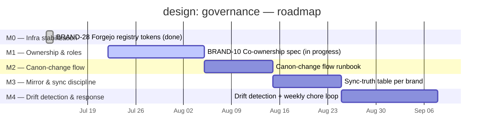

# Roadmap — design: governance

> Linear project: [design: governance](https://linear.app/cerebral-work/project/design-governance-f4b63fc9f004)
> Team: BRAND · State: backlog · Progress: 62.5% · Lead: unassigned
> Generated: 2026-07-22 via `linearctl search --project "design: governance" --state all --json`

---

## Project charter

Plan and build the system for co-owning and maintaining design work across
brands: **roles**, **canon-change flow**, **mirror/sync discipline**, and
**drift response**. Cerebral-internal first, for alignment and collaboration
across the design brand surface (cerebral, unsigned, openpanel, rina,
lab.cerebral.work).

### Issues in scope (2)

| ID | Title | State | Priority | Assignee |
|---|---|---|---|---|
| [BRAND-10](https://linear.app/cerebral-work/issue/BRAND-10/draft-the-design-co-ownership-and-maintenance-spec-cerebral-internal-first) | Draft the design co-ownership & maintenance spec (cerebral-internal first) | In Progress | P2 | ctodie |
| [BRAND-28](https://linear.app/cerebral-work/issue/BRAND-28/forgejo-org-npm-registry-publish-broken-072073080-missing-publish) | Forgejo org npm registry publish broken — tokens dead | Ready (done) | P1 | unassigned |

---

## Milestone breakdown

The governance spec (BRAND-10) defines five domains. Each maps to a milestone;
BRAND-28's resolved infrastructure incident anchors M0. All issues are
assigned to their corresponding milestone.

### M0 — Infrastructure stabilization (done)

> Forgejo npm registry tokens died post-migration; design packages
> unreachable. Resolved 2026-07-13.

| Issue | State | Priority |
|---|---|---|
| [BRAND-28](https://linear.app/cerebral-work/issue/BRAND-28) — Forgejo org npm registry publish broken | ✅ Ready (completed) | P1 |

**Outcome**: Fresh read/write tokens minted; consumer floor moved to
`@cerebral/design@0.8.0`; terrarium CI regreened. Pre-requisite for all
subsequent governance work — publishing must work before you govern it.

---

### M1 — Ownership & role definition

> Who owns what across each brand canon. Cerebral-internal first.

| Issue | State | Priority |
|---|---|---|
| [BRAND-10](https://linear.app/cerebral-work/issue/BRAND-10) — Draft the design co-ownership & maintenance spec | 🔄 In Progress | P2 |

**Scope extracted from BRAND-10**:
- Ownership roles per brand: Kimberley → cerebral, Marc → rina, operator → unsigned + openpanel
- Contributor onboarding to design work (ties to design GitHub team / Forgejo publishers)
- Cerebral-internal first; external collaboration model deferred

**Deliverable**: Reviewed spec document defining role assignments, escalation
contacts, and the contributor-onboarding path. Goes to the operator in
`$EDITOR` for review; decisions captured via interview.

---

### M2 — Canon-change flow

> How canon changes propagate per authoring mode.

**Scope** (from BRAND-10 spec sections):
- Repo PR authoring (code-first brand changes)
- claude.ai design authoring (visual/design-tool-first changes)
- Pullback (reverting or rolling back canon drift)

**Deliverable**: Decision tree + runbook for each authoring mode, specifying
which direction wins per brand and the approval gate.

---

### M3 — Mirror & sync discipline

> Which direction wins per brand when mirrors diverge.

**Scope** (from BRAND-10 spec section):
- Mirror/sync discipline per brand (repo ↔ Forgejo ↔ claude.ai)
- Conflict-resolution rules: source-of-truth declaration per brand
- Sync cadence and trigger model

**Deliverable**: Sync-truth table per brand with validated mirror paths and
documented conflict resolution.

---

### M4 — Drift detection & response

> The weekly chore loop: detect → triage → remediate.

**Scope** (from BRAND-10 spec section):
- Drift detection signal (what constitutes drift per brand)
- Response runbook (who is paged, what they do)
- Weekly chore cadence (the recurring governance maintenance loop)
- How the Brand-team projects stay the tracking surface for drift items

**Deliverable**: Automated drift-detection signal (cron or hook) +
response runbook. This is the steady-state governance loop — the project's
exit criterion.

---

## Roadmap visualization

---

## Issue → milestone matrix

| Issue | M0 Infra | M1 Ownership | M2 Canon-flow | M3 Sync | M4 Drift |
|---|---|---|---|---|---|
| BRAND-28 | ✅ | | | | |
| BRAND-10 | | 🔄 (spec covers M1–M4) | 📋 | 📋 | 📋 |

> BRAND-10 is the umbrella spec that defines M1 through M4. Once the spec is
> reviewed and approved (M1 complete), each subsequent domain can be broken
> into its own tracked issues — or the spec itself serves as the governing
> document with M2–M4 as acceptance checkpoints.

---

## Status summary

- **Completed**: 1/2 issues (50%). M0 is done — infrastructure is stable.
- **In progress**: 1/2 issues (50%). BRAND-10 is the governance spec; it is
  the single active deliverable and the gate for M1–M4.
- **Not yet tracked**: M2 (canon-change flow), M3 (mirror/sync discipline),
  and M4 (drift detection) have no dedicated issues yet — they are scoped
  within the BRAND-10 spec and will be broken out upon spec approval.
- **Project state**: backlog, 62.5% complete. The gap between 62.5% progress
  and 50% issue completion suggests archived issues counted in project
  estimation; the active surface is 2 issues.

### Next actions

1. **Operator review** of BRAND-10 spec draft (M1 gate) — decisions via
   interview, spec in `$EDITOR`.
2. **Break out M2–M4** into individual BRAND issues upon spec approval.
3. **Assign a project lead** — currently unassigned.
4. **Set target dates** — project has no start or target date.
