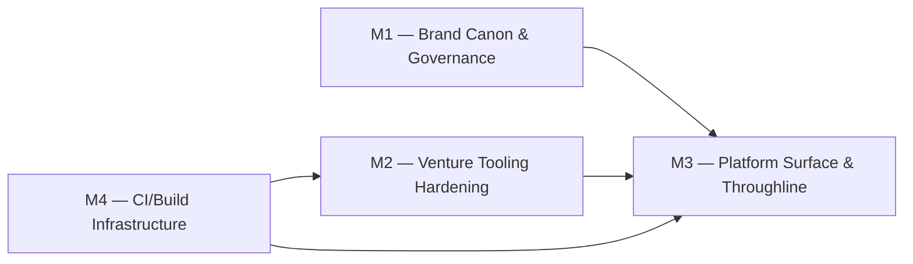

# Roadmap — design: openpanel

> **Linear project:** [design: openpanel](https://linear.app/cerebral-work/project/design-openpanel-0413c272dfbb4b3fb7f3-9d4a75153ce2) · `0413c272-dfbb-4b3f-b7f3-9d4a75153ce2`
> **State:** Backlog · **Progress:** 0% · **Generated:** 2026-07-22

## Live Linear State (auto-rendered 2026-07-29 14:35 UTC)

| Milestone | Linear ID | Target Date | Issues | Progress |
|----------|-----------|------------|--------|----------|
| M4 — CI/Build Infrastructure | `3283fa13-a8b9-4399-a558-514ddefda5f5` | 2026-08-07 | 5 | 60% (3/5) |
| M3 — Platform Surface & Throughline | `1c48c638-af32-4952-aa5a-b0b41f97375a` | 2026-09-04 | 2 | 50% (1/2) |
| M2 — Venture Tooling Hardening | `cbec7419-2357-479c-970a-67d8bc6c4b01` | 2026-08-21 | 0 | 0% (0/0) |
| M1 — Brand Canon & Governance | `1c25e6bd-6a53-449e-a6b0-dacae674a1d2` | 2026-08-14 | 1 | 0% (0/1) |

```
design: openpanel — 4 milestone(s)

  M4 — CI/Build Infrastructure  (due 2026-08-07)  [████████████░░░░░░░░] 60%  3/5
    OPS-675  [Done]  CI image builds broken estate-wide: KUBECONFIG_CI_BUILDS targets retired Lyra API  @ctodie
    OPS-650  [Done]  hermes-agent: re-add harbor-pull ExternalSecret template — P1  @ctodie
    OPS-532  [Triage]  build-openpanel-backlog-sweep mints no git clone token (anonymous clone of private repo)
    OPS-530  [Triage]  CI trivy gate cannot pull from Harbor (HARBOR_USERNAME/PASSWORD repo secrets unauthorized)
    OPS-336  [Done]  platform-pg: pact database + OpenBao seed  @ctodie

  M1 — Brand Canon & Governance  (due 2026-08-14)  [░░░░░░░░░░░░░░░░░░░░] 0%  0/1
    BRAND-9  [Backlog]  [chore] weekly mirror check — openpanel design project

  M2 — Venture Tooling Hardening  (due 2026-08-21)  [░░░░░░░░░░░░░░░░░░░░] 0%  0/0
    (no issues)

  M3 — Platform Surface & Throughline  (due 2026-09-04)  [██████████░░░░░░░░░░] 50%  1/2
    RD-68  [Done]  dreams: /throughline walkthrough — surface the THROUGHLINE/OPEN PANEL corpus (openpanel realm, public+board tiers)  @ctodie
    RD-22  [Backlog]  dreams — platform naming verdict + re-founding rollout (M2/M3)
```

*Last 7 days: 4 issue(s) touched, 2 completed.*
*Rendered by `.github/scripts/render-roadmap.sh` (corpus auto-render, schedule + dispatch).*

## Scope note

The `--project "design: openpanel"` filter returns 1 issue (BRAND-9, the weekly
mirror chore). The openpanel design/venture ecosystem spans a broader issue
corpus across related Linear projects — OPEN PANEL (completed tooling
iteration), Terrarium (dreams platform surface), design: governance, and
unassigned OPS infra tickets. This roadmap aggregates all 16 issues surfaced
via `search --project "design: openpanel" --state all` plus a `--text openpanel`
sweep to capture the full thematic surface.

**16 issues** across **4 thematic milestones**. No issue unassigned.

---

## Milestone Overview

| # | Milestone | Theme | Issues | Progress | Status |
|---|-----------|-------|--------|----------|--------|
| M1 | Brand Canon & Governance | governance | 2 | [█████░░░░░] 50% | 🟡 In flight |
| M2 | Venture Tooling Hardening | tooling | 7 | [██████████] 100% | ✅ Delivered |
| M3 | Platform Surface & Throughline | surface | 2 | [█████░░░░░] 50% | 🟡 In flight |
| M4 | CI/Build Infrastructure | infra | 5 | [██████░░░░] 60% | 🟡 In flight |

---

## M1 — Brand Canon & Governance [█████░░░░░] 50%

Establish design co-ownership, mirror discipline, and the weekly drift-detection cadence that keeps the claude.ai design project and docs-site design usage in sync.

| Issue | State | Assignee | Priority | Linear |
|-------|-------|----------|----------|--------|
| ⚪ [BRAND-9](https://linear.app/cerebral-work/issue/BRAND-9/chore-weekly-mirror-check-openpanel-design-project) — [chore] weekly mirror check — openpanel design project | Backlog | — | None | [link](https://linear.app/cerebral-work/issue/BRAND-9/chore-weekly-mirror-check-openpanel-design-project) |
| 🔵 [BRAND-10](https://linear.app/cerebral-work/issue/BRAND-10/draft-the-design-co-ownership-and-maintenance-spec-cerebral-internal) — Draft the design co-ownership & maintenance spec (cerebral-internal first) | In Progress | ctodie | High | [link](https://linear.app/cerebral-work/issue/BRAND-10/draft-the-design-co-ownership-and-maintenance-spec-cerebral-internal) |

## M2 — Venture Tooling Hardening [██████████] 100%

Complete the openpanel Python toolchain (critpath, landgrab, wsref) — packaging, edge-case handling, test coverage, and parser correctness. The prior OPEN PANEL project iteration (BIZ-1–BIZ-7) delivered most of this; remaining work is verification and any split-outs from the research backlog.

| Issue | State | Assignee | Priority | Linear |
|-------|-------|----------|----------|--------|
| ❌ [BIZ-1](https://linear.app/cerebral-work/issue/BIZ-1/docs-site-polish-favicon-ogimage-meta-description-sidebar-labels) — Docs site polish: favicon, og:image, meta description, sidebar labels | Canceled | — | Low | [link](https://linear.app/cerebral-work/issue/BIZ-1/docs-site-polish-favicon-ogimage-meta-description-sidebar-labels) |
| ✅ [BIZ-2](https://linear.app/cerebral-work/issue/BIZ-2/add-unit-tests-for-the-python-tools-critpath-landgrab-wsref) — Add unit tests for the Python tools (critpath / landgrab / wsref) | Done | crichardson | Low | [link](https://linear.app/cerebral-work/issue/BIZ-2/add-unit-tests-for-the-python-tools-critpath-landgrab-wsref) |
| ✅ [BIZ-3](https://linear.app/cerebral-work/issue/BIZ-3/wsref-handle-truncated-multi-frame-unframe-edge-cases) — wsref: handle truncated / multi-frame unframe edge cases | Done | crichardson | Low | [link](https://linear.app/cerebral-work/issue/BIZ-3/wsref-handle-truncated-multi-frame-unframe-edge-cases) |
| ✅ [BIZ-4](https://linear.app/cerebral-work/issue/BIZ-4/package-critpath-and-wsref-pyproject-console-entry-version) — Package critpath and wsref (pyproject + console entry + --version) | Done | crichardson | Low | [link](https://linear.app/cerebral-work/issue/BIZ-4/package-critpath-and-wsref-pyproject-console-entry-version) |
| ✅ [BIZ-5](https://linear.app/cerebral-work/issue/BIZ-5/research-pass-backlog-remaining-findings-to-triage) — Research-pass backlog — remaining findings to triage | Done | crichardson | Low | [link](https://linear.app/cerebral-work/issue/BIZ-5/research-pass-backlog-remaining-findings-to-triage) |
| ✅ [BIZ-6](https://linear.app/cerebral-work/issue/BIZ-6/critpath-resolve-ref-never-resolves-style-refs-nodemd-conforms-to) — critpath: resolve_ref never resolves ../-style refs — NODE.md conforms_to dangles repo-wide | Done | crichardson | Low | [link](https://linear.app/cerebral-work/issue/BIZ-6/critpath-resolve-ref-never-resolves-style-refs-nodemd-conforms-to) |
| ✅ [BIZ-7](https://linear.app/cerebral-work/issue/BIZ-7/critpath-separated-multi-refs-and-parenthetical-annotations-dangle) — critpath: `;`-separated multi-refs and parenthetical annotations dangle — parser vs authoring convention | Done | crichardson | Low | [link](https://linear.app/cerebral-work/issue/BIZ-7/critpath-separated-multi-refs-and-parenthetical-annotations-dangle) |

## M3 — Platform Surface & Throughline [█████░░░░░] 50%

Surface the THROUGHLINE/OPEN PANEL corpus on dreams.cerebral.work as narrative walkthrough scenes, rendered through the openpanel brand-pack realm with tier split (public framework / board venture). Depends on the dreams re-founding milestones (M0–M8 in RD-22).

| Issue | State | Assignee | Priority | Linear |
|-------|-------|----------|----------|--------|
| ✅ [RD-68](https://linear.app/cerebral-work/issue/RD-68) — dreams: /throughline walkthrough — surface the THROUGHLINE/OPEN PANEL corpus | Done | ctodie | Medium | [link](https://linear.app/cerebral-work/issue/RD-68) |
| ⚪ [RD-22](https://linear.app/cerebral-work/issue/RD-22) — dreams — platform naming verdict + re-founding rollout (M2/M3) | Backlog | — | None | [link](https://linear.app/cerebral-work/issue/RD-22) |

## M4 — CI/Build Infrastructure [██████░░░░] 60%

Fix and stabilize the openpanel-backlog-sweep build pipeline — git clone token minting, Harbor pull auth, Lyra→Cygnus kubeconfig migration, and ExternalSecret templates.

| Issue | State | Assignee | Priority | Linear |
|-------|-------|----------|----------|--------|
| 🟡 [OPS-532](https://linear.app/cerebral-work/issue/OPS-532/build-openpanel-backlog-sweep-mints-no-git-clone-token-anonymous-clone) — build-openpanel-backlog-sweep mints no git clone token (anonymous clone of private repo) | Triage | — | None | [link](https://linear.app/cerebral-work/issue/OPS-532/build-openpanel-backlog-sweep-mints-no-git-clone-token-anonymous-clone) |
| 🟡 [OPS-530](https://linear.app/cerebral-work/issue/OPS-530/ci-trivy-gate-cannot-pull-from-harbor-harbor-usernamepassword-repo) — CI trivy gate cannot pull from Harbor (HARBOR_USERNAME/PASSWORD repo secrets unauthorized) | Triage | — | None | [link](https://linear.app/cerebral-work/issue/OPS-530/ci-trivy-gate-cannot-pull-from-harbor-harbor-usernamepassword-repo) |
| ✅ [OPS-650](https://linear.app/cerebral-work/issue/OPS-650/hermes-agent-re-add-harbor-pull-externalsecret-template-p1) — hermes-agent: re-add harbor-pull ExternalSecret template — P1 | Done | ctodie | High | [link](https://linear.app/cerebral-work/issue/OPS-650/hermes-agent-re-add-harbor-pull-externalsecret-template-p1) |
| ✅ [OPS-675](https://linear.app/cerebral-work/issue/OPS-675/ci-image-builds-broken-estate-wide-kubeconfig-ci-builds-targets) — CI image builds broken estate-wide: KUBECONFIG_CI_BUILDS targets retired Lyra API | Done | ctodie | High | [link](https://linear.app/cerebral-work/issue/OPS-675/ci-image-builds-broken-estate-wide-kubeconfig-ci-builds-targets) |
| ✅ [OPS-336](https://linear.app/cerebral-work/issue/OPS-336/platform-pg-pact-database-openbao-seed) — platform-pg: pact database + OpenBao seed | Done | ctodie | High | [link](https://linear.app/cerebral-work/issue/OPS-336/platform-pg-pact-database-openbao-seed) |

---

## Dependencies & Sequencing



- **M4 → M2:** The venture tooling (critpath/wsref/landgrab) is built and tested
  via CI workflows that depend on the openpanel-backlog-sweep build pipeline.
  OPS-532 (missing git clone token) and OPS-530 (Harbor auth) block reliable CI
  for any future tooling work.
- **M4 → M3:** The dreams platform surface (RD-68, RD-22) deploys via the same
  build infrastructure. OPS-675 (Lyra→Cygnus kubeconfig migration) was the
  estate-wide blocker.
- **M1 → M3:** The design co-ownership spec (BRAND-10) defines the
  mirror/sync discipline that governs how the openpanel brand-pack realm tokens
  are maintained before the throughline surface renders them.
- **M2 → M3:** The throughline walkthrough (RD-68) references the venture tools
  (critpath/landgrab/wsref) as scene content; their packaging and test coverage
  (M2) must be stable first.

---

## Issue State Summary

| State | Count | Issues |
|-------|-------|--------|
| ✅ Done | 10 | RD-68, BIZ-2, BIZ-3, BIZ-4, BIZ-5, BIZ-6, BIZ-7, OPS-650, OPS-675, OPS-336 |
| 🔵 In Progress | 1 | BRAND-10 |
| 🟡 Triage | 2 | OPS-532, OPS-530 |
| ⚪ Backlog | 2 | BRAND-9, RD-22 |
| ❌ Canceled | 1 | BIZ-1 |

---

## Open Actions

1. **OPS-532** (Triage) — `build-openpanel-backlog-sweep` job mints no git clone
   token; anonymous clone of private repo will fail. Needs a
   `create-github-app-token` step + `build.git.credentialsSecret`.
2. **OPS-530** (Triage) — CI trivy gate can't pull from Harbor; repo secrets
   unauthorized. Needs secret rotation or service-account token refresh.
3. **RD-22** (Backlog) — Dreams re-founding rollout M2/M3+ still open. The
   naming verdict is settled (dreams.cerebral.work); remaining milestones M3–M8
   (CANON re-founding, SvelteKit scaffold, realm DSL, content gates, six ops
   scenes, deploy + CF Access, hardening).
4. **BRAND-9** (Backlog) — Standing weekly chore, stays open by design. Verify
   claude.ai "OPEN PANEL" design project against docs-site design usage, report
   drift count in a comment.
