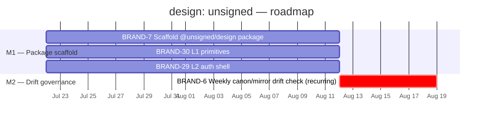

# design: unsigned — Project Roadmap

> Linear project: [design: unsigned](https://linear.app/cerebral-work/project/design-unsigned-18ff863ddffc)
> Team: BRAND · State: backlog · Progress: 0% · Lead: unassigned
> Generated: 2026-07-22 via `linearctl search --project "design: unsigned" --state all --json`
> Executed: 2026-07-22 — 2 milestones created, 4 issues assigned, 2 missing tickets filed.
> Rendered: 2026-07-22 via `linearctl roadmap --project "design: unsigned"`.

---

## Project charter

Consolidate the **machinery, not the identity** of the unsigned brand's
design surface. Today every unsigned-brand page (`index.html` landing,
`/learn/styles.css`, `apps/onboard/`) hand-copies the same tokens
(`#0a0a0a`, `#00e599`, Inter/JetBrains Mono) — drift is already visible
across copies. This project gives unsigned the same tooling shape that
`@cerebral/design` already has — a `tokens.json` → `theme.css` build, typed
exports, a Forgejo-published package, a `.design-sync.json` mirror — wearing
unsigned's own palette/voice, isolated from the Cerebral brand family.

The hard rule (from the dash-consolidation spec): **the two brand families
never merge tokens.** Cerebral (living-terminal/Catppuccin) and unsigned
(instrument-panel) stay separate.

### Issues in scope (4)

| ID | Title | State | Priority | Assignee |
|---|---|---|---|---|
| [BRAND-6](https://linear.app/cerebral-work/issue/BRAND-6/chore-weekly-canonmirror-drift-check-unsigned) | [chore] weekly canon/mirror drift check — unsigned | Backlog | P3 Medium | unassigned |
| [BRAND-7](https://linear.app/cerebral-work/issue/BRAND-7/scaffold-unsigneddesign-package-lift-cerebral-design-tooling-shape) | Scaffold @unsigned/design package (lift cerebral-design tooling shape) | Backlog | P2 High | unassigned |
| [BRAND-30](https://linear.app/cerebral-work/issue/BRAND-30) | L1 primitives: unsigned component library (panel, pill, kbd, button, command-bar, focus ring) | Backlog | P3 Medium | unassigned |
| [BRAND-29](https://linear.app/cerebral-work/issue/BRAND-29) | L2 auth shell: extract onboard Keycloak PKCE client for dash consumption | Backlog | P3 Medium | unassigned |

---

## Milestone breakdown

Two milestones. BRAND-7 is the foundation — it creates the canon
source (`tokens.json` → `dist/theme.css`, the `.design-sync.json` manifest,
the published package) that BRAND-6's drift check is meaningless without.
BRAND-6 is the steady-state governance loop that runs on top. BRAND-30 (L1
primitives) and BRAND-29 (L2 auth shell) were filed from the scoping spec
and added to M1 — they consume the scaffold's tokens and block
`dash.unsigned.gg`.

### M1 — Design package scaffold (3 issues)

> Build the `@unsigned/design` package: the single source of truth for the
> unsigned brand's tokens, generated artifacts, and design-sync manifest.
>
> **Linear milestone:** `69aa66cd-5d2e-4853-9f0c-69cb4f9514ec` · target 2026-08-12

| Issue | State | Priority |
|---|---|---|
| [BRAND-7](https://linear.app/cerebral-work/issue/BRAND-7) — Scaffold @unsigned/design package | 📋 Backlog | P2 High |
| [BRAND-30](https://linear.app/cerebral-work/issue/BRAND-30) — L1 primitives: unsigned component library | 📋 Backlog | P3 Medium |
| [BRAND-29](https://linear.app/cerebral-work/issue/BRAND-29) — L2 auth shell: extract onboard Keycloak PKCE client | 📋 Backlog | P3 Medium |

**Scope (from BRAND-7 + the 2026-07-08 brand-separation scope spec):**

- **L0 · tokens** — `packages/tokens/` in the `gg` repo (canonical brand home
  `unsigned-gg/unsigned-gg` per its CLAUDE.md + `.impeccable.md`):
  - `tokens.json` — colors, type scale, spacing, radii, motion (one source of truth)
  - Generated `dist/theme.css` (custom properties on `:root`, light + dark) and
    typed ESM export (`tokens.js`)
  - CI check: `dist/` matches source (no stale artifacts)
- **`.design-sync.json`** manifest — points at generated `theme.css`, replaces
  the current hand-maintained feed; enables the claude.ai "unsigned" design
  project mirror
- **Forgejo publish** — `@unsigned/design` published to the org npm registry
  (Forgejo tokens were fixed 2026-07-13 via BRAND-28 in `design: governance`;
  publishing must work before the package can land)
- **`.impeccable.md`** canon — the design canon document BRAND-6's drift check
  validates against; doesn't exist yet today, created in this milestone
- **Open decision (D1 from scope spec):** distribution mechanism — npm public
  `@unsigned-gg/tokens` (recommended, tokens are already public in every
  page) vs GitHub Packages private vs R2/design-sync pull. Affects only
  out-of-repo consumers (`dash.unsigned.gg`); v1 in-repo work is identical.
- **Open decision (side-bar):** which brand `git.cerebral.work` (Forgejo,
  platform infra serving the unsigned realm) wears — deliberate call,
  currently inherited.

**Deliverable:** a published `@unsigned/design` package, a checked-in `.impeccable.md`
canon, and a `.design-sync.json` manifest. This is the canon source — everything
downstream (drift checks, component primitives, auth-shell extraction, the
dash surface) depends on it existing.

**Dependency:** Forgejo npm registry must be functional (resolved — BRAND-28).

---

### M2 — Canon drift governance loop (BRAND-6)

> A standing chore: verify the unsigned canon against live usage and the
> claude.ai mirror, weekly, forever.
>
> **Linear milestone:** `f7a39b7f-ef10-44b8-94d1-2dbb5a209bf1` · target 2026-08-19

| Issue | State | Priority |
|---|---|---|
| [BRAND-6](https://linear.app/cerebral-work/issue/BRAND-6) — [chore] weekly canon/mirror drift check — unsigned | 📋 Backlog | P3 Medium |

**Scope (from BRAND-6):**

- **Weekly verification:**
  - `unsigned/gg/.impeccable.md` canon vs live usage — the
    `cluster-control-panel/index.css` tokens (the current single consumption
    point exercising the generated theme)
  - claude.ai "unsigned" design project mirror — confirm the mirror matches
    the repo canon
- **Drift reporting:** report drift as a COUNT in a comment on BRAND-6
  (the issue stays open as the standing record)
- **Automation:** already wired to the harness cron (2026-07-08) — runs
  weekly without manual invocation

**Deliverable:** a green recurring drift signal. This is the project's exit
criterion — once M1 ships the package and M2 confirms the drift check runs
clean against it, the design:unsigned surface is in steady state.

**Dependency:** M1 — the drift check is meaningless without a canon source
(`.impeccable.md` + generated `theme.css`) to compare against.

---

## Roadmap visualization


---
## Issue → milestone matrix

| Issue | M1 Package scaffold | M2 Drift governance |
|---|---|---|
| BRAND-7 — Scaffold @unsigned/design | ✅ | (enables) |
| BRAND-30 — L1 primitives: component library | ✅ | |
| BRAND-29 — L2 auth shell: Keycloak PKCE | ✅ | |
| BRAND-6 — Weekly canon/mirror drift check | | ✅ |

> BRAND-7 is the gate. Until the package + `.impeccable.md` canon exist,
> BRAND-6's drift check has nothing to validate — the two issues are
> strictly sequenced, not parallelizable.

---

## Dependency graph

```
M1: Package scaffold                   M2: Drift governance
──────────────────────                 ────────────────────
BRAND-7  scaffold package (L0)  ──┐    BRAND-6 weekly drift check
  tokens.json → theme.css          │      canon vs live usage
  .impeccable.md canon             ├──→   + claude.ai mirror
  .design-sync.json manifest       │      (harness cron, recurring)
  Forgejo publish @unsigned/design │
                                  │    │
BRAND-30 L1 primitives  ─────────┤    └─ recurring, stays open —
  panel, pill, kbd, button,         steady-state governance loop
  command-bar, focus ring

BRAND-29 L2 auth shell  ─────────┘
  Keycloak PKCE client
  (login, refresh, logout)

  [blocked-by: BRAND-28 Forgejo npm registry (resolved)]
```

**Critical path:** M1 (package scaffold + L1 + L2) → M2 (drift check).
Within M1, BRAND-7 (scaffold) is the gate for BRAND-30 (L1 primitives) and
BRAND-29 (L2 auth shell) — they consume the tokens. M2's drift check
requires the canon source from M1.

---

## Rendered roadmap

```
design: unsigned — 2 milestone(s)

  M1 — Design package scaffold  (due 2026-08-12)  [░░░░░░░░░░░░░░░░░░░░] 0%  0/3
    BRAND-30  [Backlog]  L1 primitives: unsigned component library (panel, pill, kbd, button, command-bar, focus ring)
    BRAND-29  [Backlog]  L2 auth shell: extract onboard Keycloak PKCE client for dash consumption
    BRAND-7  [Backlog]  Scaffold @unsigned/design package (lift cerebral-design tooling shape)

  M2 — Canon drift governance loop  (due 2026-08-19)  [░░░░░░░░░░░░░░░░░░░░] 0%  0/1
    BRAND-6  [Backlog]  [chore] weekly canon/mirror drift check — unsigned
```

> Rendered 2026-07-22 via `linearctl roadmap --project "design: unsigned"`.

---

## Status summary

- **Completed:** 0/4 issues (0%). No work has shipped yet — all in Backlog.
- **Milestones created in Linear:** 2
  - M1 — Design package scaffold (`69aa66cd-5d2e-4853-9f0c-69cb4f9514ec`, due 2026-08-12, 3 issues)
  - M2 — Canon drift governance loop (`f7a39b7f-ef10-44b8-94d1-2dbb5a209bf1`, due 2026-08-19, 1 issue)
- **Issues assigned to milestones:** 4/4
  - BRAND-7 → M1 · priority: High (P2)
  - BRAND-30 → M1 · priority: Medium (P3) · filed from scoping spec
  - BRAND-29 → M1 · priority: Medium (P3) · filed from scoping spec
  - BRAND-6 → M2 · priority: Medium (P3)
- **Missing tickets filed:** 2 (BRAND-30 L1 primitives, BRAND-29 L2 auth shell)
- **Rendered roadmap:** confirmed via `linearctl roadmap` — 2 milestones, 4 issues, all in M1 (3) + M2 (1).

### Next actions

1. **Resolve D1** (distribution mechanism) and the `git.cerebral.work`
   brand ownership sidebar — operator decisions blocking BRAND-7.
2. **Assign a project lead** — currently unassigned.
3. **Set project state** from backlog → planned, now that milestones + issues
   are structured.
4. **Start BRAND-7** — it's the critical-path foundation; both BRAND-30 and
   BRAND-29 consume its output.
