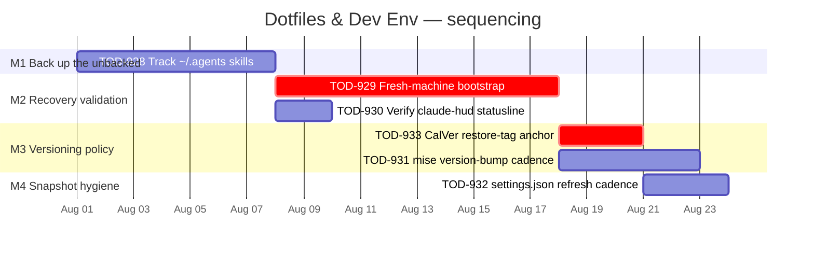

# Roadmap — Dotfiles & Dev Env

> Linear project: [Dotfiles & Dev Env](https://linear.app/cerebral-work/project/dotfiles-and-dev-env-7aafd85aac8f)
> Source of truth: Linear (milestones + issue assignments persisted via `linearctl`).
> Last synced: 2026-07-22 via `linearctl roadmap --project "Dotfiles & Dev Env"`.

## Live Linear State (auto-rendered 2026-07-29 14:34 UTC)

| Milestone | Linear ID | Target Date | Issues | Progress |
|----------|-----------|------------|--------|----------|
| M4 — Snapshot & tooling hygiene | `3920d927-d7d4-468d-b92a-61b49fe5994e` | 2026-08-29 | 1 | 0% (0/1) |
| M2 — Prove end-to-end recovery | `231e456d-5d86-45c4-9460-f743a8400255` | 2026-08-18 | 2 | 0% (0/2) |
| M3 — Restore-tag policy + version-bump cadence | `4fef2a53-01ff-4d56-a0a4-f70e9e6a4e16` | 2026-08-26 | 2 | 0% (0/2) |
| M1 — Back up the unbacked authoring surface | `84b05e95-1696-45c4-ae80-d3869e4510e4` | 2026-08-08 | 1 | 0% (0/1) |

```
Dotfiles & Dev Env — 4 milestone(s)

  M1 — Back up the unbacked authoring surface  (due 2026-08-08)  [░░░░░░░░░░░░░░░░░░░░] 0%  0/1
    TOD-928  [Backlog]  Track ~/.agents/ — skills are currently unbacked

  M2 — Prove end-to-end recovery  (due 2026-08-18)  [░░░░░░░░░░░░░░░░░░░░] 0%  0/2
    TOD-930  [Backlog]  Verify claude-hud statusline renders (bun restored)
    TOD-929  [Backlog]  Fresh-machine bootstrap runbook + test in a throwaway VM/container

  M3 — Restore-tag policy + version-bump cadence  (due 2026-08-26)  [░░░░░░░░░░░░░░░░░░░░] 0%  0/2
    TOD-933  [Backlog]  CalVer restore-tag workflow + first anchor
    TOD-931  [Backlog]  mise: version-bump cadence / upgrade flow

  M4 — Snapshot & tooling hygiene  (due 2026-08-29)  [░░░░░░░░░░░░░░░░░░░░] 0%  0/1
    TOD-932  [Backlog]  settings.json snapshot refresh cadence (committed-once, will go stale)
```

*Last 7 days: 0 issue(s) touched, 0 completed.*
*Rendered by `.github/scripts/render-roadmap.sh` (corpus auto-render, schedule + dispatch).*

## Overview

The project tracks the hygiene, recoverability, and tooling integration of
Christian's dotfiles + agent authoring environment. All 6 issues (TOD-928 …
TOD-933) sat in Backlog with no milestones; this roadmap created **4 thematic
milestones** in Linear and assigned every issue to one.

### Linear-rendered roadmap (verbatim from `linearctl roadmap`)

```
Dotfiles & Dev Env — 4 milestone(s)

  M1 — Back up the unbacked authoring surface  (due 2026-08-08)  [░░░░░░░░░░░░░░░░░░░░] 0%  0/1
    TOD-928  [Backlog]  Track ~/.agents/ — skills are currently unbacked

  M2 — Prove end-to-end recovery  (due 2026-08-18)  [░░░░░░░░░░░░░░░░░░░░] 0%  0/2
    TOD-930  [Backlog]  Verify claude-hud statusline renders (bun restored)
    TOD-929  [Backlog]  Fresh-machine bootstrap runbook + test in a throwaway VM/container

  M3 — Restore-tag policy + version-bump cadence  (due 2026-08-26)  [░░░░░░░░░░░░░░░░░░░░] 0%  0/2
    TOD-933  [Backlog]  CalVer restore-tag workflow + first anchor
    TOD-931  [Backlog]  mise: version-bump cadence / upgrade flow

  M4 — Snapshot & tooling hygiene  (due 2026-08-29)  [░░░░░░░░░░░░░░░░░░░░] 0%  0/1
    TOD-932  [Backlog]  settings.json snapshot refresh cadence (committed-once, will go stale)
```

### At a glance

| Milestone | Theme | Issues | Pri mix | Target |
|---|---|---|---|---|
| M1 | Back up the unbacked authoring surface | 1 | High | 2026-08-08 |
| M2 | Prove end-to-end recovery | 2 | Medium ×2 | 2026-08-18 |
| M3 | Restore-tag policy + version-bump cadence | 2 | Med / Low | 2026-08-26 |
| M4 | Snapshot & tooling hygiene | 1 | Low | 2026-08-29 |



---

## Milestones (Linear-resident)

### M1 — Back up the unbacked authoring surface  *(release gate)*

- **Linear ID:** `84b05e95-1696-45c4-ae80-d3869e4510e4`
- **Target:** 2026-08-08

The single High-priority issue and the most acute risk: `~/.agents/skills/`
has **no git and no remote** — if the machine dies, every authored skill
(coord-drain, cut-release, file-bug, linear-file-spec, mesh-cleanup,
orphan-lock-clean, reveried-swap, snapshot) is gone. Everything downstream
(recovery, tag anchors, cadence docs) assumes these skills exist.

| Issue | Pri | Summary |
|---|---|---|
| [TOD-928](https://linear.app/cerebral-work/issue/TOD-928/track-agents-skills-are-currently-unbacked) | High | `git init` + remote `~/.agents/`, OR fold authored skills into dotfiles; decide ownership (reverie-adjacent?). **Acceptance:** skills version-controlled somewhere with a remote. |

**Why first:** blast radius is "total loss of authored IP"; blocks nothing
else but it's the prerequisite for every other milestone's assumption
("the agent authoring surface exists and is recoverable").

---

### M2 — Prove end-to-end recovery  *(validation)*

- **Linear ID:** `231e456d-5d86-45c4-9460-f743a8400255`
- **Target:** 2026-08-18

Validate the recovery story that's currently *asserted but never tested*:
`chezmoi init --apply todie` → `~/.secrets` token → `mise install` →
reverie deploy → `~/.agents`. Paired with a visual smoke test of the one
tool integration that broke during the last wipe-and-restore (claude-hud
statusline).

| Issue | Pri | Summary |
|---|---|---|
| [TOD-929](https://linear.app/cerebral-work/issue/TOD-929/fresh-machine-bootstrap-runbook-test-in-a-throwaway-vmcontainer) | Medium | Write top-level bootstrap runbook (manual step = 1Password token); validate in a clean WSL/container/VM. **Acceptance:** documented sequence that reconstitutes a working machine, proven once in throwaway env. |
| [TOD-930](https://linear.app/cerebral-work/issue/TOD-930/verify-claude-hud-statusline-renders-bun-restored) | Medium | `~/.local/bin/bun` (1.3.14) was wiped/restored but HUD wasn't visually confirmed. **Acceptance:** fresh Claude Code session shows the claude-hud statusline rendering (not blank/error). |

**Dependency note:** TOD-929 is the critical path — its runbook is the
artefact M3's CalVer anchor tags against. TOD-930 is a fast independent
smoke test that can ride alongside.

---

### M3 — Restore-tag policy + version-bump cadence  *(policy)*

- **Linear ID:** `4fef2a53-01ff-4d56-a0a4-f70e9e6a4e16`
- **Target:** 2026-08-26

With a proven recovery story in M2, lock in the versioning convention
(CalVer restore tags as rollback anchors) and a documented, low-friction
flow for refreshing pinned tool versions (mise pins, currently silently
ageing).

| Issue | Pri | Summary |
|---|---|---|
| [TOD-933](https://linear.app/cerebral-work/issue/TOD-933/calver-restore-tag-workflow-first-anchor) | Medium | No semver; tag known-good states with CalVer (`YYYY.MM.DD`) after a clean `chezmoi apply`. **Acceptance:** documented tagging convention + first restore tag pushed. |
| [TOD-931](https://linear.app/cerebral-work/issue/TOD-931/mise-version-bump-cadence-upgrade-flow) | Low | `~/.config/mise/config.toml` pins exact versions with no bump flow → they age silently. **Acceptance:** documented, low-friction way to refresh pins. |

**Dependency note:** TOD-933 explicitly says "drop the **first anchor** at
HEAD once [CHANGELOG #24] merges" — it waits on the recovery runbook (TOD-929)
proving a known-good state worth anchoring. TOD-931 is policy-only and
independent within the milestone.

---

### M4 — Snapshot & tooling hygiene  *(cleanup)*

- **Linear ID:** `3920d927-d7d4-468d-b92a-61b49fe5994e`
- **Target:** 2026-08-29

Closing items that drift quietly: the `settings.json` recovery snapshot
committed once then `.chezmoiignore`'d (Claude Code rewrites it).

| Issue | Pri | Summary |
|---|---|---|
| [TOD-932](https://linear.app/cerebral-work/issue/TOD-932/settingsjson-snapshot-refresh-cadence-committed-once-will-go-stale) | Low | Decide re-snapshot cadence (`chezmoi add ~/.claude/settings.json` periodically) or accept as rough baseline and document. **Acceptance:** cadence decision, documented. |

**Dependency note:** TOD-932 trails the CalVer policy (M3/TOD-933) because a
documented refresh cadence lives inside the same versioning convention the
restore-tag anchor establishes. If the snapshot is accepted as "rough
baseline only," this closes fast.

---

## Issue index (canonical)

| ID | Title | State | Pri | Milestone |
|---|---|---|---|---|
| TOD-928 | [Track ~/.agents/ — skills are currently unbacked](https://linear.app/cerebral-work/issue/TOD-928/track-agents-skills-are-currently-unbacked) | Backlog | High | M1 |
| TOD-929 | [Fresh-machine bootstrap runbook + test in a throwaway VM/container](https://linear.app/cerebral-work/issue/TOD-929/fresh-machine-bootstrap-runbook-test-in-a-throwaway-vmcontainer) | Backlog | Medium | M2 |
| TOD-930 | [Verify claude-hud statusline renders (bun restored)](https://linear.app/cerebral-work/issue/TOD-930/verify-claude-hud-statusline-renders-bun-restored) | Backlog | Medium | M2 |
| TOD-931 | [mise: version-bump cadence / upgrade flow](https://linear.app/cerebral-work/issue/TOD-931/mise-version-bump-cadence-upgrade-flow) | Backlog | Low | M3 |
| TOD-932 | [settings.json snapshot refresh cadence (committed-once, will go stale)](https://linear.app/cerebral-work/issue/TOD-932/settingsjson-snapshot-refresh-cadence-committed-once-will-go-stale) | Backlog | Low | M4 |
| TOD-933 | [CalVer restore-tag workflow + first anchor](https://linear.app/cerebral-work/issue/TOD-933/calver-restore-tag-workflow-first-anchor) | Backlog | Medium | M3 |

All 6 issues assigned to milestones in Linear. 0 unassigned. 0 missing tickets — every milestone's scope is covered by existing issues, so no `file` calls were needed.

---

## Sequencing rationale

- **M1 → M2:** can't prove recovery of `~/.agents` if the skills have no
  remote — TOD-928 must close before the bootstrap runbook (TOD-929) can
  claim end-to-end.
- **M2 ⊳ M3 (TOD-933):** the CalVer anchor is pushed *against a proven
  known-good state*; that state is what TOD-929 validates. TOD-933's own
  text states it waits on CHANGELOG #24 (assumed part of the bootstrap
  runbook work).
- **M3 ⊳ M4 (TOD-932):** the settings.json snapshot cadence is a case
  of the broader versioning/tagging convention; safer to land after the
  CalVer policy is decided in M3.
- **Independent fast-track:** TOD-930 (2-day smoke test) and TOD-931
  (pure policy doc) can land any time inside their milestones without
  blocking the chain.
