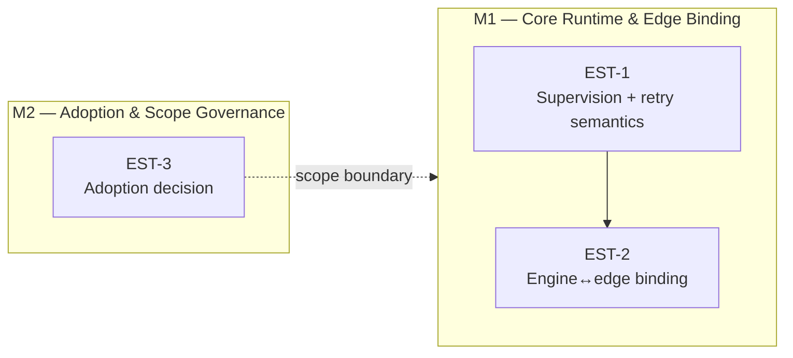

# Roadmap — escapement

**Linear project:** [escapement](https://linear.app/cerebral-work/project/escapement-bc630e34501d)
- **State:** backlog
- **Progress:** 0% (0 of 3 issues done)
- **Issues:** 3 (all Backlog)
- **Assignee:** ctodie (all issues)
- **Generated:** 2026-07-22

## Live Linear State (auto-rendered 2026-07-29 14:30 UTC)

| Milestone | Linear ID | Target Date | Issues | Progress |
|----------|-----------|------------|--------|----------|
| M2 — Adoption & Scope Governance | `1c98daaa-4945-4dc9-87b2-2750ecaa96ac` | 2026-08-01 | 1 | 0% (0/1) |
| M1 — Core Runtime & Edge Binding | `5693790d-7e0c-4879-8a1c-97c4dec0a22a` | 2026-08-15 | 2 | 0% (0/2) |

```
escapement — 2 milestone(s)

  M2 — Adoption & Scope Governance  (due 2026-08-01)  [░░░░░░░░░░░░░░░░░░░░] 0%  0/1
    EST-3  [Backlog]  escapement: adoption decision — do AgentHub DO + agent.unsigned.gg move under escapement?  @ctodie

  M1 — Core Runtime & Edge Binding  (due 2026-08-15)  [░░░░░░░░░░░░░░░░░░░░] 0%  0/2
    EST-2  [Backlog]  escapement: engine↔edge binding — expose the core through the Worker edge  @ctodie
    EST-1  [Backlog]  escapement-core: supervision + retry semantics (task failure, agent death, requeue policy)  @ctodie
```

*Last 7 days: 76 issue(s) touched, 21 completed.*
*Rendered by `.github/scripts/render-roadmap.sh` (corpus auto-render, schedule + dispatch).*

## Milestones

| Milestone | Theme | Issues | Dependency |
|---|---|---|---|
| **M1 — Core Runtime & Edge Binding** | Build the escapement engine supervision model, then expose it through the Worker edge. | [EST-1](https://linear.app/cerebral-work/issue/EST-1/escapement-core-supervision-retry-semantics-task-failure-agent-death), [EST-2](https://linear.app/cerebral-work/issue/EST-2/escapement-engineedge-binding-expose-the-core-through-the-worker-edge) | EST-2 depends on EST-1 — the engine supervision model must exist before the edge binding can expose it. |
| **M2 — Adoption & Scope Governance** | Decide whether AgentHub DO + agent.unsigned.gg consolidate under escapement. | [EST-3](https://linear.app/cerebral-work/issue/EST-3/escapement-adoption-decision-do-agenthub-do-agentunsignedgg-move-under) | Resolves in parallel with M1; its outcome sets M1's scope boundaries and should land before M1 hardening. |

### M1 — Core Runtime & Edge Binding

> Build the escapement engine supervision model, then expose it through the Worker edge.

**Dependency:** EST-2 depends on EST-1 — the engine supervision model must exist before the edge binding can expose it.

| ID | Title | State | Priority | Assignee |
|---|---|---|---|---|
| [EST-1](https://linear.app/cerebral-work/issue/EST-1/escapement-core-supervision-retry-semantics-task-failure-agent-death) | escapement-core: supervision + retry semantics (task failure, agent death, requeue policy) | Backlog | Medium | ctodie |
| [EST-2](https://linear.app/cerebral-work/issue/EST-2/escapement-engineedge-binding-expose-the-core-through-the-worker-edge) | escapement: engine↔edge binding — expose the core through the Worker edge | Backlog | Medium | ctodie |

### M2 — Adoption & Scope Governance

> Decide whether AgentHub DO + agent.unsigned.gg consolidate under escapement.

**Dependency:** Resolves in parallel with M1; its outcome sets M1's scope boundaries and should land before M1 hardening.

| ID | Title | State | Priority | Assignee |
|---|---|---|---|---|
| [EST-3](https://linear.app/cerebral-work/issue/EST-3/escapement-adoption-decision-do-agenthub-do-agentunsignedgg-move-under) | escapement: adoption decision — do AgentHub DO + agent.unsigned.gg move under escapement? | Backlog | Low | ctodie |

## Roadmap Diagram



## Execution Notes

- All three issues are currently in **Backlog** with no progress yet.
- **M2** is a decision/governance task — fast to resolve, high leverage. Unblocking it early clarifies whether M1 needs to absorb the AgentHub DO and `agent.unsigned.gg` surfaces.
- **M1** is the build track: EST-1 defines the supervision + retry contract (task failure, agent death, requeue policy); EST-2 then binds that engine to the Worker edge.
- Recommended sequence: kick off M2 immediately (decision), begin EST-1 in parallel, gate EST-2 on EST-1's supervision contract.
