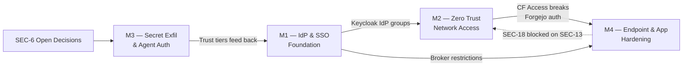

# Roadmap: Identity & Access

> **Generated:** 2026-07-22 · **Source:** Linear (cerebral-work workspace)
> **Scope:** Identity & Access project + cross-project identity-adjacent issues from Identity & Realms, Cloudflare Zero Trust adoption, Big Board — Security, and the SEC team.

## Overview

The Identity & Access program spans the full authentication and authorization surface across the
unsigned/cerebral estate: Keycloak OIDC brokering, Cloudflare Zero Trust network access, agent-mesh
secret-exfiltration prevention, and endpoint-level application hardening. It aggregates **27 issues**
across 5 Linear projects and 2 teams (OPS, SEC), with **15 completed** and **12 open**.

| Metric | Count |
|--------|-------|
| Total issues | 27 |
| Completed | 15 (56%) |
| Open / Backlog | 12 (44%) |
| Urgent (P1) open | 2 |
| Projects spanned | 5 |

## Milestones

### M1 — Identity Provider & SSO Foundation

> **Theme:** Keycloak realm configuration, Google Workspace OIDC brokering, bootstrap-to-production transition, and config-as-code IaC.
> **Progress:** 8/10 complete (80%) · **Status:** Substantially delivered — 2 remaining items extend the foundation.

This milestone covers the core identity infrastructure: the `cerebral` Keycloak realm with Google
Workspace as the primary IdP, terraform-managed config-as-code, OIDC broker setup, and the operational
runbooks that codify the July 2026 learnings. The cerebral realm is live with Google login working
end-to-end, temp bootstrap admin retired, and pact clients configured.

| Status | ID | Priority | Title | Project |
|--------|----|----------|-------|---------|
| ✓ Done | OPS-335 | P2 | Keycloak cerebral realm: pact clients + google-public IdP | Identity & Realms |
| ✓ Done | OPS-264 | P3 | Google Workspace → Keycloak directory/login integration (OIDC brokering primary) | Identity & Realms |
| ✓ Done | OPS-243 | P3 | Keycloak config-as-code via terraform-provider-keycloak | Identity & Realms |
| ✓ Done | OPS-329 | P2 | cerebral: first Google login e2e + promote operator to cerebral-admins | Identity & Realms |
| ✓ Done | OPS-328 | P2 | GCP: authorize Keycloak broker redirect URI on the cerebral OAuth client | Identity & Realms |
| ✓ Done | OPS-327 | P2 | cerebral: delete temp bootstrap admin after ops-admin verification | Identity & Realms |
| ✓ Done | OPS-331 | P3 | docs: fold 2026-07-02 keycloak learnings into runbooks | Identity & Realms |
| ✓ Done | OPS-403 | P3 | SSO 3 — CF Access: swap docs.cerebral.work (+ dreams legacy app) policies to Keycloak IdP groups | Cloudflare Zero Trust |
| ○ Open | OPS-330 | P2 | unsigned-paas realm: Google Workspace brokering (OPS-264 remaining half) | Identity & Realms |
| ○ Open | OPS-541 | P2 | keycloak-config-cli on cerebral realm can prune operators/board/pact-users — silent lockout risk | Identity & Realms |

---

### M2 — Zero Trust Network Access

> **Theme:** Cloudflare Access as the zero-trust perimeter, cloudflared tunnel ingress, edge certificate management, and Tailscale retirement.
> **Progress:** 5/7 complete (71%) · **Status:** Core ZTNA delivered — Forgejo auth integration and Tailscale retirement remaining.

The Cloudflare Zero Trust adoption is the estate's network-access transformation: provisioning the ZT
org, standing up cloudflared as an additive ingress, edge certificate management, and the architectural
decision to coexist-by-tier rather than rip-and-replace. The dev edge (`*.dev.unsigned.gg`) is now fronted
by CF Access with Keycloak IdP groups. The remaining work is resolving the Forgejo-auth breakage caused by
CF Access (SEC-13) and the eventual retirement of Tailscale once WARP is proven.

| Status | ID | Priority | Title | Project |
|--------|----|----------|-------|---------|
| ✓ Done | OPS-386 | P2 | Phase 0 (BLOCKER): provision Cloudflare Zero Trust org — team domain + plan | Cloudflare Zero Trust |
| ✓ Done | OPS-388 | P0 | DECISION: app-sso coexist-by-tier vs CF Access replaces it | Cloudflare Zero Trust |
| ✓ Done | OPS-387 | P0 | Phase 1: cloudflared Tunnel as additive ingress path (non-destructive) | Cloudflare Zero Trust |
| ✓ Done | OPS-392 | P2 | Investigate 530/1033 edge→tunnel routing before Phase 2 cutover | Cloudflare Zero Trust |
| ✓ Done | OPS-390 | P3 | Phase 2 GATE: Advanced Certificate Manager for `*.dev.unsigned.gg` edge cert | Cloudflare Zero Trust |
| ○ Open | SEC-13 | P2 | Core-services: Cloudflare Access breaks Forgejo auth — Forgejo-primary migration | SEC team |
| ○ Open | OPS-389 | P4 | Phase 6: retire Tailscale (LAST, after WARP proven) | Cloudflare Zero Trust |

---

### M3 — Secret Exfiltration & Agent Auth

> **Theme:** Agent mesh authentication, blast-radius enforcement gates, structural secret-exfiltration prevention, and trust-tier governance.
> **Progress:** 1/6 complete (17%) · **Status:** Early phase — most work is backlog pending interview-driven design decisions.

This milestone is the "WS" (workstream) series from the Big Board — Security project. It addresses the
agent-mesh threat model: preventing secrets from reaching exfiltration paths, enforcing blast-radius
gates on PreToolUse, authenticating peer wakeups in the mesh, and encoding trust tiers in governance.
Only the Phase 0 send-keys attribution logging (SEC-1) is complete; the remaining five workstream
items are gated on the open decisions interview (SEC-6) and proceed through phases 1→3.

| Status | ID | Priority | Title | Project |
|--------|----|----------|-------|---------|
| ✓ Done | SEC-1 | P2 | WS4 — send-keys attribution logging (Phase 0) | Big Board — Security |
| ○ Open | SEC-6 | P2 | Open decisions — interview before build | Big Board — Security |
| ○ Open | SEC-2 | P2 | WS1 — enforced PreToolUse gate on blast-radius actions (Phase 0) | Big Board — Security |
| ○ Open | SEC-3 | P3 | WS3 — make secret→exfil structurally unreachable (Phase 1) | Big Board — Security |
| ○ Open | SEC-4 | P3 | WS2 — authenticated peer wakeups (Phase 2) | Big Board — Security |
| ○ Open | SEC-5 | P4 | WS5 — governance: encode trust tiers (Phase 3) | Big Board — Security |

---

### M4 — Endpoint & Application Hardening

> **Theme:** Unauthenticated endpoint remediation, OIDC broker restrictions, Forgejo auth under ZTNA, and transport security headers.
> **Progress:** 1/4 complete (25%) · **Status:** One urgent vuln fixed; two P1/P2 open items need attention.

This milestone captures point-in-time vulnerability remediations and hardening items that cut across
the identity perimeter — debug-route leaks, OIDC broker misconfigurations, exposed agent endpoints, and
parked transport-security commits. The SEC-8 debug-auth leak is closed; SEC-17 (google-public OIDC broker
with no hosted-domain restriction) is an **urgent open item** allowing any Google account to self-provision
a realm user.

| Status | ID | Priority | Title | Project |
|--------|----|----------|-------|---------|
| ✓ Done | SEC-8 | P1 | rina: unauthenticated debug-auth endpoint leaks partial session cookie + email/role — delete | Identity & Access |
| ○ Open | SEC-17 | P1 | cerebral realm: `google-public` OIDC broker has no hosted-domain restriction — any Google account self-provisions a realm user | SEC team |
| ○ Open | SEC-14 | P2 | SEC: kagent agent endpoints exposed unauthenticated on dev.unsigned.gg — harden + make durable | Big Board — Security |
| ○ Open | SEC-18 | P3 | godseat HSTS+CSP commit parked unpublished — blocked on Forgejo reachability (SEC-13) | SEC team |

## Dependency Graph

## Critical Path

1. **SEC-17** (M4, P1) — google-public OIDC broker allows any Google account to self-provision. This is the highest-severity open item: a hosted-domain restriction is a one-line fix with outsized blast-radius reduction.

2. **OPS-541** (M1, P2) — keycloak-config-cli can silently prune operator/board groups, causing lockout of mission-control. This is a latent availability risk to the identity plane.

3. **SEC-6** (M3, P2) — the open-decisions interview gates the entire agent-mesh auth workstream (SEC-2, SEC-3, SEC-4, SEC-5). Until design decisions are captured, five workstream items are blocked.

4. **SEC-13** (M2, P2) — CF Access breaks Forgejo auth, blocking the Forgejo-primary migration and transitively SEC-18 (HSTS+CSP commit). Resolving this unblocks both M2 completion and M4's parked transport-security work.

## Milestone Summary

| Milestone | Total | Done | Open | Progress | Next Action |
|-----------|-------|------|------|----------|-------------|
| M1 — Identity Provider & SSO Foundation | 10 | 8 | 2 | 80% | Close OPS-330 (paas realm brokering) + fix OPS-541 (config-cli lockout) |
| M2 — Zero Trust Network Access | 7 | 5 | 2 | 71% | Resolve SEC-13 (Forgejo auth under CF Access) |
| M3 — Secret Exfiltration & Agent Auth | 6 | 1 | 5 | 17% | Complete SEC-6 (open-decisions interview) to unblock WS1–WS5 |
| M4 — Endpoint & Application Hardening | 4 | 1 | 3 | 25% | Fix SEC-17 (hosted-domain restriction) — P1, one-line fix |
| **Total** | **27** | **15** | **12** | **56%** | |
