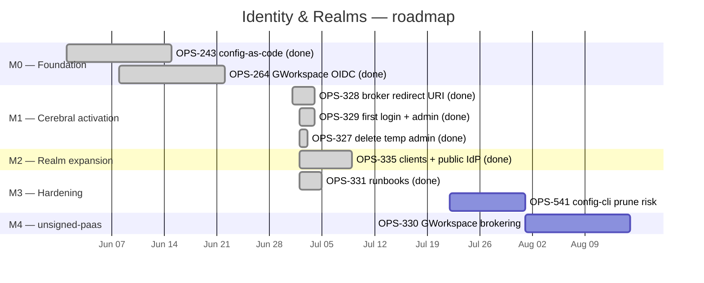

# Roadmap — Identity & Realms

> Linear project: [Identity & Realms](https://linear.app/cerebral-work/project/identity-and-realms-bfdd67eb948e)
> Team: OPS · State: backlog · Progress: 77.8% · Lead: ctodie
> Generated: 2026-07-22 via `linearctl search --project "Identity & Realms" --state all --json`
> Milestones created & issues assigned in Linear: 2026-07-22 (5 milestones, 9 issues assigned)
> Rendered: 2026-07-22 via `linearctl roadmap --project "Identity & Realms" --json`
---

## Live Linear State (auto-rendered 2026-07-29 14:34 UTC)

| Milestone | Linear ID | Target Date | Issues | Progress |
|----------|-----------|------------|--------|----------|
| M4 — unsigned-paas Realm Brokering | `fad2c942-3ca8-40d1-b5cd-5d4e6f63daf5` | 2026-08-19 | 1 | 0% (0/1) |
| M3 — Hardening & Operational Safety | `16ef2e1d-5d4f-471e-bcf7-30228d28d3f9` | 2026-08-05 | 2 | 100% (2/2) |
| M2 — Realm Expansion: Clients & IdP Federation | `a84648e4-0344-42f0-b63f-4ef6a079d1ee` | 2026-07-09 | 1 | 100% (1/1) |
| M1 — Cerebral Realm Activation | `cd4c93e0-69e8-4604-9ba0-b7fce7ad3851` | 2026-07-02 | 3 | 100% (3/3) |
| M0 — Foundation: Config-as-Code & IdP Brokering | `7649c9bc-6cd1-4199-a335-701cf7bed70e` | 2026-06-15 | 2 | 100% (2/2) |

```
Identity & Realms — 5 milestone(s)

  M0 — Foundation: Config-as-Code & IdP Brokering  (due 2026-06-15)  [████████████████████] 100%  2/2
    OPS-264  [Done]  Google Workspace → Keycloak directory/login integration (OIDC brokering primary)  @ctodie
    OPS-243  [Done]  Keycloak config-as-code via terraform-provider-keycloak  @ctodie

  M1 — Cerebral Realm Activation  (due 2026-07-02)  [████████████████████] 100%  3/3
    OPS-329  [Done]  cerebral: first Google login e2e + promote operator to cerebral-admins
    OPS-328  [Done]  GCP: authorize Keycloak broker redirect URI on the cerebral OAuth client
    OPS-327  [Done]  cerebral: delete temp bootstrap admin after ops-admin verification

  M2 — Realm Expansion: Clients & IdP Federation  (due 2026-07-09)  [████████████████████] 100%  1/1
    OPS-335  [Done]  Keycloak cerebral realm: pact clients + google-public IdP  @ctodie

  M3 — Hardening & Operational Safety  (due 2026-08-05)  [████████████████████] 100%  2/2
    OPS-541  [Done]  keycloak-config-cli on cerebral realm can prune cerebral-operators / board / pact-users — silent lockout of mission-control + dreams /ops  @ctodie
    OPS-331  [Done]  docs: fold 2026-07-02 keycloak learnings into runbooks  @ctodie

  M4 — unsigned-paas Realm Brokering  (due 2026-08-19)  [░░░░░░░░░░░░░░░░░░░░] 0%  0/1
    OPS-330  [Backlog]  unsigned-paas realm: Google Workspace brokering (OPS-264 remaining half)
```

*Last 7 days: 0 issue(s) touched, 0 completed.*
*Rendered by `.github/scripts/render-roadmap.sh` (corpus auto-render, schedule + dispatch).*

## Project charter

Stand up Keycloak as the estate's identity and access backbone — managed as
code, federated through Google Workspace, and progressively extended realm by
realm. Each realm is a trust boundary with its own clients, IdP brokering, and
operator lifecycle. The cerebral realm is the worked example; the pattern
repeats for unsigned-paas and beyond.

The project tracks the full arc: from bare Terraform-managed Keycloak through
the first real Google login, realm expansion with application clients, and the
operational hardening that makes the system safe to run. The two open issues
are the unfinished edges — a silent-lockout risk in config-cli and the next
realm's brokering work.

### Issues in scope (9)

| ID | Title | State | Priority | Assignee |
|---|---|---|---|---|
| [OPS-243](https://linear.app/cerebral-work/issue/OPS-243/keycloak-config-as-code-via-terraform-provider-keycloak) | Keycloak config-as-code via terraform-provider-keycloak | ✅ Done | P3 | ctodie |
| [OPS-264](https://linear.app/cerebral-work/issue/OPS-264/google-workspace-keycloak-directorylogin-integration-oidc-brokering) | Google Workspace → Keycloak directory/login integration (OIDC brokering primary) | ✅ Done | P3 | ctodie |
| [OPS-328](https://linear.app/cerebral-work/issue/OPS-328/gcp-authorize-keycloak-broker-redirect-uri-on-the-cerebral-oauth) | GCP: authorize Keycloak broker redirect URI on the cerebral OAuth client | ✅ Done | P2 | unassigned |
| [OPS-329](https://linear.app/cerebral-work/issue/OPS-329/cerebral-first-google-login-e2e-promote-operator-to-cerebral-admins) | cerebral: first Google login e2e + promote operator to cerebral-admins | ✅ Done | P2 | unassigned |
| [OPS-327](https://linear.app/cerebral-work/issue/OPS-327/cerebral-delete-temp-bootstrap-admin-after-ops-admin-verification) | cerebral: delete temp bootstrap admin after ops-admin verification | ✅ Done | P2 | unassigned |
| [OPS-335](https://linear.app/cerebral-work/issue/OPS-335/keycloak-cerebral-realm-pact-clients-google-public-idp) | Keycloak cerebral realm: pact clients + google-public IdP | ✅ Done | P2 | ctodie |
| [OPS-331](https://linear.app/cerebral-work/issue/OPS-331/docs-fold-2026-07-02-keycloak-learnings-into-runbooks) | docs: fold 2026-07-02 keycloak learnings into runbooks | ✅ Done | P3 | ctodie |
| [OPS-541](https://linear.app/cerebral-work/issue/OPS-541/keycloak-config-cli-on-cerebral-realm-can-prune-cerebral-operators) | keycloak-config-cli on cerebral realm can prune operators — silent lockout | ⬜ Backlog | P2 | unassigned |
| [OPS-330](https://linear.app/cerebral-work/issue/OPS-330/unsigned-paas-realm-google-workspace-brokering-ops-264-remaining-half) | unsigned-paas realm: Google Workspace brokering (OPS-264 remaining half) | ⬜ Backlog | P2 | unassigned |

---

## Milestone breakdown

The project follows a layered progression: infrastructure → first realm
activation → realm expansion → operational safety → next realm. Each milestone
builds on the trust established by the previous one.

### M0 — Foundation: Config-as-Code & IdP Brokering (done)

> Keycloak managed via Terraform; Google Workspace wired as the OIDC identity
> broker. Everything else depends on this.

| Issue | State | Priority |
|---|---|---|
| [OPS-243](https://linear.app/cerebral-work/issue/OPS-243) — Keycloak config-as-code via terraform-provider-keycloak | ✅ Done | P3 |
| [OPS-264](https://linear.app/cerebral-work/issue/OPS-264) — Google Workspace → Keycloak directory/login integration (OIDC brokering) | ✅ Done | P3 |

**Outcome**: Keycloak realms, clients, and IdP mappers are declared in
Terraform, not hand-configured. Google Workspace is the primary identity
provider via OIDC brokering — the operator's Google identity is the single
sign-on surface. This is the load-bearing layer; without it, every subsequent
realm is a manual, drift-prone configuration.

---

### M1 — Cerebral Realm Activation (done)

> The first real realm: broker redirect authorized, first Google login
> verified, operator promoted to admin, bootstrap admin retired.

| Issue | State | Priority |
|---|---|---|
| [OPS-328](https://linear.app/cerebral-work/issue/OPS-328) — GCP: authorize Keycloak broker redirect URI on cerebral OAuth client | ✅ Done | P2 |
| [OPS-329](https://linear.app/cerebral-work/issue/OPS-329) — cerebral: first Google login e2e + promote operator to cerebral-admins | ✅ Done | P2 |
| [OPS-327](https://linear.app/cerebral-work/issue/OPS-327) — cerebral: delete temp bootstrap admin after ops-admin verification | ✅ Done | P2 |

**Outcome**: The cerebral realm is live and operator-accessible via Google SSO.
The bootstrap admin — a temporary elevated credential used during setup — was
deleted only after verifying the operator could authenticate and administer
through the real path. This is the security-critical cutover: the temp admin
existed precisely long enough to verify the real access path, then was removed.

---

### M2 — Realm Expansion: Clients & IdP Federation (done)

> Extending the cerebral realm with application clients and a public-facing
> IdP profile. The realm moves from "operator login" to "application SSO."

| Issue | State | Priority |
|---|---|---|
| [OPS-335](https://linear.app/cerebral-work/issue/OPS-335) — Keycloak cerebral realm: pact clients + google-public IdP | ✅ Done | P2 |

**Outcome**: Pact clients (application OAuth clients in the cerebral realm) are
configured, and the google-public IdP profile extends federation beyond the
internal operator flow. The cerebral realm now serves both operator
administrative access and application-level SSO — the pattern that subsequent
realms will replicate.

---

### M3 — Hardening & Operational Safety (partially done)

> Documented learnings and the unresolved config-cli lockout risk. The
> difference between a system you can run and one that will bite you.

| Issue | State | Priority |
|---|---|---|
| [OPS-331](https://linear.app/cerebral-work/issue/OPS-331) — docs: fold 2026-07-02 keycloak learnings into runbooks | ✅ Done | P3 |
| [OPS-541](https://linear.app/cerebral-work/issue/OPS-541) — keycloak-config-cli can prune operators — silent lockout | ⬜ Backlog | P2 |

**Done**: The 2026-07-02 Keycloak learnings are captured in runbooks — the
operational knowledge from standing up the cerebral realm is preserved, not
tribal.

**Open risk (OPS-541)**: `keycloak-config-cli`, when reconciling the cerebral
realm, can prune the `cerebral-operators`, `board`, and `pact-users` groups.
This is a silent lockout — mission-control, dreams, and `/ops` lose access
with no warning. The config-cli import is authoritative; if the Terraform state
or import file omits a group, the cli removes it. This is P2 and unassigned —
a known, documented risk that has not yet been remediated. It should block
production claims about the cerebral realm's reliability until resolved.

**Exit criteria**: config-cli reconciliation is idempotent and safe — group
pruning is either prevented (import-only mode, no destructive diff) or guarded
by a dry-run + approval gate. The silent-lockout path is closed.

---

### M4 — unsigned-paas Realm Brokering (backlog)

> Apply the proven brokering pattern to the next realm. This is the
> replication test — does the cerebral workflow generalize?

| Issue | State | Priority |
|---|---|---|
| [OPS-330](https://linear.app/cerebral-work/issue/OPS-330) — unsigned-paas realm: Google Workspace brokering (OPS-264 remaining half) | ⬜ Backlog | P2 |

**Scope**: OPS-330 is explicitly the "remaining half" of OPS-264 — the Google
Workspace brokering work covered the cerebral realm; the unsigned-paas realm
still needs the same treatment. This means: declare the unsigned-paas realm in
Terraform, wire Google Workspace as the OIDC broker, configure broker redirect
URIs, verify the first login, and set up the client/application access.

**Key dependency**: OPS-541 (the config-cli prune risk) should be resolved
before standing up another realm that the same config-cli manages. Otherwise
the unsigned-paas realm inherits the same silent-lockout risk as cerebral —
compounding the blast radius across two realms instead of one.

**Exit criteria**: unsigned-paas realm is live with Google Workspace brokering,
operator can authenticate via Google SSO, and the realm has at least one
application client. The config-cli reconciliation does not threaten this realm's
groups.

---

## Dependency graph

```
M0: Foundation (done)          M1: Cerebral Activation (done)
─────────────────────          ──────────────────────────────
OPS-243 config-as-code ─┐
                        ├──→  OPS-328 broker redirect URI ─┐
OPS-264 GWorkspace OIDC ┘     OPS-329 first login + admin ─┤──→  (realm live)
                              OPS-327 delete temp admin ───┘

M2: Realm Expansion (done)    M3: Hardening (partial)       M4: unsigned-paas (backlog)
──────────────────────       ──────────────────────       ──────────────────────────
OPS-335 clients + public IdP  OPS-331 runbooks (done)       OPS-330 GWorkspace brokering
        ↑                     OPS-541 config-cli prune ─┐           ↑
        │                     (open risk, P2)           │           │
        └── built on M1 ──────────────────────────────────┘           │
                                            └─── should resolve ──────┘
                                                 before M4 stands up
                                                 another realm
```

**Critical path**: M0 → M1 → M2 (the cerebral realm is built). M3 runs in
parallel — OPS-331 (runbooks) was captured during M1/M2 work; OPS-541 (the
prune risk) is an independent safety issue that should gate M4. The remaining
work is OPS-541 → OPS-330: resolve the config-cli safety risk, then replicate
the brokering pattern to unsigned-paas.

---

## Roadmap visualization



> Dates before 2026-07-22 are approximate reconstructions from issue context
> and the 2026-07-02 learnings date; only 2026-07-22 onward is projected.

---

## Live rendered roadmap (linearctl)

> Output of `linearctl roadmap --project "Identity & Realms" --json`, run
> 2026-07-22 after all 5 milestones were created and all 9 issues assigned.

| Milestone | Target | Done | Total | % | Issues |
|---|---|---|---|---|---|
| M0 — Foundation: Config-as-Code & IdP Brokering | 2026-06-15 | 2 | 2 | 100% | OPS-264 ✅, OPS-243 ✅ |
| M1 — Cerebral Realm Activation | 2026-07-02 | 3 | 3 | 100% | OPS-329 ✅, OPS-328 ✅, OPS-327 ✅ |
| M2 — Realm Expansion: Clients & IdP Federation | 2026-07-09 | 1 | 1 | 100% | OPS-335 ✅ |
| M3 — Hardening & Operational Safety | 2026-08-05 | 1 | 2 | 50% | OPS-541 ⬜, OPS-331 ✅ |
| M4 — unsigned-paas Realm Brokering | 2026-08-19 | 0 | 1 | 0% | OPS-330 ⬜ |

**Linear milestone IDs:**

| Milestone | UUID |
|---|---|
| M0 — Foundation: Config-as-Code & IdP Brokering | `7649c9bc-6cd1-4199-a335-701cf7bed70e` |
| M1 — Cerebral Realm Activation | `cd4c93e0-69e8-4604-9ba0-b7fce7ad3851` |
| M2 — Realm Expansion: Clients & IdP Federation | `a84648e4-0344-42f0-b63f-4ef6a079d1ee` |
| M3 — Hardening & Operational Safety | `16ef2e1d-5d4f-471e-bcf7-30228d28d3f9` |
| M4 — unsigned-paas Realm Brokering | `fad2c942-3ca8-40d1-b5cd-5d4e6f63daf5` |

---

## Issue → milestone matrix

| Issue | M0 Foundation | M1 Activation | M2 Expansion | M3 Hardening | M4 unsigned-paas |
|---|---|---|---|---|---|
| OPS-243 | ✅ | | | | |
| OPS-264 | ✅ | | | | |
| OPS-328 | | ✅ | | | |
| OPS-329 | | ✅ | | | |
| OPS-327 | | ✅ | | | |
| OPS-335 | | | ✅ | | |
| OPS-331 | | | | ✅ | |
| OPS-541 | | | | ⬜ | |
| OPS-330 | | | | | ⬜ |

---

## Status summary

- **Completed**: 7/9 issues (78%). M0, M1, and M2 are fully done — the cerebral
  realm is stood up, operator-accessible via Google SSO, and expanded with
  application clients and a public IdP profile.
- **In progress / open**: 2/9 issues (22%).
  - OPS-541 (config-cli prune risk) is the critical safety gap — a silent
    lockout path that should be closed before the pattern replicates.
  - OPS-330 (unsigned-paas brokering) is the next realm, explicitly the
    "remaining half" of OPS-264.
- **Milestones**: 5 created in Linear (M0–M4), all 9 issues assigned to their
  respective milestones. Live progress rendered via
  `linearctl roadmap --project "Identity & Realms" --json`.
- **Project progress**: 77.8% (Linear's estimate), consistent with 7/9 issue
  completion modulo priority weighting.
- **Project state**: backlog (not started). Despite 78% progress, the project
  itself has not been formally moved to "started" — the work has been
  incremental and issue-driven.

### Next actions

1. **Resolve OPS-541** — the config-cli prune risk. Determine whether
   keycloak-config-cli should run in import-only/no-destroy mode, or whether
   a dry-run + approval gate is needed. This blocks safe realm replication.
2. **Assign OPS-541 and OPS-330** — both are unassigned. OPS-541 is P2 and a
   safety-critical fix; OPS-330 is P2 and the project's forward progress.
3. **Execute OPS-330** — stand up the unsigned-paas realm using the proven
   cerebral workflow: Terraform declaration → Google Workspace broker → redirect
   URI → first login → client setup.
4. **Move project to "started"** — the work is well underway; the backlog state
   understates the progress.
