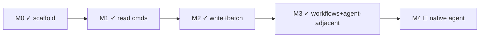

# linearctl — Roadmap

> Auto-generated 2026-07-25 from spec.md §12 + repo state.
> Source of truth: `docs/spec.md` (product/design contract), `PUNCH-LIST.md`
> (Linear backlog snapshot).

## Milestone status

### M0 — Scaffold ✅
`whoami` + client factory + CI pipeline + SHA-pinned actions + SLSA attestation.

### M1 — Read commands ✅
`digest`, `triage`, `milestone` burn-down, live-API contract tests, output
contract (table/`--json`), SHA-pin all actions. All shipped and verified
against live data.

### M2 — Write + batch ✅
`file` (single + `--stdin` batch with RATELIMITED backoff), `project`
(create/list/update), `milestone create`, macOS notarization pipeline
(ADR-0007; dormant-until-keyed — CER-1150). Dogfoods own backlog via
`linearctl file`.

### M3 — Workflows + agent-adjacent ✅
`cycle`, `stale`, `xref` (with `--fix`), `release-notes`, `standup`,
`ratelimit`, `doc` get/set, `comment`, `roadmap`, `pull` (soma funnel
contract), `--limit` bounded pull, Loop recipe catalog, dev loop scripts,
CONTRIBUTING.md, full core test coverage (301 tests).

### M4 — Native agent 🔲 (operator-gated)
OAuth `actor=app` (CER-1148), `watch` daemon (CER-1149), maintainer-agent
facility (CER-1188). TUI (CER-1550) competes for this slot. Standup Slack
send (T12) shipped — PR #104, `--slack --apply` (CER-1730).

## Deferred tickets (4 open in Linear)

| ID | Pri | Title | Assignee | Blocker |
|---|---|---|---|---|
| CER-1148 | P4 | `feat(agent)`: OAuth `actor=app` scaffolding | ctodie | M4 prerequisite |
| CER-1149 | P4 | `feat(agent)`: `linearctl watch` — AgentSessionEvent daemon | ctodie | loop driver + watch CLI shipped (full-loop fallback); daemon follow-up |
| CER-1150 | P4 | `chore(release)`: macOS notarization / codesign | ctodie | Apple Developer Program enrollment |
| CER-1188 | P4 | `feat(agent)`: maintainer-agent facility (phased) | ctodie | M4; depends on CER-1148 + CER-1149 |
| CER-1550 | P0 | `feat(tui)`: full-screen keyboard-driven dashboard over `core/*` | unassigned | scope decision needed |

## Shipped this session (2026-07-24/25, PRs #89-#97 + direct)

| PR | Title | Delta |
|---|---|---|
| #89 | feat(funnel): soma parity — id field, multi-state --state-set, clobber guard | soma funnel contract |
| #90 | chore: dev loop scripts + CONTRIBUTING.md | dev ergonomics |
| #92 | fix(core): add limit field to SearchOptions | pull --limit prep |
| #94 | test: dupcheck + documents core tests | +41 tests |
| #95 | test: milestone, project, roadmap + dev loop improvements | +59 tests, lefthook typecheck, PUNCH-LIST |
| #96 | feat(pull): --limit for bounded smoke loops + updatedAt invariant | funnel contract |
| #97 | feat(loops): Linear Loop recipe catalog | .linearctl/loop-recipes/ |
| direct | test: issues-core, whoami, bulk, comments core coverage | +45 tests |

## Test coverage matrix

| Core module | Test file | Tests |
|---|---|---|
| search (buildSearchFilter) | search.test.ts | 11 |
| funnel-parity (stateSet, clobber guard, --limit) | funnel-parity.test.ts | 14 |
| issues-query (collectIssuesFlat, scopedTeams, projectClause) | issues-query.test.ts | 12 |
| pull (PullIssue mapping contract) | pull.test.ts | 9 |
| issues (updateIssue, closeIssue, getIssue, resolveAssignee, createComment) | issues-core.test.ts | 19 |
| createIssue (project name resolution) | create-issue.test.ts | 3 |
| milestone (createMilestone, resolveMilestoneId, deleteMilestone) | milestone.test.ts | 10 |
| project (updateProject state/name/desc) | project.test.ts | 7 |
| roadmap (sorting, progress, issue mapping) | roadmap.test.ts | 8 |
| digest (state-type grouping, ordering) | digest.test.ts | 9 |
| stale (age bucketing, daysStale, sort) | stale.test.ts | 8 |
| triage (reason tagging) | triage.test.ts | 8 |
| cycles (resolveCycleId) | cycles.test.ts | 12 |
| documents (create, update, list) | documents.test.ts | 11 |
| comments (commentsByAuthor) | comments-core.test.ts | 6 |
| bulk (parseBulkSpec) | bulk-core.test.ts | 7 |
| whoami (viewer + org) | whoami.test.ts | 3 |
| dupcheck | dupcheck.test.ts | — |
| xref (gate, fix) | xref-fix.test.ts, xref-gate.test.ts | — |
| watch (emitThought, driveAgentLoop, moveToStartedIfDelegated, driveLoop) | watch.test.ts | 14 |
| operator (healthz, delegate, shutdown, queue poll/ack, SIGTERM subprocess) | operator.test.ts | 11 |
| + remaining test files | | 301 total |

## Repo metrics

| Tests | 301 pass, 0 fail (654 expects) |
| Expect calls | 654 |
| Test files | 45 |
| Core modules | 25 |
| Commands | 28 |
| Typecheck | clean |
| Version | 0.7.0 |
| Runtime | bun 1.3.14 |
| Distribution | mise (SLSA-attested single binary) |
