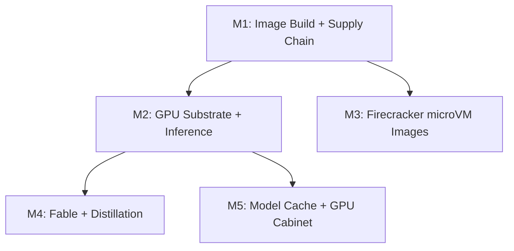

# ML Image — Project Roadmap

> Generated 2026-07-22 from `linearctl search --project "ML Image" --state all --json`
> (1 in-project issue: OPS-552) supplemented by text-scoped searches across
> `GPU`, `Triton`, `Dynamo`, `distill`, `cosign`, `Firecracker`, `ml-images`,
> `model cache`, `Kueue`, and `image build` — 81 issues analyzed across OPS/CER/TOD
> teams; 64 active issues assigned to 5 thematic milestones. 17 completed/canceled
> issues tracked as precedent.

## Live Linear State (auto-rendered 2026-07-29 14:32 UTC)

| Milestone | Linear ID | Target Date | Issues | Progress |
|----------|-----------|------------|--------|----------|
| Firecracker microVM Image Supply Chain | `7904195e-3734-4de6-854b-5954384020e2` | 2026-10-15 | 6 | 0% (0/6) |
| GPU Substrate & Inference Runtime | `459804d1-992b-4a18-bb59-6c7e9a679861` | 2026-10-31 | 19 | 0% (0/19) |
| Image Build Foundation & Supply Chain Security | `31a6fccc-761c-415e-a6dd-dd08ea84012f` | 2026-09-30 | 23 | 9% (2/23) |
| Fable Continuity Ensemble & Distillation Lane | `65c00b8f-3f3d-4e63-884f-f2ab724406a1` | 2026-11-30 | 8 | 0% (0/8) |
| Model Cache, CI Runners & GPU Cabinet | `ddce444c-0f99-4f51-9f74-fc315f8d5bc8` | 2027-03-31 | 5 | 0% (0/5) |

```
ML Image — 5 milestone(s)

  Image Build Foundation & Supply Chain Security  (due 2026-09-30)  [██░░░░░░░░░░░░░░░░░░] 9%  2/23
    OPS-897  [Triage]  [unsigned-paas] cosign-sign app images — cerebral-voicenotes trips verify (CER-1442 mirror)
    OPS-892  [Triage]  reverie release: SBOM + signature + provenance + advisory scan (CER-1366 mirror)
    OPS-889  [Triage]  ml-images: build-litellm.yaml never publishes -rN revision tags (CER-1537 mirror)
    OPS-810  [Done]  image-build: BuildKit cache export 413s through Cloudflare — route in-cluster or gate cache  @ctodie
    OPS-806  [Triage]  S7 — multi-project registry + isolation guard
    OPS-781  [Triage]  Provision cosign signing key + wire to Helm-publish/build pipelines (unblocks verify-image-signatures ramp)
    OPS-780  [Triage]  Kyverno ramp wave 2: restrict-image-registries + require-networkpolicy Audit→Deny
    OPS-761  [Triage]  SEC H8: unmanaged write-scoped Harbor push credential (ml-images-harbor-push)
    OPS-757  [Triage]  SEC H4: unsigned/public-registry images run unchecked (verify Audit + harbor-only)
    OPS-691  [Done]  Cygnus: rootless BuildKit broken fleet-wide — user.max_user_namespaces=0 on all nodes  @ctodie
    OPS-637  [Backlog]  Bake CI tooling (gettext/envsubst, cosign) into a custom ARC runner image
    OPS-626  [Triage]  Harbor push path from workstation: tailscale-operator ingress dead-ends on Cilium kernel-DNAT reply path
    OPS-612  [Backlog]  cosign signing coverage for non-paas image pipelines
    OPS-548  [Duplicate]  Kyverno verify-image-signatures references missing secret kyverno/cosign-public-key — policy inert, PolicyViolation noise on every Harbor image
    OPS-531  [Triage]  Kyverno PolicyException for ci-builds BuildKit pods (apparmor/seccomp) before enforce ramp
    OPS-498  [Triage]  paas runbook guards: ArgoCD op-patch revision trap + IfNotPresent re-pointed-tag trap  @ctodie
    OPS-460  [Triage]  ml-images expansion: execute phases 1-4 (foundation, supply chain, base tiers, GPU family)
    OPS-446  [Triage]  ml-images-pull secret is hand-applied per-namespace — make it declarative (ESO) + seed kyverno cosign key
    OPS-440  [Triage]  CI: verify-image-signatures policy test consistently red — blocks all kyverno-policies PRs
    OPS-341  [Backlog]  Kyverno verify-image-signatures is a dead policy — wire cosign signing or retire it
    OPS-300  [Backlog]  Kyverno policy import: native VAP PSS + verifyImages/mutateDigest + generate default-deny NP + chainsaw CI
    OPS-266  [Backlog]  No image signing / SBOM anywhere in the supply chain
    OPS-120  [Backlog]  Harbor secret: split general (1Password) from S3 (terraform-sourced) — drop S3 out of 1P

  Firecracker microVM Image Supply Chain  (due 2026-10-15)  [░░░░░░░░░░░░░░░░░░░░] 0%  0/6
    OPS-834  [In Progress]  Holistic engineer-VM access: persistent workspace + correct image + designed SSH path (darius-vm, supersedes patchwork)  @ctodie
    OPS-833  [Triage]  engineer-vm image: mount /dev/pts in /init + enlarge rootfs.ext4 (darius-vm findings)
    OPS-589  [Triage]  Converge engineer Firecracker microVMs onto fcsm on a dedicated Cygnus hoplite pool
    OPS-586  [Triage]  Live engineer Firecracker VMs on Cygnus have zero git provenance (imperative apply, ad-hoc images) — converge onto fcsm
    OPS-550  [Backlog]  Firecracker microVMs: remove hostNetwork to lift the 1-VM-per-node cap (tap0 collision) — fix proven live
    OPS-539  [Backlog]  Firecracker VM namespaces: podAntiAffinity missing + defaults to same-namespace, so tenant microVMs collide on tap0

  GPU Substrate & Inference Runtime  (due 2026-10-31)  [░░░░░░░░░░░░░░░░░░░░] 0%  0/19
    OPS-896  [Triage]  Deploy unsigned-paas dev cluster VKE Terraform apply (CER-941 mirror)
    OPS-895  [Triage]  Deploy external embedder service BGE-large on Triton GPU pool (CER-943 mirror)
    OPS-893  [Triage]  TEI GPU embedder service on gpubox/3090 + bench REST-embedder backend (CER-1274 mirror)
    OPS-623  [Triage]  llm.unsigned.gg gateway down — LiteLLM proxy 401s all keys (LiteLLM_VerificationToken does not exist) despite healthy DB  @ctodie
    OPS-538  [Backlog]  apiserver-egress NetworkPolicy pattern breaks on Cygnus bare metal — needs CiliumNetworkPolicy or endpoint-explicit rules before Phase 3
    OPS-535  [Triage]  Docs: supersede Hetzner substrate ADR + give GPU/inference a home in the Cygnus plan
    OPS-458  [Backlog]  llm endpoint: admin/control plane was internet-exposed (master key + UI) — edge-deny applied, residual hardening
    OPS-397  [Backlog]  Crusoe verification: managed per-token routing row (ADR addendum) + D5 sidecar bench entry
    OPS-348  [Todo]  GCP burst-GPU satellite: file GPU quota now + Talos-on-GCE scaffold + egress cost model (ADR D4)
    OPS-298  [Backlog]  GPU pool autoscaling + queueing: KEDA ScaledObject + Kueue flavors/cohort/priority
    OPS-297  [Backlog]  NVIDIA inference deploy: DynamoGraphDeployment + warm model-cache + SLA/queue-depth autoscaling
    OPS-295  [Backlog]  Spike: Rust LLM gateway on pingora
    OPS-287  [Backlog]  Evaluate agentgateway as the MCP/A2A data plane in front of Dynamo-Triton
    OPS-285  [Backlog]  GPU sharing: evaluate NVIDIA KAI-Scheduler alongside KEDA/Kueue/MIG
    OPS-159  [Backlog]  GPU enablement: gpu-operator pin + gpu-pool + triton + inference-cache
    OPS-78  [Backlog]  Track B: baremetal/Talos profile scaffold (deploymentTarget=baremetal)
    OPS-29  [Backlog]  W4-A: Deploy NVIDIA Triton + sample inference model  @ctodie
    OPS-30  [Backlog]  W4-B: Deploy TensorFlow Serving fallback  @ctodie
    OPS-40  [Backlog]  Deploy KEDA, Kueue, GPU Operator, and inference cache  @ctodie

  Fable Continuity Ensemble & Distillation Lane  (due 2026-11-30)  [░░░░░░░░░░░░░░░░░░░░] 0%  0/8
    OPS-894  [Triage]  Fine-tune/quantize lane: Unsloth Core + llm-compressor (TOD-995 mirror)
    OPS-235  [Backlog]  F4 — Cutover + re-measure (Triton-Fable behind the router + style classifier gate)  @ctodie
    OPS-234  [Backlog]  F3 — Owned-weights distill (ENDGAME): corpus to QLoRA to Triton  @ctodie
    OPS-233  [Backlog]  F2 — Prompted ensemble: the bridge (rules router + exemplar bank)  @ctodie
    OPS-198  [Backlog]  F4 — cutover + re-measure with the owned-weights voice provider  @ctodie
    OPS-197  [Backlog]  F3 — owned-weights distill (the endgame), on the gpu-pool  @ctodie
    OPS-195  [Backlog]  F1 — stand up the two-engine §4 eval harness + persona prompt  @ctodie
    OPS-193  [Backlog]  Fable continuity ensemble — reproduce Fable to a measured bar (epic)  @ctodie

  Model Cache, CI Runners & GPU Cabinet  (due 2027-03-31)  [░░░░░░░░░░░░░░░░░░░░] 0%  0/5
    OPS-891  [Triage]  Self-hosted CI runner with prewarmed fastembed bge-large cache (CER-1131 mirror)
    OPS-890  [Triage]  CI runners missing fastembed BGE model cache (CER-1113 mirror)
    OPS-836  [Triage]  fastembed ARC runner evicted: ephemeral-storage exceeds 16Gi limit (embedding model cache)  @ctodie
    OPS-552  [Backlog]  GPU cabinet build: 48× HGX B200 (3-rack air, IB NDR, Ceph, SUNK) — colo cage, ~$3.3M CapEx  @ctodie
    OPS-639  [Triage]  CI runners: bake fastembed BGE model cache into reverie self-hosted runners (+ runner IaC gap)
```

*Last 7 days: 3 issue(s) touched, 2 completed.*
*Rendered by `.github/scripts/render-roadmap.sh` (corpus auto-render, schedule + dispatch).*

## Project state

| Metric | Value |
|--------|-------|
| Linear project | [ML Image](https://linear.app/cerebral-work/project/ml-image-d48dac8644f7) |
| Project state | Started |
| Current progress | 0% |
| Total issues analyzed | 81 |
| Active issues | 64 |
| Completed | 15 |
| Canceled/Duplicate | 2 |
| Teams touched | OPS (71), CER (9), TOD (1) |
| Top assignee | ctodie (23) |

## Milestone summary

| # | Milestone | Target | Issues | Dependencies | Theme |
|---|----------|--------|--------|--------------|-------|
| M1 | Image Build Foundation & Supply Chain Security | 2026-09-30 | 25 | — | Rootless BuildKit + cosign/SBOM + Harbor hardening + ml-images base tiers |
| M2 | GPU Substrate & Inference Runtime | 2026-10-31 | 19 | M1 | GPU operator + Triton/Dynamo + Kueue/KEDA + BGE embedder |
| M3 | Firecracker microVM Image Supply Chain | 2026-10-15 | 7 | M1 | fcsm convergence + provenance + rootfs + multi-VM-per-node |
| M4 | Fable Continuity Ensemble & Distillation Lane | 2026-11-30 | 8 | M2 | Fable reproduction + QLoRA distill + cutover/re-measure |
| M5 | Model Cache, CI Runners & GPU Cabinet | 2027-Q1 | 5 | M2 | BGE model cache on CI runners + 48× HGX B200 cabinet |

## Dependency graph



## M1: Image Build Foundation & Supply Chain Security

**Target:** 2026-09-30

Stand up the rootless BuildKit image build pipeline, wire cosign signing + SBOM across
all image pipelines, harden the Harbor registry (declarative pull secrets, multi-project
isolation, push credential custody), and execute the ml-images expansion phases 1–4
(foundation, supply chain, base tiers, GPU family). This is the foundation — both M2
(GPU substrate) and M3 (Firecracker images) consume the signed, hardened image supply
chain produced here.

| Issue | State | Priority | Assignee | Title |
|-------|-------|----------|----------|-------|
| [OPS-460](https://linear.app/cerebral-work/issue/OPS-460/ml-images-expansion-execute-phases-1-4-foundation-supply-chain-base) | Triage | Urgent | — | ml-images expansion: execute phases 1-4 (foundation, supply chain, base tiers, GPU family) |
| [OPS-691](https://linear.app/cerebral-work/issue/OPS-691/cygnus-rootless-buildkit-broken-fleet-wide-usermax-user-namespaces0-on) | In Progress | Medium | ctodie | Cygnus: rootless BuildKit broken fleet-wide — user.max_user_namespaces=0 on all nodes |
| [OPS-810](https://linear.app/cerebral-work/issue/OPS-810/image-build-buildkit-cache-export-413s-through-cloudflare-route-in) | Triage | Low | — | image-build: BuildKit cache export 413s through Cloudflare — route in-cluster or gate cache |
| [OPS-531](https://linear.app/cerebral-work/issue/OPS-531/kyverno-policyexception-for-ci-builds-buildkit-pods-apparmorseccomp) | Triage | Urgent | — | Kyverno PolicyException for ci-builds BuildKit pods (apparmor/seccomp) before enforce ramp |
| [OPS-637](https://linear.app/cerebral-work/issue/OPS-637/bake-ci-tooling-gettextenvsubst-cosign-into-a-custom-arc-runner-image) | Backlog | Low | — | Bake CI tooling (gettext/envsubst, cosign) into a custom ARC runner image |
| [OPS-446](https://linear.app/cerebral-work/issue/OPS-446/ml-images-pull-secret-is-hand-applied-per-namespace-make-it) | Triage | Urgent | — | ml-images-pull secret is hand-applied per-namespace — make it declarative (ESO) + seed kyverno cosign key |
| [CER-1537](https://linear.app/cerebral-work/issue/CER-1537/ml-images-build-litellmyaml-never-publishes-rn-revision-tags-silently) | Backlog | Medium | — | ml-images: build-litellm.yaml never publishes -rN revision tags — silently overwrites the base version tag |
| [OPS-781](https://linear.app/cerebral-work/issue/OPS-781/provision-cosign-signing-key-wire-to-helm-publishbuild-pipelines) | Triage | Low | — | Provision cosign signing key + wire to Helm-publish/build pipelines (unblocks verify-image-signatures ramp) |
| [OPS-612](https://linear.app/cerebral-work/issue/OPS-612/cosign-signing-coverage-for-non-paas-image-pipelines) | Backlog | Low | — | cosign signing coverage for non-paas image pipelines |
| [OPS-266](https://linear.app/cerebral-work/issue/OPS-266/no-image-signing-sbom-anywhere-in-the-supply-chain) | Backlog | Medium | — | No image signing / SBOM anywhere in the supply chain |
| [OPS-341](https://linear.app/cerebral-work/issue/OPS-341/kyverno-verify-image-signatures-is-a-dead-policy-wire-cosign-signing) | Backlog | Medium | — | Kyverno verify-image-signatures is a dead policy — wire cosign signing or retire it |
| [OPS-440](https://linear.app/cerebral-work/issue/OPS-440/ci-verify-image-signatures-policy-test-consistently-red-blocks-all) | Triage | Urgent | — | CI: verify-image-signatures policy test consistently red — blocks all kyverno-policies PRs |
| [OPS-300](https://linear.app/cerebral-work/issue/OPS-300/kyverno-policy-import-native-vap-pss-verifyimagesmutatedigest-generate) | Backlog | Low | — | Kyverno policy import: native VAP PSS + verifyImages/mutateDigest + generate default-deny NP + chainsaw CI |
| [CER-1366](https://linear.app/cerebral-work/issue/CER-1366/reverie-release-sbom-signature-provenance-scheduled-fresh-db-advisory) | Backlog | Low | ctodie | reverie release: SBOM + signature + provenance + scheduled fresh-DB advisory scan |
| [CER-1442](https://linear.app/cerebral-work/issue/CER-1442/unsigned-paas-cosign-sign-app-images-cerebral-voicenotes-trips-verify) | Backlog | Low | ctodie | [unsigned-paas] cosign-sign app images — cerebral-voicenotes trips verify-image-signatures (audit) |
| [OPS-757](https://linear.app/cerebral-work/issue/OPS-757/sec-h4-unsignedpublic-registry-images-run-unchecked-verify-audit) | Triage | Medium | — | SEC H4: unsigned/public-registry images run unchecked (verify Audit + harbor-only) |
| [OPS-780](https://linear.app/cerebral-work/issue/OPS-780/kyverno-ramp-wave-2-restrict-image-registries-require-networkpolicy) | Triage | Low | — | Kyverno ramp wave 2: restrict-image-registries + require-networkpolicy Audit→Deny |
| [OPS-761](https://linear.app/cerebral-work/issue/OPS-761/sec-h8-unmanaged-write-scoped-harbor-push-credential-ml-images-harbor) | Triage | Low | — | SEC H8: unmanaged write-scoped Harbor push credential (ml-images-harbor-push) |
| [OPS-626](https://linear.app/cerebral-work/issue/OPS-626/harbor-push-path-from-workstation-tailscale-operator-ingress-dead-ends) | Triage | Low | — | Harbor push path from workstation: tailscale-operator ingress dead-ends on Cilium kernel-DNAT reply path |
| [OPS-806](https://linear.app/cerebral-work/issue/OPS-806/s7-multi-project-registry-isolation-guard) | Triage | Low | — | S7 — multi-project registry + isolation guard |
| [OPS-120](https://linear.app/cerebral-work/issue/OPS-120/harbor-secret-split-general-1password-from-s3-terraform-sourced-drop) | Backlog | Low | — | Harbor secret: split general (1Password) from S3 (terraform-sourced) — drop S3 out of 1P |
| [OPS-281](https://linear.app/cerebral-work/issue/OPS-281/productionize-the-reveried-image-build-ci-cosign-eso-secrets-kaniko) | Backlog | Medium | ctodie | Productionize the reveried image build (CI + cosign + ESO secrets + kaniko Dockerfile egress) |
| [OPS-548](https://linear.app/cerebral-work/issue/OPS-548/kyverno-verify-image-signatures-references-missing-secret) | Duplicate | Low | — | Kyverno verify-image-signatures references missing secret kyverno/cosign-public-key — policy inert, PolicyViolation noise on every Harbor image |
| [OPS-498](https://linear.app/cerebral-work/issue/OPS-498/paas-runbook-guards-argocd-op-patch-revision-trap-ifnotpresent-re) | Triage | — | ctodie | paas runbook guards: ArgoCD op-patch revision trap + IfNotPresent re-pointed-tag trap |
| [OPS-796](https://linear.app/cerebral-work/issue/OPS-796/metal-foundry-talos-image-buildpublish-pipeline-imager-r2-vultr) | Triage | Low | — | metal-foundry: Talos image build/publish pipeline (imager → R2 + Vultr) |

## M2: GPU Substrate & Inference Runtime

**Target:** 2026-10-31

Deploy the GPU substrate on Cygnus: NVIDIA gpu-operator, Triton inference server, Dynamo
graph deployment with warm model-cache, KEDA/Kueue autoscaling with flavor/cohort/priority.
Wire the BGE-large embedder onto the Triton GPU pool. Resolve the GCP burst-GPU satellite
for overflow capacity. Harden the LiteLLM gateway (internet-exposed admin plane, 401 auth
regression). Evaluate the Rust LLM gateway on pingora + agentgateway as MCP/A2A data plane
in front of Dynamo-Triton. Depends on M1's signed image supply chain.

**Depends on:** M1

| Issue | State | Priority | Assignee | Title |
|-------|-------|----------|----------|-------|
| [OPS-159](https://linear.app/cerebral-work/issue/OPS-159/gpu-enablement-gpu-operator-pin-gpu-pool-triton-inference-cache) | Backlog | Medium | — | GPU enablement: gpu-operator pin + gpu-pool + triton + inference-cache |
| [OPS-40](https://linear.app/cerebral-work/issue/OPS-40/deploy-keda-kueue-gpu-operator-and-inference-cache) | Backlog | Medium | ctodie | Deploy KEDA, Kueue, GPU Operator, and inference cache |
| [OPS-29](https://linear.app/cerebral-work/issue/OPS-29/w4-a-deploy-nvidia-triton-sample-inference-model) | Backlog | High | ctodie | W4-A: Deploy NVIDIA Triton + sample inference model |
| [OPS-30](https://linear.app/cerebral-work/issue/OPS-30/w4-b-deploy-tensorflow-serving-fallback) | Backlog | Medium | ctodie | W4-B: Deploy TensorFlow Serving fallback |
| [OPS-297](https://linear.app/cerebral-work/issue/OPS-297/nvidia-inference-deploy-dynamographdeployment-warm-model-cache) | Backlog | Medium | — | NVIDIA inference deploy: DynamoGraphDeployment + warm model-cache + SLA/queue-depth autoscaling |
| [OPS-298](https://linear.app/cerebral-work/issue/OPS-298/gpu-pool-autoscaling-queueing-keda-scaledobject-kueue) | Backlog | Medium | — | GPU pool autoscaling + queueing: KEDA ScaledObject + Kueue flavors/cohort/priority |
| [OPS-285](https://linear.app/cerebral-work/issue/OPS-285/gpu-sharing-evaluate-nvidia-kai-scheduler-alongside-kedakueuemig) | Backlog | — | — | GPU sharing: evaluate NVIDIA KAI-Scheduler alongside KEDA/Kueue/MIG |
| [OPS-535](https://linear.app/cerebral-work/issue/OPS-535/docs-supersede-hetzner-substrate-adr-give-gpuinference-a-home-in-the) | Triage | Urgent | — | Docs: supersede Hetzner substrate ADR + give GPU/inference a home in the Cygnus plan |
| [OPS-538](https://linear.app/cerebral-work/issue/OPS-538/apiserver-egress-networkpolicy-pattern-breaks-on-cygnus-bare-metal) | Backlog | Medium | — | apiserver-egress NetworkPolicy pattern breaks on Cygnus bare metal — needs CiliumNetworkPolicy or endpoint-explicit rules before Phase 3 |
| [CER-943](https://linear.app/cerebral-work/issue/CER-943/post-v10-deploy-external-embedder-service-bge-large-on-triton-gpu-pool) | Backlog | Medium | ctodie | post-v1.0: Deploy external embedder service (BGE-large on Triton GPU pool) — closes CER-914 |
| [CER-1274](https://linear.app/cerebral-work/issue/CER-1274/cer-914-pull-forward-tei-gpu-embedder-service-on-gpubox3090-bench-rest) | Backlog | Medium | aria | CER-914 pull-forward: TEI GPU embedder service on gpubox/3090 + bench REST-embedder backend (REVERIE_EMBEDDER_URL) |
| [OPS-348](https://linear.app/cerebral-work/issue/OPS-348/gcp-burst-gpu-satellite-file-gpu-quota-now-talos-on-gce-scaffold) | Todo | Medium | — | GCP burst-GPU satellite: file GPU quota now + Talos-on-GCE scaffold + egress cost model (ADR D4) |
| [OPS-397](https://linear.app/cerebral-work/issue/OPS-397/crusoe-verification-managed-per-token-routing-row-adr-addendum-d5) | Backlog | Low | — | Crusoe verification: managed per-token routing row (ADR addendum) + D5 sidecar bench entry |
| [OPS-78](https://linear.app/cerebral-work/issue/OPS-78/track-b-baremetaltalos-profile-scaffold-deploymenttargetbaremetal) | Backlog | Medium | — | Track B: baremetal/Talos profile scaffold (deploymentTarget=baremetal) |
| [OPS-623](https://linear.app/cerebral-work/issue/OPS-623/llmunsignedgg-gateway-down-litellm-proxy-401s-all-keys-litellm) | Triage | Medium | ctodie | llm.unsigned.gg gateway down — LiteLLM proxy 401s all keys (LiteLLM_VerificationToken does not exist) despite healthy DB |
| [OPS-458](https://linear.app/cerebral-work/issue/OPS-458/llm-endpoint-admincontrol-plane-was-internet-exposed-master-key-ui) | Backlog | Medium | — | llm endpoint: admin/control plane was internet-exposed (master key + UI) — edge-deny applied, residual hardening |
| [OPS-295](https://linear.app/cerebral-work/issue/OPS-295/spike-rust-llm-gateway-on-pingora) | Backlog | — | — | Spike: Rust LLM gateway on pingora |
| [OPS-287](https://linear.app/cerebral-work/issue/OPS-287/evaluate-agentgateway-as-the-mcpa2a-data-plane-in-front-of-dynamo) | Backlog | — | — | Evaluate agentgateway as the MCP/A2A data plane in front of Dynamo-Triton |
| [CER-941](https://linear.app/cerebral-work/issue/CER-941/post-v10-deploy-unsigned-paas-dev-cluster-vultrvke-terraform-apply) | Backlog | Medium | ctodie | post-v1.0: Deploy unsigned-paas dev cluster (Vultr/VKE Terraform apply + kubeconfig) |

## M3: Firecracker microVM Image Supply Chain

**Target:** 2026-10-15

Converge the live engineer Firecracker microVMs onto fcsm on a dedicated Cygnus hoplite pool,
establish git provenance for all VM images, fix the rootfs.ext4 size + /dev/pts mount, remove
hostNetwork to lift the 1-VM-per-node cap, add podAntiAffinity for tenant isolation, and wire
the fcsm snapshot/resume wake backend. Runs in parallel with M2 — both consume M1's image
supply chain but have no interdependency.

**Depends on:** M1

| Issue | State | Priority | Assignee | Title |
|-------|-------|----------|----------|-------|
| [OPS-589](https://linear.app/cerebral-work/issue/OPS-589/converge-engineer-firecracker-microvms-onto-fcsm-on-a-dedicated-cygnus) | Triage | Urgent | — | Converge engineer Firecracker microVMs onto fcsm on a dedicated Cygnus hoplite pool |
| [OPS-586](https://linear.app/cerebral-work/issue/OPS-586/live-engineer-firecracker-vms-on-cygnus-have-zero-git-provenance) | Triage | Low | — | Live engineer Firecracker VMs on Cygnus have zero git provenance (imperative apply, ad-hoc images) — converge onto fcsm |
| [OPS-550](https://linear.app/cerebral-work/issue/OPS-550/firecracker-microvms-remove-hostnetwork-to-lift-the-1-vm-per-node-cap) | Backlog | Medium | — | Firecracker microVMs: remove hostNetwork to lift the 1-VM-per-node cap (tap0 collision) — fix proven live |
| [OPS-539](https://linear.app/cerebral-work/issue/OPS-539/firecracker-vm-namespaces-podantiaffinity-missing-defaults-to-same) | Backlog | Medium | — | Firecracker VM namespaces: podAntiAffinity missing + defaults to same-namespace, so tenant microVMs collide on tap0 |
| [OPS-833](https://linear.app/cerebral-work/issue/OPS-833/engineer-vm-image-mount-devpts-in-init-enlarge-rootfsext4-darius-vm) | Triage | Low | — | engineer-vm image: mount /dev/pts in /init + enlarge rootfs.ext4 (darius-vm findings) |
| [OPS-834](https://linear.app/cerebral-work/issue/OPS-834/holistic-engineer-vm-access-persistent-workspace-correct-image) | In Progress | Medium | ctodie | Holistic engineer-VM access: persistent workspace + correct image + designed SSH path (darius-vm, supersedes patchwork) |
| [OPS-673](https://linear.app/cerebral-work/issue/OPS-673/engineer-vm-waker-p4-fcsm-snapshotresume-wake-backend) | Triage | — | — | engineer-vm-waker P4: fcsm snapshot/resume wake backend |

## M4: Fable Continuity Ensemble & Distillation Lane

**Target:** 2026-11-30

Execute the Fable continuity ensemble: reproduce Fable to a measured bar (F1 eval harness +
persona prompt), build the prompted ensemble bridge (F2 rules router + exemplar bank), run
the owned-weights distill endgame on the GPU pool (F3 corpus → QLoRA → Triton), and cutover +
re-measure (F4 Triton-Fable behind the router + style classifier gate). Stand up the
fine-tune/quantize lane (Unsloth Core + llm-compressor). Depends on M2's GPU pool + Triton
serving.

**Depends on:** M2

| Issue | State | Priority | Assignee | Title |
|-------|-------|----------|----------|-------|
| [OPS-193](https://linear.app/cerebral-work/issue/OPS-193/fable-continuity-ensemble-reproduce-fable-to-a-measured-bar-epic) | Backlog | Medium | ctodie | Fable continuity ensemble — reproduce Fable to a measured bar (epic) |
| [OPS-195](https://linear.app/cerebral-work/issue/OPS-195/f1-stand-up-the-two-engine-4-eval-harness-persona-prompt) | Backlog | Medium | ctodie | F1 — stand up the two-engine §4 eval harness + persona prompt |
| [OPS-233](https://linear.app/cerebral-work/issue/OPS-233/f2-prompted-ensemble-the-bridge-rules-router-exemplar-bank) | Backlog | Low | ctodie | F2 — Prompted ensemble: the bridge (rules router + exemplar bank) |
| [OPS-197](https://linear.app/cerebral-work/issue/OPS-197/f3-owned-weights-distill-the-endgame-on-the-gpu-pool) | Backlog | Low | ctodie | F3 — owned-weights distill (the endgame), on the gpu-pool |
| [OPS-234](https://linear.app/cerebral-work/issue/OPS-234/f3-owned-weights-distill-endgame-corpus-to-qlora-to-triton) | Backlog | Low | ctodie | F3 — Owned-weights distill (ENDGAME): corpus to QLoRA to Triton |
| [OPS-198](https://linear.app/cerebral-work/issue/OPS-198/f4-cutover-re-measure-with-the-owned-weights-voice-provider) | Backlog | Low | ctodie | F4 — cutover + re-measure with the owned-weights voice provider |
| [OPS-235](https://linear.app/cerebral-work/issue/OPS-235/f4-cutover-re-measure-triton-fable-behind-the-router-style-classifier) | Backlog | Low | ctodie | F4 — Cutover + re-measure (Triton-Fable behind the router + style classifier gate) |
| [TOD-995](https://linear.app/cerebral-work/issue/TOD-995/fine-tunequantize-lane-unsloth-core-uv-pinned-llm-compressor-0120) | Backlog | Low | — | Fine-tune/quantize lane: Unsloth Core (uv-pinned) + llm-compressor 0.12.0; repoint AutoAWQ references |

## M5: Model Cache, CI Runners & GPU Cabinet

**Target:** 2027-Q1

Bake the fastembed BGE model cache into CI runners to stop ephemeral-storage evictions,
stand up the self-hosted runner with prewarmed bge-large-en-v1.5 for embedder e2e tests, and
execute the GPU cabinet build: 48× HGX B200 (3-rack air-cooled, IB NDR, Ceph, SUNK) in a colo
cage — ~$3.3M CapEx. The cabinet unlocks the throughput ceiling for both M4 distillation and
production inference at scale. Depends on M2's GPU substrate design.

**Depends on:** M2

| Issue | State | Priority | Assignee | Title |
|-------|-------|----------|----------|-------|
| [OPS-552](https://linear.app/cerebral-work/issue/OPS-552/gpu-cabinet-build-48-hgx-b200-3-rack-air-ib-ndr-ceph-sunk-colo-cage) | Backlog | Low | ctodie | GPU cabinet build: 48× HGX B200 (3-rack air, IB NDR, Ceph, SUNK) — colo cage, ~$3.3M CapEx |
| [OPS-836](https://linear.app/cerebral-work/issue/OPS-836/fastembed-arc-runner-evicted-ephemeral-storage-exceeds-16gi-limit) | Triage | Low | ctodie | fastembed ARC runner evicted: ephemeral-storage exceeds 16Gi limit (embedding model cache) |
| [OPS-639](https://linear.app/cerebral-work/issue/OPS-639/ci-runners-bake-fastembed-bge-model-cache-into-reverie-self-hosted) | Triage | Urgent | — | CI runners: bake fastembed BGE model cache into reverie self-hosted runners (+ runner IaC gap) |
| [CER-1113](https://linear.app/cerebral-work/issue/CER-1113/ci-runners-missing-fastembed-bge-model-cache-mirror-of-unsigned-paas3) | Backlog | Medium | ctodie | CI runners missing fastembed BGE model cache (mirror of unsigned-paas#3) |
| [CER-1131](https://linear.app/cerebral-work/issue/CER-1131/self-hosted-ci-runner-with-prewarmed-fastembed-bge-large-en-v15-cache) | Backlog | Low | ctodie | Self-hosted CI runner with prewarmed fastembed (bge-large-en-v1.5) cache for embedder e2e tests |

## Completed work (precedent)

These issues provide context for the active roadmap — they represent prior phases that
shaped the current architecture (kaniko→BuildKit migration, Harbor host migration,
supply-chain hardening, GPU substrate activation spec, Kyverno policy import, etc.).

| Issue | State | Title |
|-------|-------|-------|
| [CER-1362](https://linear.app/cerebral-work/issue/CER-1362/reveried-container-image-is-never-builtpushedsigned-in-ci) | Done | reveried container image is never built/pushed/signed in CI |
| [OPS-179](https://linear.app/cerebral-work/issue/OPS-179/harbor-reverie-project-robots-reveried-image-build-via-kaniko) | Done | Harbor `reverie` project + robots + reveried image build via kaniko |
| [OPS-188](https://linear.app/cerebral-work/issue/OPS-188/gpu-substrate-activation-spec-resolve-host-fork-size-for-bge-embedder) | Done | GPU substrate activation spec — resolve host fork + size for BGE embedder AND Fable-distill (gpu-pool/Triton/Kueue) |
| [OPS-293](https://linear.app/cerebral-work/issue/OPS-293/llm-model-catalog-schema-modelsdev-style-intrinsicserving-split) | Done | LLM model-catalog schema (models.dev-style intrinsic/serving split) |
| [OPS-443](https://linear.app/cerebral-work/issue/OPS-443/ci-schemapolicy-gate-verify-image-signatures-kyverno-test) | Done | CI Schema+Policy Gate: verify-image-signatures kyverno-test deterministically red (blocks all kyverno-policies PRs, incl #803) |
| [OPS-492](https://linear.app/cerebral-work/issue/OPS-492/kaniko-archived-june-2025-migrate-in-cluster-image-builds-to-rootless) | Done | kaniko archived (June 2025) — migrate in-cluster image builds to rootless BuildKit |
| [OPS-506](https://linear.app/cerebral-work/issue/OPS-506/kueue-apiserver-egress-netpol-allows-443-only-latent-post-dnat-6443) | Done | kueue: apiserver egress netpol allows 443 only — latent post-DNAT 6443 failure (keda-class) |
| [OPS-624](https://linear.app/cerebral-work/issue/OPS-624/ops-153-wave-1-regression-seccompapparmor-enforce-broke-ci-builds) | Done | OPS-153 wave-1 regression: seccomp/apparmor Enforce broke ci-builds BuildKit image builds |
| [OPS-646](https://linear.app/cerebral-work/issue/OPS-646/onboarding-portal-gated-guides-live-arc-fleet-cygnus-reconciled-runner) | Done | Onboarding portal gated guides live + ARC fleet Cygnus-reconciled + runner security scoped |
| [OPS-656](https://linear.app/cerebral-work/issue/OPS-656/engineer-vm-image-supply-chain-p2) | Done | engineer-vm image supply chain — P2 |
| [OPS-668](https://linear.app/cerebral-work/issue/OPS-668/harbor-registry-host-migration-externalurl-harborunsignedgg-oidc) | Done | Harbor registry-host migration: externalURL -> harbor.unsigned.gg (OIDC + docker token service coupling) |
| [OPS-674](https://linear.app/cerebral-work/issue/OPS-674/harbor-serving-state-regression-engineer-vm-images-todays-robots) | Done | Harbor serving-state regression: engineer-vm images + today's robots vanished — entire VM fleet running on node cache only |
| [OPS-675](https://linear.app/cerebral-work/issue/OPS-675/ci-image-builds-broken-estate-wide-kubeconfig-ci-builds-targets) | Done | CI image builds broken estate-wide: KUBECONFIG_CI_BUILDS targets retired Lyra API |
| [OPS-679](https://linear.app/cerebral-work/issue/OPS-679/litellm-langfuse-otel-callback-hard-gate-on-berriai-19644-fix-in) | Done | LiteLLM langfuse_otel callback — HARD GATE on BerriAI #19644 fix in pinned image |
| [OPS-764](https://linear.app/cerebral-work/issue/OPS-764/hermes-agent-imagepullbackoff-a2a-shim020-missing-from-harbor-buildkit) | Done | hermes-agent ImagePullBackOff: a2a-shim:0.2.0 missing from Harbor + BuildKit build denied by Kyverno (exception label mismatch) |
| [OPS-84](https://linear.app/cerebral-work/issue/OPS-84/supply-chain-hardening-digest-pin-images-cosignsbom-enforce-via-harbor) | Done | Supply-chain hardening: digest-pin images + cosign/SBOM, enforce via Harbor + Gatekeeper |
| [OPS-315](https://linear.app/cerebral-work/issue/OPS-315/kyverno-policies-ignoredifferences-addendum-for-newly-created-policies) | Done | kyverno-policies: ignoreDifferences addendum for newly-created policies (verify-image-signatures) |

## Methodology

1. **Data collection:** `linearctl search --project "ML Image" --state all --json`
   (1 in-project issue: OPS-552 — the GPU cabinet build) supplemented by text-scoped
   searches across `GPU`, `Triton`, `Dynamo`, `distill`, `cosign`, `Firecracker`,
   `ml-images`, `model cache`, `Kueue`, and `image build`. Deduplicated by identifier
   → 81 unique issues across OPS (71), CER (9), TOD (1) teams.
2. **Thematic analysis:** Each active issue's title was classified by architectural concern
   — image build foundation + supply chain security, GPU substrate + inference runtime,
   Firecracker microVM image supply chain, Fable continuity ensemble + distillation,
   and model cache + CI runners + GPU cabinet. Completed/canceled issues were grouped
   as precedent.
3. **Milestone design:** 5 milestones with explicit dependency edges. M1 (image build
   foundation + supply chain security) is the foundation — both M2 (GPU substrate +
   inference) and M3 (Firecracker microVM images) consume its signed, hardened image
   supply chain. M4 (Fable + distillation) is sequenced after M2 to consume the GPU
   pool + Triton serving. M5 (model cache + GPU cabinet) completes last, gated on
   M2's GPU substrate design for the cabinet build.
4. **Target dates:** Estimated from issue scope, dependencies, and the Cygnus migration
   timeline (OPS-468). M1 targets 2026-09-30 (unblock BuildKit fleet-wide + cosign
   ramp). M2/M3 follow in parallel (both October). M4 after GPU pool lands (November).
   M5 (GPU cabinet ~$3.3M CapEx) is the long pole — 2027-Q1 based on colo procurement
   and rack lead times.
