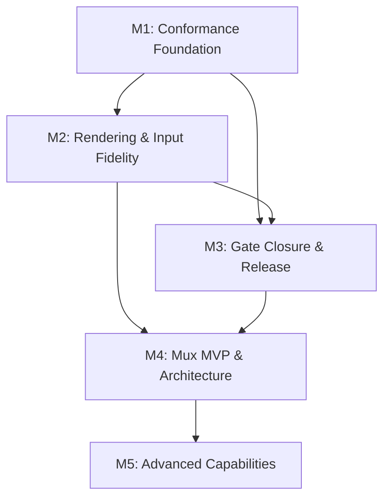

# Overflow — Project Roadmap

> Generated 2026-07-22 from `linearctl search --project Overflow --state all --json`.
> 5 milestones created in Linear; 23 issues assigned (20 original + 3 filed during
> roadmap generation). Project progress: ~6%. Team RD.

## What Overflow Is

Overflow is a Rust-native terminal emulator and multiplexer — a from-scratch
VT renderer + PTY mux with an explicit conformance-first philosophy. The project
publishes a numbered "Part N" delivery sequence (RD-141 through RD-150) that
walks from day-one pipeline unblock → conformance harness → alpha releases
(themes, full-screen apps, input fidelity) → structural cleanup → mux MVP, and
a parallel "Phase N" series (RD-71 through RD-77) that sketches the long-arc
future: remote state sync, attention routing, memory, project agents.

The conformance harness (RD-143) is deliberately built **before** the rendering
wire is touched — golden frames regress every change from Part 3 onward. The
Office is writing a correct terminal emulator, not a fast one that guesses.

---

## Linear milestone IDs

| Milestone | Linear ID | Target |
|-----------|-----------|--------|
| M1: Conformance Foundation & Contract Integrity | `c45f9e2e-7f48-494b-93df-5f46f17cbc04` | 2026-08-31 |
| M2: Terminal Rendering & Input Fidelity | `cb550a40-b21e-4edd-ad85-8e5d8307da9d` | 2026-10-15 |
| M3: Conformance Gate Closure & Release Readiness | `5d366b17-e7a9-45ba-a95b-8c3ba29a2aee` | 2026-11-30 |
| M4: Multiplexer MVP & Architectural Foundation | `43ab5f23-5c27-4893-88e1-81d6c3c38e4d` | 2027-01-31 |
| M5: Advanced Capabilities & Ecosystem | `01e107e9-69bd-4598-8ea5-fca7797cba24` | 2027-04-30 |

---

## Milestone summary

| # | Milestone | Target | Issues | Dependencies | Theme |
|---|----------|--------|--------|--------------|-------|
| M1 | Conformance Foundation & Contract Integrity | 2026-08-31 | 2 | — | Panic containment + golden-frame regression net |
| M2 | Terminal Rendering & Input Fidelity | 2026-10-15 | 3 | M1 | v0.1.x alpha releases — themes, full-screen, input |
| M3 | Conformance Gate Closure & Release Readiness | 2026-11-30 | 4 | M1, M2 | esctest-over-PTY + structural cleanup + v0.1 release |
| M4 | Multiplexer MVP & Architectural Foundation | 2027-01-31 | 7 | M2, M3 | v0.2.0-alpha mux MVP + workspace split + pane comm + cross-compile |
| M5 | Advanced Capabilities & Ecosystem | 2027-04-30 | 7 | M4 | Remote sync, attention, memory, agents, K8s, codegen |

---

## Dependency graph



**Critical path:** M1 (harness) → M2 (rendering alphas) → M3 (conformance gate
+ release truth) → M4 (mux MVP) → M5 (advanced capabilities). The conformance
harness in M1 gates every rendering change in M2/M3; the mux MVP in M4 cannot
land until the terminal it multiplexes is correct and released.

---

## Rendered roadmap (live from Linear)

```
Overflow — 5 milestone(s)

  M1: Conformance Foundation & Contract Integrity  (due 2026-08-31)  [░░░░░░░░░░░░░░░░░░░░] 0%  0/2
    RD-143  [Backlog]  Part 3: Golden-frame conformance harness: the regression net, built before the wire is touched
    RD-142  [Backlog]  Part 2: Contract integrity + panic containment: fix live PGT drift, guard it mechanically, feature-gate the todo!() stubs

  M2: Terminal Rendering & Input Fidelity  (due 2026-10-15)  [░░░░░░░░░░░░░░░░░░░░] 0%  0/3
    RD-146  [Backlog]  Part 6: v0.1.3-alpha — input fidelity: kitty keyboard protocol done right + input-encoding goldens
    RD-145  [Backlog]  Part 5: v0.1.2-alpha — full-screen apps render right: ED2/DECSTBM, BCE, normal mouse tracking
    RD-144  [Backlog]  Part 4: v0.1.1-alpha — themes actually work: default-color pipeline fix + colored underlines

  M3: Conformance Gate Closure & Release Readiness  (due 2026-11-30)  [░░░░░░░░░░░░░░░░░░░░] 0%  0/4
    RD-199  [Backlog]  Tag and publish v0.1 stable release
    RD-149  [Backlog]  Part 9: Release truth + Windows confidence: README reality, RELEASING checklist, self-hosted Windows runner
    RD-148  [Backlog]  Part 8: Domain truth + structural cleanup: unify blocks/history, amend the migration plan, delete dead code, cheap pure-logic suites
    RD-147  [Backlog]  Part 7: Close the Phase 2 conformance gate: esctest-over-PTY in CI + the long-tail fixes

  M4: Multiplexer MVP & Architectural Foundation  (due 2027-01-31)  [░░░░░░░░░░░░░░░░░░░░] 0%  0/7
    RD-201  [Backlog]  Wire cross-compile matrix in CI (Linux/macOS/Windows × x86_64/aarch64)
    RD-200  [Backlog]  Implement pane-to-pane communication (design from RD-177)
    RD-177  [Backlog]  Design canonical pane-to-pane communication in Overflow mux
    RD-152  [In Progress]  Bake mingw-w64 + aarch64 cross toolchains into the ci-rust runner image  @ctodie
    RD-150  [Backlog]  Part 10: v0.2.0-alpha — Phase 3 mux MVP: panes, splits, per-pane PTY
    RD-73  [Backlog]  Full 6-crate workspace split
    RD-71  [Backlog]  Phase 3 — Mux (herdr): session/pane management

  M5: Advanced Capabilities & Ecosystem  (due 2027-04-30)  [░░░░░░░░░░░░░░░░░░░░] 0%  0/7
    RD-79  [Backlog]  PGT codegen: wire .pgt files to codegen
    RD-78  [Backlog]  K8s integration via kube crate
    RD-77  [Backlog]  Phase 10 — Somnium: project agents
    RD-76  [Backlog]  Phase 9 — Reverie memory: session snapshots
    RD-75  [Backlog]  Phase 8 — Attention router: priority queue
    RD-74  [Backlog]  Phase 7 — Demon mode: gate classification
    RD-72  [Backlog]  Phase 6 — Mosh remote: UDP state sync
```

---

## M1: Conformance Foundation & Contract Integrity

**Target:** 2026-08-31 · **Linear ID:** `c45f9e2e-7f48-494b-93df-5f46f17cbc04`

Fix the live PGT drift, mechanically guard the contract, feature-gate the
`todo!()` stubs — then build the golden-frame conformance harness. The harness
is the regression net for every rendering change that follows; it must exist
before Part 4 touches the theme pipeline. This is the foundation that makes
"correct terminal emulator" a testable claim rather than an aspiration.

| Issue | State | Priority | Assignee | Title |
|-------|-------|----------|----------|-------|
| [RD-142](https://linear.app/cerebral-work/issue/RD-142) | Backlog | High | — | Part 2: Contract integrity + panic containment: fix live PGT drift, guard it mechanically, feature-gate the `todo!()` stubs |
| [RD-143](https://linear.app/cerebral-work/issue/RD-143) | Backlog | High | — | Part 3: Golden-frame conformance harness: the regression net, built before the wire is touched |

**Key risks:**
- The PGT drift is live — any consumer touching the contract surface before
  RD-142 lands inherits the drift. Feature-gating the `todo!()` stubs changes
  the compile-time surface; downstream code that assumed the stubs were
  functional will need adapter points.
- The conformance harness must be maintained for the life of the project. Its
  value is proportional to golden-frame coverage — a sparse net catches nothing.

**Exit criteria:** PGT contract is guarded mechanically (not by convention),
`todo!()` stubs are feature-gated, and the golden-frame harness runs in CI with
at least one passing frame per rendering category (SGR, cursor, erase, scroll).

---

## M2: Terminal Rendering & Input Fidelity

**Target:** 2026-10-15 · **Linear ID:** `cb550a40-b21e-4edd-ad85-8e5d8307da9d`

The v0.1.x alpha sequence: make themes actually work (v0.1.1), make full-screen
apps render right (v0.1.2), make input fidelity correct (v0.1.3). Each alpha is
a visible, shippable milestone gated by the conformance harness from M1.

| Issue | State | Priority | Assignee | Title |
|-------|-------|----------|----------|-------|
| [RD-144](https://linear.app/cerebral-work/issue/RD-144) | Backlog | High | — | Part 4: v0.1.1-alpha — themes actually work: default-color pipeline fix + colored underlines |
| [RD-145](https://linear.app/cerebral-work/issue/RD-145) | Backlog | High | — | Part 5: v0.1.2-alpha — full-screen apps render right: ED2/DECSTBM, BCE, normal mouse tracking |
| [RD-146](https://linear.app/cerebral-work/issue/RD-146) | Backlog | High | — | Part 6: v0.1.3-alpha — input fidelity: kitty keyboard protocol done right + input-encoding goldens |

**Key risks:**
- RD-145 (full-screen apps) is the surface area where real TUI programs
  stress the renderer — vim, tmux, less. DECSTBM (scroll regions) and BCE
  (background color erase) are the two features most commonly implemented
  wrong; they interact subtly. The harness catches regressions but cannot
  prove correctness for an unbounded input space.
- Kitty keyboard protocol (RD-146) is a moving target — the protocol has
  several revision levels and edge cases in modifier encoding. Input
  encoding goldens must pin a protocol revision.

**Exit criteria:** v0.1.1, v0.1.2, v0.1.3 alphas tagged and released; each
passes the conformance harness with no new golden-frame regressions; at least
one real-world full-screen TUI app (vim or tmux) renders and accepts input
correctly.

---

## M3: Conformance Gate Closure & Release Readiness

**Target:** 2026-11-30 · **Linear ID:** `5d366b17-e7a9-45ba-a95b-8c3ba29a2aee`

Close the Phase 2 conformance gate (esctest-over-PTY in CI), unify the domain
model (blocks/history), delete dead code, and make the release story honest
(README, RELEASING checklist, self-hosted Windows runner) — then tag and
publish v0.1 stable.

| Issue | State | Priority | Assignee | Title |
|-------|-------|----------|----------|-------|
| [RD-147](https://linear.app/cerebral-work/issue/RD-147) | Backlog | Medium | — | Part 7: Close the Phase 2 conformance gate: esctest-over-PTY in CI + the long-tail fixes |
| [RD-148](https://linear.app/cerebral-work/issue/RD-148) | Backlog | Medium | — | Part 8: Domain truth + structural cleanup: unify blocks/history, amend the migration plan, delete dead code, cheap pure-logic suites |
| [RD-149](https://linear.app/cerebral-work/issue/RD-149) | Backlog | Medium | — | Part 9: Release truth + Windows confidence: README reality, RELEASING checklist, self-hosted Windows runner |
| [RD-199](https://linear.app/cerebral-work/issue/RD-199) | Backlog | High | — | Tag and publish v0.1 stable release *(filed during roadmap generation)* |

**Key risks:**
- RD-147 (esctest-over-PTY) requires running a real PTY in CI — self-hosted
  runners with PTY access are a prerequisite (RD-149 builds the Windows
  runner; the Linux side is assumed). If the CI environment has no PTY, the
  gate cannot run and regressions slip through silently.
- RD-148 unifies blocks/history — this is a domain-model refactor on
  conformance-gated code. If the migration plan amendment is wrong, the
  unification breaks golden frames. The cheap pure-logic suites are the
  safety net; they must be in place before the refactor.
- RD-199 (v0.1 release tag) is blocked by RD-147, RD-148, and RD-149 — all
  three must land before the release is cut. A flaky Windows runner (RD-149)
  blocks the tag.

**Exit criteria:** esctest runs in CI over a PTY; blocks/history are unified
under a single domain model with no dead code; README matches reality; v0.1.0
tag exists with artifacts published from a self-hosted runner.

---

## M4: Multiplexer MVP & Architectural Foundation

**Target:** 2027-01-31 · **Linear ID:** `43ab5f23-5c27-4893-88e1-81d6c3c38e4d`

Ship the v0.2.0-alpha mux MVP (panes, splits, per-pane PTY), split the workspace
into six crates, design and implement canonical pane-to-pane communication, and
wire cross-compile CI for six targets. The mux is the project's reason for
existing — a correct terminal that doesn't multiplex is a reimplementation of
everyone else's terminal.

| Issue | State | Priority | Assignee | Title |
|-------|-------|----------|----------|-------|
| [RD-150](https://linear.app/cerebral-work/issue/RD-150) | Backlog | Medium | — | Part 10: v0.2.0-alpha — Phase 3 mux MVP: panes, splits, per-pane PTY |
| [RD-73](https://linear.app/cerebral-work/issue/RD-73) | Backlog | Low | — | Full 6-crate workspace split |
| [RD-71](https://linear.app/cerebral-work/issue/RD-71) | Backlog | Medium | — | Phase 3 — Mux (herdr): session/pane management |
| [RD-177](https://linear.app/cerebral-work/issue/RD-177) | Backlog | Urgent | — | Design canonical pane-to-pane communication in Overflow mux |
| [RD-200](https://linear.app/cerebral-work/issue/RD-200) | Backlog | Medium | — | Implement pane-to-pane communication (design from RD-177) *(filed during roadmap generation)* |
| [RD-152](https://linear.app/cerebral-work/issue/RD-152) | In Progress | Medium | ctodie | Bake mingw-w64 + aarch64 cross toolchains into the ci-rust runner image |
| [RD-201](https://linear.app/cerebral-work/issue/RD-201) | Backlog | Medium | — | Wire cross-compile matrix in CI (Linux/macOS/Windows × x86_64/aarch64) *(filed during roadmap generation)* |

**Key risks:**
- RD-177 (pane-to-pane communication design) is marked Urgent priority — it is
  the architectural decision that gates the mux MVP. If it's wrong, every
  downstream phase (Mosh remote, attention router, Somnium agents) inherits
  the wrong contract. This design should be an RFC, not an ad-hoc decision.
- RD-200 (implementation of the pane-to-pane design) is blocked-by RD-177.
  The design must land before implementation starts — a half-designed
  message bus is worse than none.
- RD-73 (6-crate workspace split) is a structural refactor that touches every
  module boundary. Doing it concurrently with the mux MVP (RD-150) creates
  merge friction — the split should land first, or the MVP should be built in
  the current structure and split afterward.
- RD-201 (cross-compile matrix) depends on RD-152 (toolchain image) landing
  first — the matrix can't wire what isn't baked.

**Exit criteria:** v0.2.0-alpha ships with panes, splits, and per-pane PTYs;
workspace is split into six crates with clean dependency edges; pane-to-pane
communication is designed and implemented; CI cross-compiles for
Linux/macOS/Windows × x86_64/aarch64 producing release artifacts.

---

## M5: Advanced Capabilities & Ecosystem

**Target:** 2027-04-30 · **Linear ID:** `01e107e9-69bd-4598-8ea5-fca7797cba24`

The long-arc future: Mosh-style remote state sync, demon mode (gate
classification), attention routing (priority queue), reverie memory integration
(session snapshots), Somnium project agents, K8s integration, and PGT codegen.
These phases transform Overflow from a terminal emulator into an ambient
computing surface — the terminal as a sensing, routing, memory-carrying agent
substrate.

| Issue | State | Priority | Assignee | Title |
|-------|-------|----------|----------|-------|
| [RD-72](https://linear.app/cerebral-work/issue/RD-72) | Backlog | Low | — | Phase 6 — Mosh remote: UDP state sync |
| [RD-74](https://linear.app/cerebral-work/issue/RD-74) | Backlog | Low | — | Phase 7 — Demon mode: gate classification |
| [RD-75](https://linear.app/cerebral-work/issue/RD-75) | Backlog | Low | — | Phase 8 — Attention router: priority queue |
| [RD-76](https://linear.app/cerebral-work/issue/RD-76) | Backlog | Low | — | Phase 9 — Reverie memory: session snapshots |
| [RD-77](https://linear.app/cerebral-work/issue/RD-77) | Backlog | Low | — | Phase 10 — Somnium: project agents |
| [RD-78](https://linear.app/cerebral-work/issue/RD-78) | Backlog | Low | — | K8s integration via kube crate |
| [RD-79](https://linear.app/cerebral-work/issue/RD-79) | Backlog | Low | — | PGT codegen: wire .pgt files to codegen |

**Key risks:**
- These phases are the most speculative — all Low priority, no assignee. They
  represent a vision, not a committed plan. The mux MVP (M4) must land before
  any of these are tractable, and the pane-to-pane design (RD-177, M4) is the
  contract they all consume. If that contract is wrong, M5 is wrong.
- RD-76 (reverie memory) and RD-77 (Somnium agents) create a dependency on the
  reverie/cerebral estate. These are cross-project integrations; their
  feasibility depends on the maturity of the reverie memory API and the soma
  agent runtime, both of which are themselves under active development.
- RD-78 (K8s integration) and RD-79 (PGT codegen) are ecosystem plays that
  extend Overflow beyond a local terminal into a cluster-aware surface. The
  blast radius of a terminal that talks to Kubernetes is high — the
  integration must be capability-gated, not ambient.

**Exit criteria:** at least two of the seven phases have working prototypes
integrated into the mux; the remaining phases have scoped RFCs with dependency
analysis against the reverie/soma estate.

---

## Completed work (precedent)

| Issue | State | Title |
|-------|-------|-------|
| [RD-141](https://linear.app/cerebral-work/issue/RD-141) | Done | Part 1: Day-one pipeline unblock: full test gate, repo reconcile, Windows compile check, Dependabot dispositions |

RD-141 established the CI pipeline that every subsequent part depends on — the
full test gate, repo reconciliation, and Windows compile check are the
ground that M1's conformance harness and M4's cross-toolchain CI stand on.

---

## Tickets filed during roadmap generation

Three gaps were identified where the roadmap's exit criteria referenced work
without a corresponding Linear issue. These were filed via `linearctl file`:

| ID | Milestone | Title | Priority |
|----|-----------|-------|----------|
| [RD-199](https://linear.app/cerebral-work/issue/RD-199) | M3 | Tag and publish v0.1 stable release | High |
| [RD-200](https://linear.app/cerebral-work/issue/RD-200) | M4 | Implement pane-to-pane communication (design from RD-177) | Medium |
| [RD-201](https://linear.app/cerebral-work/issue/RD-201) | M4 | Wire cross-compile matrix in CI (Linux/macOS/Windows × x86_64/aarch64) | Medium |

---

## Issue Summary

| ID | Title | Priority | State | Milestone |
|----|-------|----------|-------|-----------|
| RD-142 | Part 2: Contract integrity + panic containment | High | Backlog | M1 — Conformance Foundation |
| RD-143 | Part 3: Golden-frame conformance harness | High | Backlog | M1 — Conformance Foundation |
| RD-144 | Part 4: v0.1.1-alpha — themes | High | Backlog | M2 — Rendering & Input |
| RD-145 | Part 5: v0.1.2-alpha — full-screen apps | High | Backlog | M2 — Rendering & Input |
| RD-146 | Part 6: v0.1.3-alpha — input fidelity | High | Backlog | M2 — Rendering & Input |
| RD-147 | Part 7: Conformance gate closure (esctest-over-PTY) | Medium | Backlog | M3 — Gate Closure & Release |
| RD-148 | Part 8: Domain truth + structural cleanup | Medium | Backlog | M3 — Gate Closure & Release |
| RD-149 | Part 9: Release truth + Windows confidence | Medium | Backlog | M3 — Gate Closure & Release |
| RD-199 | Tag and publish v0.1 stable release | High | Backlog | M3 — Gate Closure & Release |
| RD-150 | Part 10: v0.2.0-alpha — mux MVP | Medium | Backlog | M4 — Mux MVP & Architecture |
| RD-73 | Full 6-crate workspace split | Low | Backlog | M4 — Mux MVP & Architecture |
| RD-71 | Phase 3 — Mux (herdr): session/pane management | Medium | Backlog | M4 — Mux MVP & Architecture |
| RD-177 | Design pane-to-pane communication | Urgent | Backlog | M4 — Mux MVP & Architecture |
| RD-200 | Implement pane-to-pane communication | Medium | Backlog | M4 — Mux MVP & Architecture |
| RD-152 | Bake mingw-w64 + aarch64 cross toolchains into CI | Medium | In Progress | M4 — Mux MVP & Architecture |
| RD-201 | Wire cross-compile matrix in CI | Medium | Backlog | M4 — Mux MVP & Architecture |
| RD-72 | Phase 6 — Mosh remote: UDP state sync | Low | Backlog | M5 — Advanced Capabilities |
| RD-74 | Phase 7 — Demon mode: gate classification | Low | Backlog | M5 — Advanced Capabilities |
| RD-75 | Phase 8 — Attention router: priority queue | Low | Backlog | M5 — Advanced Capabilities |
| RD-76 | Phase 9 — Reverie memory: session snapshots | Low | Backlog | M5 — Advanced Capabilities |
| RD-77 | Phase 10 — Somnium: project agents | Low | Backlog | M5 — Advanced Capabilities |
| RD-78 | K8s integration via kube crate | Low | Backlog | M5 — Advanced Capabilities |
| RD-79 | PGT codegen: wire .pgt files to codegen | Low | Backlog | M5 — Advanced Capabilities |
| RD-141 | Part 1: Day-one pipeline unblock | Urgent | Done | (precedent) |

---

## Methodology

1. **Data collection:** `linearctl search --project Overflow --state all --json`
   → 21 issues, all in team RD. Deduplicated by identifier.
2. **Thematic analysis:** Issues were classified by the two numbering patterns
   in the project — the sequential "Part N" delivery sequence (RD-141 through
   RD-150) and the architectural "Phase N" capability series (RD-71 through
   RD-77), plus standalone infrastructure issues (RD-152 cross-toolchain CI,
   RD-177 pane-to-pane comm design, RD-78 K8s, RD-79 PGT codegen).
3. **Milestone creation:** 5 milestones created in Linear via
   `linearctl milestone create` with target dates and descriptions.
4. **Issue assignment:** All 20 active issues assigned to milestones via
   `linearctl update <ID> --milestone '<Milestone Name>'`. RD-141 (Done) left
   unassigned as precedent.
5. **Gap filing:** 3 missing tickets filed via `linearctl file` — RD-199
   (v0.1 release tag), RD-200 (pane-to-pane implementation), RD-201
   (cross-compile matrix) — covering exit criteria that lacked corresponding
   issues.
6. **Final render:** `linearctl roadmap --project Overflow` confirms 23 issues
   across 5 milestones, all correctly assigned.
