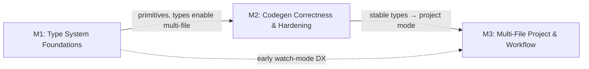

# pgt — Project Roadmap

> Generated from Linear project **pgt** (cerebral-work workspace)
> Source: 10 issues, all in **Backlog** state
> Generated: 2026-07-22

---

## Live Linear State (auto-rendered 2026-07-29 14:32 UTC)

| Milestone | Linear ID | Target Date | Issues | Progress |
|----------|-----------|------------|--------|----------|
| M3: Multi-File Project & Workflow | `44c2be7a-c3ad-4980-af50-680e8843e531` | 2026-09-23 | 3 | 0% (0/3) |
| M2: Codegen Correctness & Hardening | `e103a252-c9c5-4dc9-9dc1-796ae65541d0` | 2026-09-02 | 3 | 0% (0/3) |
| M1: Type System Foundations | `71bd2a93-65a5-4660-b7de-9b183c8a02d1` | 2026-08-12 | 4 | 0% (0/4) |

```
pgt — 3 milestone(s)

  M1: Type System Foundations  (due 2026-08-12)  [░░░░░░░░░░░░░░░░░░░░] 0%  0/4
    CER-1593  [Backlog]  Allow inline string enums in struct fields
    CER-1592  [Backlog]  Add generics support (type Response<T> { data T })
    CER-1591  [Backlog]  Add map<K,V> type support to lexer, parser, AST, and codegen
    CER-1590  [Backlog]  Add extended primitives to validator + all codegen backends

  M2: Codegen Correctness & Hardening  (due 2026-09-02)  [░░░░░░░░░░░░░░░░░░░░] 0%  0/3
    CER-1598  [Backlog]  Canonical type ordering in pgt fmt
    CER-1597  [Backlog]  Fix string enum Rust serde rename for non-PascalCase values
    CER-1596  [Backlog]  Check summary + non-zero exit codes on validation errors

  M3: Multi-File Project & Workflow  (due 2026-09-23)  [░░░░░░░░░░░░░░░░░░░░] 0%  0/3
    CER-1599  [Backlog]  Add pgt watch mode for iterative development
    CER-1595  [Backlog]  Multi-file codegen project mode
    CER-1594  [Backlog]  Multi-file fmt and check (accept multiple file args)
```

*Last 7 days: 0 issue(s) touched, 0 completed.*
*Rendered by `.github/scripts/render-roadmap.sh` (corpus auto-render, schedule + dispatch).*

## Overview



**Milestones execute sequentially (type system → correctness → multi-file DX),**
with M3 watch-mode available as parallel DX work once type foundations land.

---

## M1: Type System Foundations

**Goal:** Extend the pgt type system with primitives, enums, maps, and generics — the language-level capabilities everything else builds on.

| Issue | Title | Priority | State |
|-------|-------|----------|-------|
| [CER-1590](https://linear.app/cerebral-work/issue/CER-1590) | Add extended primitives to validator + all codegen backends | Medium | Backlog |
| [CER-1593](https://linear.app/cerebral-work/issue/CER-1593) | Allow inline string enums in struct fields | Low | Backlog |
| [CER-1591](https://linear.app/cerebral-work/issue/CER-1591) | Add map<K,V> type support to lexer, parser, AST, and codegen | Medium | Backlog |
| [CER-1592](https://linear.app/cerebral-work/issue/CER-1592) | Add generics support (type Response<T> { data T }) | Medium | Backlog |

## M2: Codegen Correctness & Hardening

**Goal:** Fix edge-case bugs in generated output and tighten validation/exit-code semantics so failures are observable in CI.

| Issue | Title | Priority | State |
|-------|-------|----------|-------|
| [CER-1597](https://linear.app/cerebral-work/issue/CER-1597) | Fix string enum Rust serde rename for non-PascalCase values | Medium | Backlog |
| [CER-1596](https://linear.app/cerebral-work/issue/CER-1596) | Check summary + non-zero exit codes on validation errors | — | Backlog |
| [CER-1598](https://linear.app/cerebral-work/issue/CER-1598) | Canonical type ordering in pgt fmt | — | Backlog |

## M3: Multi-File Project & Workflow

**Goal:** Scale pgt from single-file usage to full project workflows with multi-file check/fmt/codegen and watch-mode DX.

| Issue | Title | Priority | State |
|-------|-------|----------|-------|
| [CER-1594](https://linear.app/cerebral-work/issue/CER-1594) | Multi-file fmt and check (accept multiple file args) | Low | Backlog |
| [CER-1595](https://linear.app/cerebral-work/issue/CER-1595) | Multi-file codegen project mode | Low | Backlog |
| [CER-1599](https://linear.app/cerebral-work/issue/CER-1599) | Add pgt watch mode for iterative development | — | Backlog |

---

## Summary

| Milestone | Issues | Priorities |
|-----------|--------|------------|
| M1: Type System Foundations | 4 | Medium, Medium, Medium, Low |
| M2: Codegen Correctness & Hardening | 3 | Medium, —, — |
| M3: Multi-File Project & Workflow | 3 | Low, Low, — |
| **Total** | **10** | — |

## Issue Index

| Issue | Milestone | Title |
|-------|-----------|-------|
| [CER-1590](https://linear.app/cerebral-work/issue/CER-1590) | M1: Type System Foundations | Add extended primitives to validator + all codegen backends |
| [CER-1591](https://linear.app/cerebral-work/issue/CER-1591) | M1: Type System Foundations | Add map<K,V> type support to lexer, parser, AST, and codegen |
| [CER-1592](https://linear.app/cerebral-work/issue/CER-1592) | M1: Type System Foundations | Add generics support (type Response<T> { data T }) |
| [CER-1593](https://linear.app/cerebral-work/issue/CER-1593) | M1: Type System Foundations | Allow inline string enums in struct fields |
| [CER-1594](https://linear.app/cerebral-work/issue/CER-1594) | M3: Multi-File Project & Workflow | Multi-file fmt and check (accept multiple file args) |
| [CER-1595](https://linear.app/cerebral-work/issue/CER-1595) | M3: Multi-File Project & Workflow | Multi-file codegen project mode |
| [CER-1596](https://linear.app/cerebral-work/issue/CER-1596) | M2: Codegen Correctness & Hardening | Check summary + non-zero exit codes on validation errors |
| [CER-1597](https://linear.app/cerebral-work/issue/CER-1597) | M2: Codegen Correctness & Hardening | Fix string enum Rust serde rename for non-PascalCase values |
| [CER-1598](https://linear.app/cerebral-work/issue/CER-1598) | M2: Codegen Correctness & Hardening | Canonical type ordering in pgt fmt |
| [CER-1599](https://linear.app/cerebral-work/issue/CER-1599) | M3: Multi-File Project & Workflow | Add pgt watch mode for iterative development |
