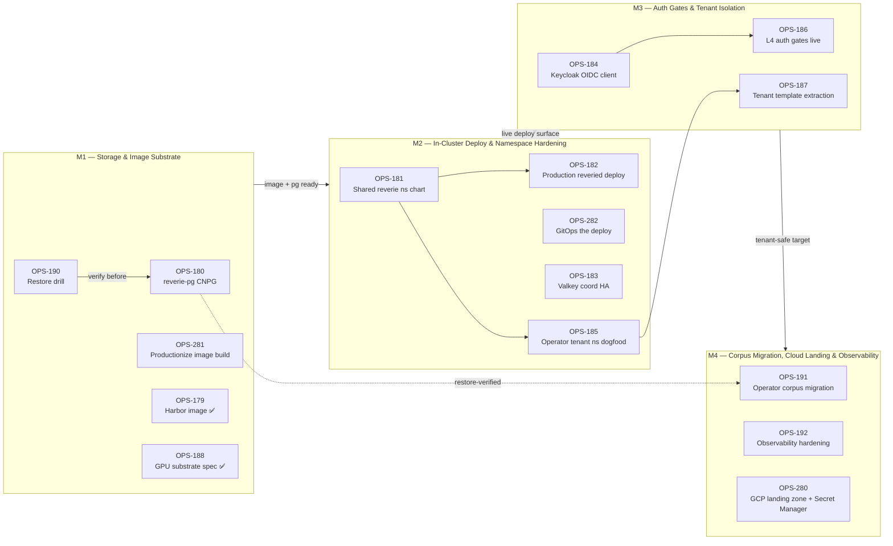

# Roadmap — reverie-cloud platform prereqs

**Linear project:** [reverie-cloud platform prereqs](https://linear.app/cerebral-work/project/reverie-cloud-platform-prereqs-e98c5e7861d0)
- **State:** started
- **Progress:** 15.6% (3 of 16 issues done — OPS-179, OPS-188, partially OPS-180)
- **Issues:** 16 (3 Done, 2 In Progress, 11 Backlog)
- **Assignee:** ctodie (all issues)
- **Generated:** 2026-07-22

## Live Linear State (auto-rendered 2026-07-29 14:34 UTC)

| Milestone | Linear ID | Target Date | Issues | Progress |
|----------|-----------|------------|--------|----------|
| Corpus Migration, Cloud Landing & Observability | `6b1abb23-1be1-4ad3-8ad6-2c52955d2b0c` | 2026-09-23 | 3 | 0% (0/3) |
| In-Cluster Deploy & Namespace Hardening | `daeba53d-ca3c-4bf0-83be-00147e5cc042` | 2026-08-26 | 4 | 0% (0/4) |
| Storage & Image Substrate | `68a6bbd8-c695-4a93-bd14-0dc814370362` | 2026-08-12 | 5 | 40% (2/5) |
| Auth Gates & Tenant Isolation | `c65c9d32-24c3-411e-9aa2-8c611c5b3a73` | 2026-09-09 | 4 | 0% (0/4) |

```
reverie-cloud platform prereqs — 4 milestone(s)

  Storage & Image Substrate  (due 2026-08-12)  [████████░░░░░░░░░░░░] 40%  2/5
    OPS-281  [Backlog]  Productionize the reveried image build (CI + cosign + ESO secrets + kaniko Dockerfile egress)  @ctodie
    OPS-190  [Backlog]  reverie-pg restore drill + backup verification before corpus migration  @ctodie
    OPS-188  [Done]  GPU substrate activation spec — resolve host fork + size for BGE embedder AND Fable-distill (gpu-pool/Triton/Kueue)  @ctodie
    OPS-180  [In Progress]  Dedicated reverie-pg CNPG cluster with pgvector + ESO + verify-full TLS  @ctodie
    OPS-179  [Done]  Harbor `reverie` project + robots + reveried image build via kaniko  @ctodie

  In-Cluster Deploy & Namespace Hardening  (due 2026-08-26)  [░░░░░░░░░░░░░░░░░░░░] 0%  0/4
    OPS-282  [Backlog]  GitOps the reverie cloud deploy + merge PR #765 (eliminate R0 hand-applied state)  @ctodie
    OPS-183  [Backlog]  Valkey coord HA chart (Sentinel topology) — platform substrate for adr-013  @ctodie
    OPS-182  [Backlog]  Production reveried deploy (dogfood) — Harbor image, hardened Helm, /health green in `reverie` ns  @ctodie
    OPS-181  [Backlog]  Shared `reverie` namespace chart — ns, PSA labels, NetworkPolicy, ResourceQuota, ESO wiring  @ctodie

  Auth Gates & Tenant Isolation  (due 2026-09-09)  [░░░░░░░░░░░░░░░░░░░░] 0%  0/4
    OPS-187  [Backlog]  Tenant template extraction + provision Patrick / Krishna / JIT Pal namespaces  @ctodie
    OPS-186  [Backlog]  L4 auth gates live — OIDC wiring, per-caller rate limits, public-endpoint hardening (HARD gate for tenants)  @ctodie
    OPS-185  [Backlog]  Operator tenant namespace (dogfood) — per-tenant ns/netpol/quota reference implementation  @ctodie
    OPS-184  [Backlog]  Keycloak `reveried` OIDC client (kcadm in dev + codified in realm import)  @ctodie

  Corpus Migration, Cloud Landing & Observability  (due 2026-09-23)  [░░░░░░░░░░░░░░░░░░░░] 0%  0/3
    OPS-280  [Backlog]  Stand up GCP landing zone + GCP Secret Manager for cerebral.work (ESO-consumed)  @ctodie
    OPS-192  [Backlog]  Reverie observability hardening — alert rules, runbook, game-day drill  @ctodie
    OPS-191  [In Progress]  Operator corpus migration: laptop engram.db → cloud reverie-pg + client cutover (freeze-window, one-way)  @ctodie
```

*Last 7 days: 0 issue(s) touched, 0 completed.*
*Rendered by `.github/scripts/render-roadmap.sh` (corpus auto-render, schedule + dispatch).*

## Milestones

Four thematic milestones sequence the reverie-cloud platform prerequisites. Each
milestone is a self-contained deliverable that gates the next: storage + image
substrate underpins the in-cluster deploy, the deploy must be live before auth
gates can screen tenants, and only after tenants are isolated can the operator
corpus migration land against a hardened, observable substrate.

| Milestone | Theme | Issues | Dependency |
|---|---|---|---|
| **M1 — Storage & Image Substrate** | Stand up the data plane (reverie-pg CNPG + pgvector) and the container base (Harbor image + productionized build) that every later milestone builds on. | OPS-179 ✅, OPS-188 ✅, OPS-180 🔄, OPS-190, OPS-281 | Foundation — no upstream dependency; OPS-190 and the corpus migration (M4 — OPS-191) both gate on OPS-180 reaching a restore-verified state. |
| **M2 — In-Cluster Deploy & Namespace Hardening** | Deploy reveried live inside a hardened shared `reverie` namespace with GitOps-managed config and a HA Valkey coord substrate. | OPS-181, OPS-182, OPS-282, OPS-183 | Depends on M1: the productionized image (OPS-281) and reverie-pg (OPS-180) must be green before OPS-182 can deploy a healthy dogfood workload. |
| **M3 — Auth Gates & Tenant Isolation** | Wire OIDC (Keycloak `reveried` client), enforce L4 auth gates, and extract a tenant template that provisions isolated namespaces with ns/netpol/quota. | OPS-184, OPS-186, OPS-185, OPS-187 | Depends on M2: the live dogfood deploy (OPS-182) is the surface auth gates attach to; tenant isolation (OPS-185) extends the shared namespace chart from OPS-181. |
| **M4 — Corpus Migration, Cloud Landing & Observability** | Cut the operator corpus over to cloud reverie-pg, stand up the GCP landing zone + Secret Manager (ESO-consumed), and harden observability with runbook + game-day drill. | OPS-191 🔄, OPS-192, OPS-280 | Depends on M3: the corpus migration (OPS-191) lands only after auth gates (OPS-186) and tenant isolation (M3) make reverie-pg a tenant-safe target. Observability hardening (OPS-192) exercises the whole stack M1–M3 produced. |

### M1 — Storage & Image Substrate

> Stand up the data plane (reverie-pg CNPG + pgvector) and the container base
> (Harbor image + productionized build) that every later milestone builds on.

**Dependency:** Foundation — no upstream dependency. OPS-190 (restore drill) and
the M4 corpus migration (OPS-191) both gate on OPS-180 reaching a
restore-verified state.

| ID | Title | State | Priority | Assignee |
|---|---|---|---|---|
| OPS-179 | Harbor `reverie` project + robots + reveried image build via kaniko | Done | High | ctodie |
| OPS-188 | GPU substrate activation spec — resolve host fork + size for BGE embedder AND Fable-distill | Done | Medium | ctodie |
| OPS-180 | Dedicated reverie-pg CNPG cluster with pgvector + ESO + verify-full TLS | In Progress | High | ctodie |
| OPS-190 | reverie-pg restore drill + backup verification before corpus migration | Backlog | High | ctodie |
| OPS-281 | Productionize the reveried image build (CI + cosign + ESO secrets + kaniko Dockerfile egress) | Backlog | High | ctodie |

### M2 — In-Cluster Deploy & Namespace Hardening

> Deploy reveried live inside a hardened shared `reverie` namespace with
> GitOps-managed config and a HA Valkey coord substrate.

**Dependency:** Depends on M1: the productionized image (OPS-281) and
reverie-pg (OPS-180) must be green before OPS-182 can deploy a healthy dogfood
workload.

| ID | Title | State | Priority | Assignee |
|---|---|---|---|---|
| OPS-181 | Shared `reverie` namespace chart — ns, PSA labels, NetworkPolicy, ResourceQuota, ESO wiring | Backlog | High | ctodie |
| OPS-182 | Production reveried deploy (dogfood) — Harbor image, hardened Helm, /health green in `reverie` ns | Backlog | High | ctodie |
| OPS-282 | GitOps the reverie cloud deploy + merge PR #765 (eliminate R0 hand-applied state) | Backlog | High | ctodie |
| OPS-183 | Valkey coord HA chart (Sentinel topology) — platform substrate for adr-013 | Backlog | Medium | ctodie |

### M3 — Auth Gates & Tenant Isolation

> Wire OIDC (Keycloak `reveried` client), enforce L4 auth gates, and extract a
> tenant template that provisions isolated namespaces with ns/netpol/quota.

**Dependency:** Depends on M2: the live dogfood deploy (OPS-182) is the surface
auth gates attach to; tenant isolation (OPS-185) extends the shared namespace
chart from OPS-181.

| ID | Title | State | Priority | Assignee |
|---|---|---|---|---|
| OPS-184 | Keycloak `reveried` OIDC client (kcadm in dev + codified in realm import) | Backlog | Medium | ctodie |
| OPS-186 | L4 auth gates live — OIDC wiring, per-caller rate limits, public-endpoint hardening (HARD gate for tenants) | Backlog | High | ctodie |
| OPS-185 | Operator tenant namespace (dogfood) — per-tenant ns/netpol/quota reference implementation | Backlog | Medium | ctodie |
| OPS-187 | Tenant template extraction + provision Patrick / Krishna / JIT Pal namespaces | Backlog | Medium | ctodie |

### M4 — Corpus Migration, Cloud Landing & Observability

> Cut the operator corpus over to cloud reverie-pg, stand up the GCP landing
> zone + Secret Manager (ESO-consumed), and harden observability with runbook
> + game-day drill.

**Dependency:** Depends on M3: the corpus migration (OPS-191) lands only after
auth gates (OPS-186) and tenant isolation (M3) make reverie-pg a tenant-safe
target. Observability hardening (OPS-192) exercises the whole stack M1–M3
produced.

| ID | Title | State | Priority | Assignee |
|---|---|---|---|---|
| OPS-191 | Operator corpus migration: laptop engram.db → cloud reverie-pg + client cutover (freeze-window, one-way) | In Progress | High | ctodie |
| OPS-192 | Reverie observability hardening — alert rules, runbook, game-day drill | Backlog | Medium | ctodie |
| OPS-280 | Stand up GCP landing zone + GCP Secret Manager for cerebral.work (ESO-consumed) | Backlog | High | ctodie |

## Roadmap Diagram



## Execution Notes

- **M1 is the foundation and is already the furthest along** — 2 of 5 issues
  done (OPS-179 Harbor image, OPS-188 GPU substrate spec) with OPS-180
  (reverie-pg CNPG) in progress. The critical-path item is OPS-281
  (productionize the image build: CI + cosign + ESO secrets + kaniko egress
  hardening) — the R0 Harbor image exists but is not yet a reproducible,
  signed, egress-hardened build. OPS-190 (restore drill) is a pre-flight gate
  for the M4 corpus migration: do it now, not later.
- **M2 is pure buildout and can start in parallel with the tail of M1** — the
  shared `reverie` namespace chart (OPS-181) has no image dependency and can
  proceed immediately. OPS-182 (production deploy) blocks on OPS-281 landing a
  signed image. OPS-282 (GitOps + PR #765) eliminates the R0 hand-applied state
  that OPS-182 will otherwise leave behind — pair them. Valkey HA (OPS-183) is a
  substrate for ADR-013 and can proceed independently within the milestone.
- **M3 is the hard gate for tenants.** OPS-186 is explicitly labelled a HARD
  gate — no tenant namespace goes live without L4 auth gates + OIDC enforced.
  The tenant template work (OPS-185 → OPS-187) is sequential: stand up the
  dogfood operator tenant as the reference implementation, then extract the
  template and provision Patrick / Krishna / JIT Pal from it. Do not provision
  real tenants before the dogfood tenant proves the netpol/quota boundary.
- **M4 lands the cutover and the safety net.** OPS-191 (corpus migration) is a
  one-way freeze-window operation — it must not fire until M1's restore drill
  (OPS-190) proves reverie-pg can be restored AND M3's auth gates make the
  target tenant-safe. OPS-280 (GCP landing zone + Secret Manager) unblocks
  ESO consumption of GCP-hosted secrets for any future multi-cloud workloads
  and can proceed independently within M4. OPS-192 (observability hardening +
  runbook + game-day drill) should be the last item — it exercises the entire
  M1–M3 stack and the drill is most valuable once the surface is stable.
- **Suggested cadence** (target dates, each ~2 weeks from the prior):
  M1 → 2026-08-12, M2 → 2026-08-26, M3 → 2026-09-09, M4 → 2026-09-23. These
  are planning anchors, not commitments — the corpus migration (OPS-191) is a
  one-way operation that should slip if M1/M3 gates are not green.

## Rendered Roadmap

<!-- populated below by `linearctl roadmap --project 'reverie-cloud platform prereqs'` -->

